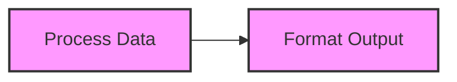
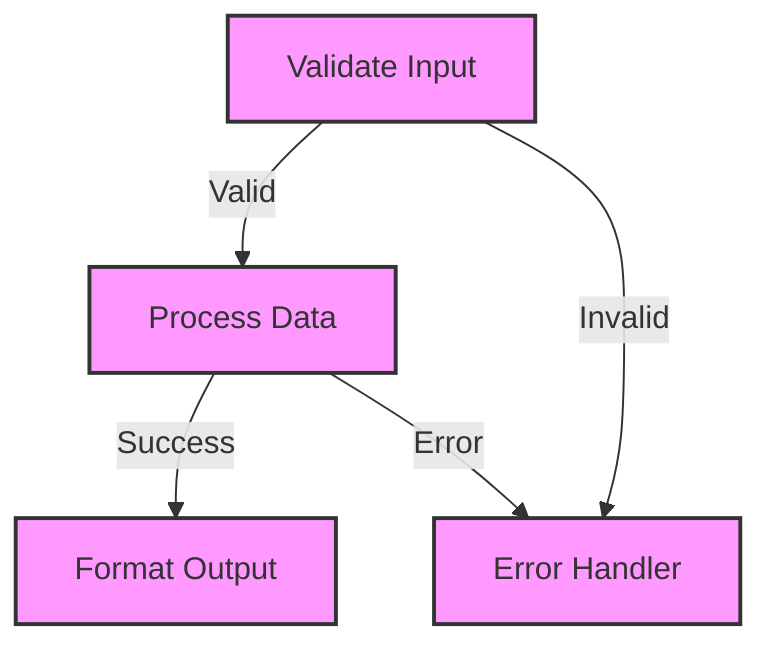
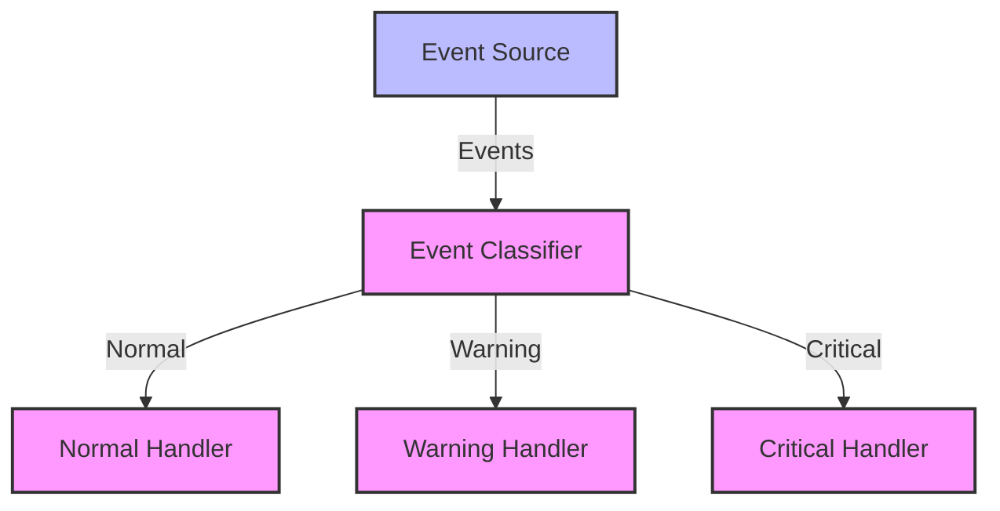

# 🚀 Flowrs: The Power of Workflows in Rust

[](https://github.com/aitoroses/flowrs/actions/workflows/ci.yml)
[](https://crates.io/crates/flowrs-core)
[](https://docs.rs/flowrs-core)
[](https://opensource.org/licenses/MIT)

> A type-safe, composable directed graph workflow system written in Rust.

## 💫 Overview

Flowrs transforms complex workflow orchestration into a delightful experience. Built with Rust's powerful type system at its core, Flowrs provides a flexible, performant, and type-safe way to create sophisticated workflow graphs with crystal-clear transitions between steps.

## ✨ Key Features

- **🔒 Type-Safe By Design**: Leverage Rust's type system for compile-time workflow correctness
- **🧩 Composable Architecture**: Build complex workflows from simple, reusable components
- **⚡ Async First**: Native support for asynchronous execution with Tokio
- **🔄 Advanced Patterns**: Support for batch processing, event-driven workflows, and more
- **💾 State Management**: Built-in serialization for workflow persistence
- **🔍 Observability**: Comprehensive tracing and monitoring capabilities
- **🧪 Testable**: Design your workflows for easy testing and verification

## 🚀 Quick Start

Add Flowrs to your project:

```toml
[dependencies]
flowrs-core = "0.1.0"
```

Create your first workflow:

```rust
use flowrs_core::{lifecycle_node, LifecycleNode, Workflow, DefaultAction, FlowrsError};
use async_trait::async_trait;
use std::sync::Arc;

// Define your context type
#[derive(Debug, Clone)]
struct MessageContext {
    input: String,
    result: Option<String>,
}

// Create a node using the convenience function
fn create_processor_node() -> impl LifecycleNode<MessageContext, DefaultAction> {
    lifecycle_node(
        Some("processor"), // Node ID
        |ctx: &mut MessageContext| async move {
            // Preparation phase
            println!("Preparing to process: {}", ctx.input);
            Ok(ctx.input.clone())
        },
        |input: String| async move {
            // Execution phase
            println!("Processing message...");
            Ok(format!("✅ Processed: {}", input))
        },
        |_prep, exec_result, ctx: &mut MessageContext| async move {
            // Post-processing phase
            ctx.result = Some(exec_result);
            Ok(DefaultAction::Next)
        },
    )
}

#[tokio::main]
async fn main() -> Result<(), Box<dyn std::error::Error>> {
    // Create a context
    let mut context = MessageContext {
        input: "Hello, Flowrs!".to_string(),
        result: None,
    };

    // Create a node and workflow
    let node = Arc::new(create_processor_node());
    let mut workflow = Workflow::new(node);

    // Execute the workflow
    workflow.execute(&mut context).await?;

    // Print the result
    println!("Result: {:?}", context.result);

    Ok(())
}
```

## 🧩 Workflow Pattern Examples

Flowrs supports a wide variety of workflow patterns:

### 🔄 Simple Chain



### 🌲 Complex Branching



### 🔄 Event-Driven Flow



## 📚 Examples & Documentation

Explore our extensive examples and documentation:

- [Complete API Documentation](https://docs.rs/flowrs-core)
- [Example Workflows](https://github.com/aitoroses/flowrs/tree/main/examples)
- [Architectural Decision Records](https://github.com/aitoroses/flowrs/tree/main/docs/adrs)

Try our examples directly:

```bash
git clone https://github.com/aitoroses/flowrs.git
cd flowrs
cargo run --example lifecycle_node
```

## 🤝 Contributing

We welcome contributions of all kinds! Whether you're fixing a bug, adding a feature, or improving documentation, your help is appreciated.

See our [Contributing Guidelines](CONTRIBUTING.md) for more details on how to get started.

## 📄 License

Flowrs is available under the MIT License - see the [LICENSE](LICENSE) file for details.

## 🙏 Acknowledgments

- The Rust community for their excellent crates and support
- Our amazing contributors who help make Flowrs better every day
