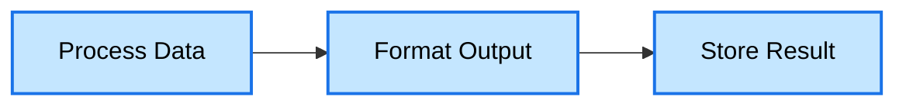
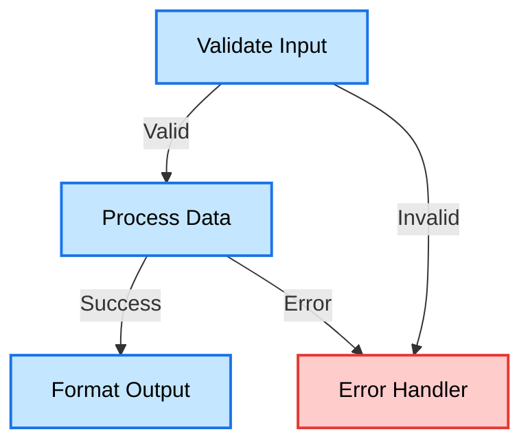
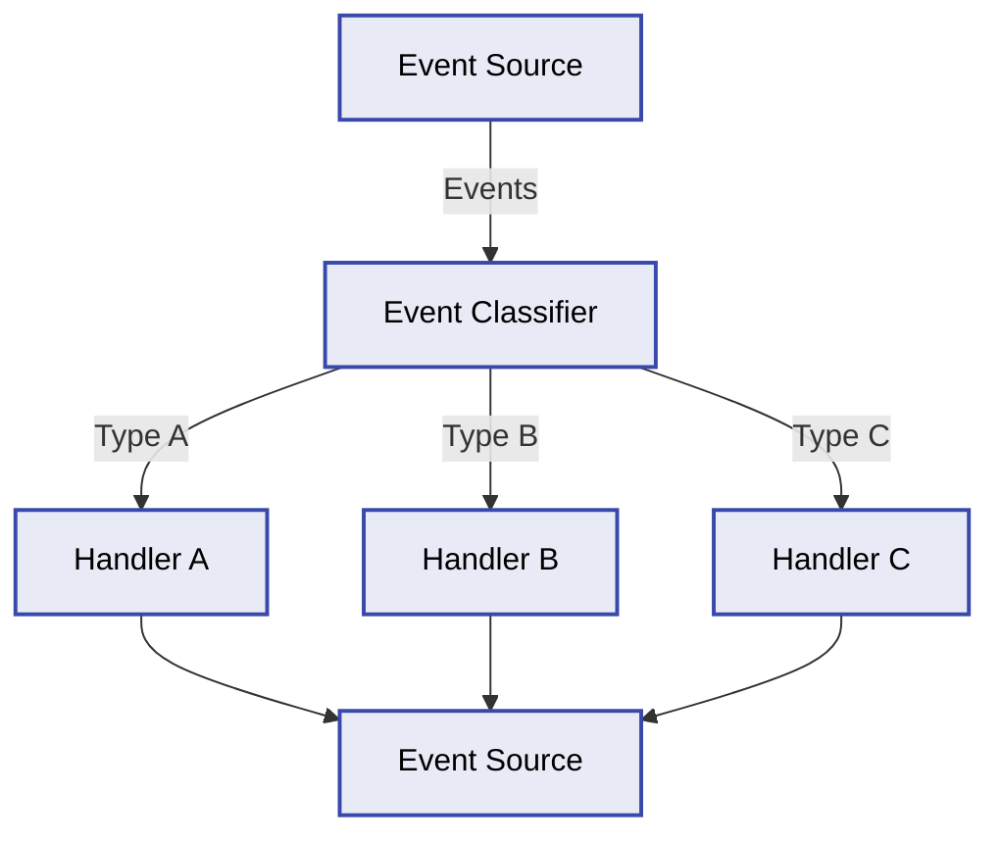
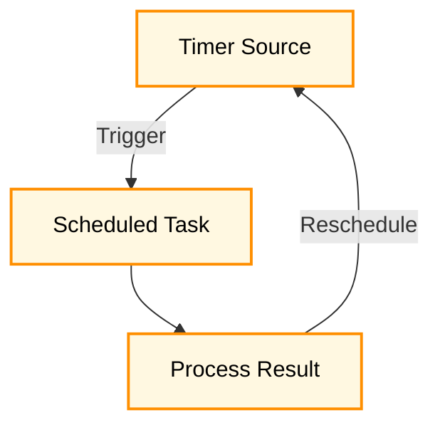
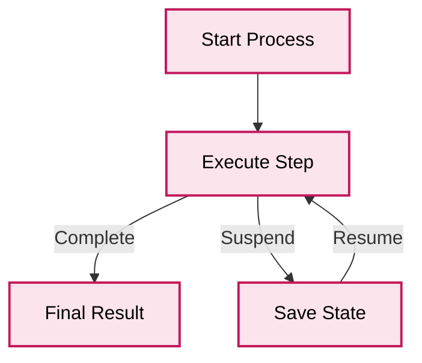
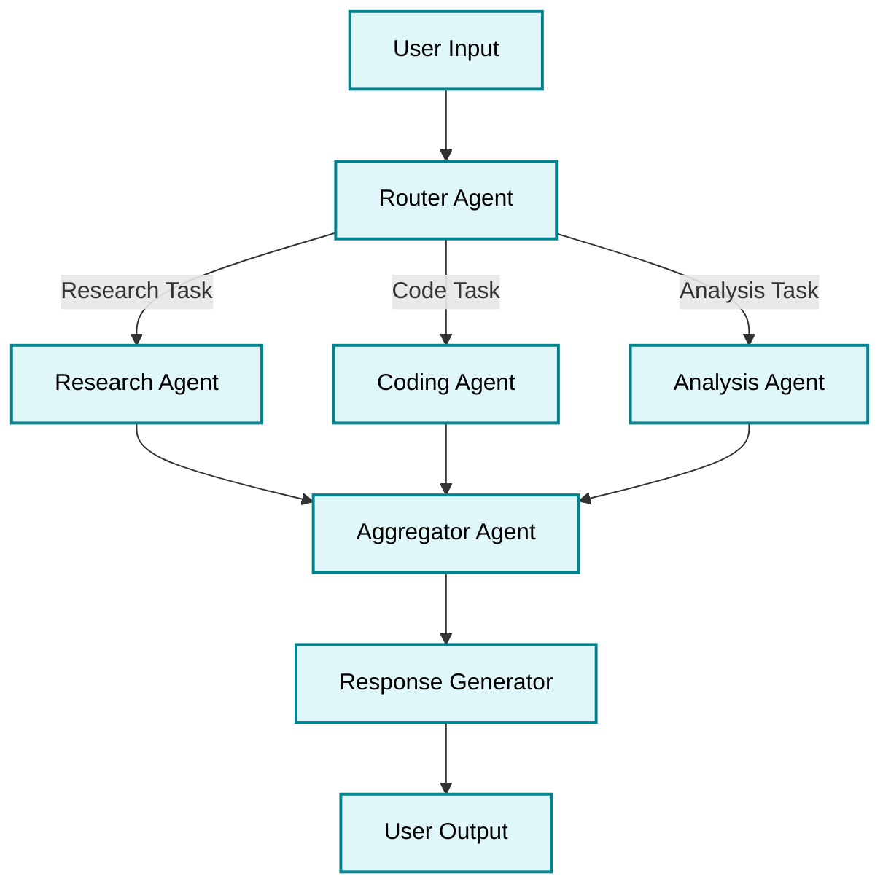

# 🚀 Flowrs: The Power of Workflows in Rust

[](https://github.com/aitoroses/flowrs/actions/workflows/ci.yml)
[](https://crates.io/crates/flowrs-core)
[](https://docs.rs/flowrs-core)
[](https://opensource.org/licenses/MIT)

> A type-safe, composable directed graph workflow system written in Rust.

## 💫 Overview

Flowrs transforms complex workflow orchestration into a delightful experience. Built with Rust's powerful type system at its core, Flowrs provides a flexible, performant, and type-safe way to create sophisticated workflow graphs with crystal-clear transitions between steps.

## ✨ Key Features

- **🔒 Type-Safe By Design**: Leverage Rust's type system for compile-time workflow correctness
- **🧩 Composable Architecture**: Build complex workflows from simple, reusable components
- **⚡ Async First**: Native support for asynchronous execution with Tokio
- **🔄 Advanced Patterns**: Support for batch processing, event-driven workflows, and more
- **💾 State Management**: Built-in serialization for workflow persistence
- **🔍 Observability**: Comprehensive tracing and monitoring capabilities
- **🧪 Testable**: Design your workflows for easy testing and verification

## 📐 Architectural Decisions

This project follows documented architectural decisions recorded in ADRs (Architectural Decision Records). Each ADR captures the context, decision, and consequences of significant architectural choices. The development is guided by an LLM with rules defined in the `.cursorrules` file.

Key architectural decisions include:

- [**Core Framework Abstractions**](https://github.com/aitoroses/flowrs/tree/main/docs/adrs/0003-core-framework-abstractions.md) - Defining the fundamental abstractions like Node, Action, and Workflow with a trait-based approach for type safety and flexibility.

- [**Project Structure and Crate Organization**](https://github.com/aitoroses/flowrs/tree/main/docs/adrs/0002-project-structure-and-crate-organization.md) - Organizing the framework as a Cargo workspace with multiple specialized crates for modularity and separation of concerns.

- [**Async Runtime Selection**](https://github.com/aitoroses/flowrs/tree/main/docs/adrs/0004-async-runtime-selection.md) - Choosing Tokio as the primary async runtime for its comprehensive feature set and wide adoption.

- [**Node Lifecycle Methods**](https://github.com/aitoroses/flowrs/tree/main/docs/adrs/0008-node-lifecycle-methods.md) - Implementing a three-phase lifecycle (prep/exec/post) for workflow nodes to provide clear separation of concerns.

- [**Batch Processing Implementation**](https://github.com/aitoroses/flowrs/tree/main/docs/adrs/0007-batch-processing-implementation.md) - Designing a batch processing system that efficiently handles parallel execution with configurable concurrency limits.

- [**Event-Driven Workflow Pattern**](https://github.com/aitoroses/flowrs/tree/main/docs/adrs/0009-event-driven-workflow-pattern.md) - Extending the framework with event-driven capabilities for handling asynchronous events.

- [**Reactive Node Implementation**](https://github.com/aitoroses/flowrs/tree/main/docs/adrs/0017-reactive-node-implementation.md) - Creating nodes that can respond to changes in external data sources using a stream-based approach.

- [**Timer Node Implementation**](https://github.com/aitoroses/flowrs/tree/main/docs/adrs/0021-timer-node-implementation.md) - Supporting time-based scheduling for workflow execution with various scheduling patterns.

- [**Long-Running Node Implementation**](https://github.com/aitoroses/flowrs/tree/main/docs/adrs/0022-longrunning-node-implementation.md) - Enabling workflows to process work incrementally with state persistence between executions.

## 🚀 Quick Start

Add Flowrs to your project:

```toml
[dependencies]
flowrs = { version = "1.0.0", features = ["transform", "event"] }
```

Create your first workflow:

```rust
use flowrs::{lifecycle_node, LifecycleNode, Workflow, DefaultAction, FlowrsError};
use async_trait::async_trait;
use std::sync::Arc;

// Define your context type
#[derive(Debug, Clone)]
struct MessageContext {
    input: String,
    result: Option<String>,
}

// Create a node using the convenience function
fn create_processor_node() -> impl LifecycleNode<MessageContext, DefaultAction> {
    lifecycle_node(
        Some("processor"), // Node ID
        |ctx: &mut MessageContext| async move {
            // Preparation phase
            println!("Preparing to process: {}", ctx.input);
            Ok(ctx.input.clone())
        },
        |input: String| async move {
            // Execution phase
            println!("Processing message...");
            Ok(format!("✅ Processed: {}", input))
        },
        |_prep, exec_result, ctx: &mut MessageContext| async move {
            // Post-processing phase
            ctx.result = Some(exec_result);
            Ok(DefaultAction::Next)
        },
    )
}

#[tokio::main]
async fn main() -> Result<(), Box<dyn std::error::Error>> {
    // Create a context
    let mut context = MessageContext {
        input: "Hello, Flowrs!".to_string(),
        result: None,
    };

    // Create a node and workflow
    let node = Arc::new(create_processor_node());
    let mut workflow = Workflow::new(node);

    // Execute the workflow
    workflow.execute(&mut context).await?;

    // Print the result
    println!("Result: {:?}", context.result);

    Ok(())
}
```

## 📦 Feature Flags

Flowrs uses feature flags to allow you to include only the functionality you need:

| Feature | Description | Dependencies |
|---------|-------------|-------------|
| `core` | Core abstractions and functionality (default) | None |
| `transform` | Transform node implementations | `core` |
| `event` | Event-driven workflow functionality | `core` |
| `timer` | Time-based workflow functionality | `core` |
| `longrunning` | Long-running process functionality | `core` |
| `reactive` | Reactive workflow functionality | `core` |
| `full` | All features | All of the above |

Example of using specific features:

```toml
# Only include core and transform functionality
flowrs = { version = "1.0.0", features = ["transform"] }

# Include event-driven and timer functionality
flowrs = { version = "1.0.0", features = ["event", "timer"] }

# Include all functionality
flowrs = { version = "1.0.0", features = ["full"] }
```

## 🧩 Workflow Pattern Examples

Flowrs supports a wide variety of workflow patterns through its modular crate system. Each pattern is designed to solve specific workflow challenges:

### 🔄 Simple Chain (Linear Workflow)

A basic sequence of nodes executed one after another. This is the foundation of all workflows.



**Example:** [lifecycle_node.rs](https://github.com/aitoroses/flowrs/tree/main/examples/lifecycle_node.rs)

### 🌲 Conditional Branching

Workflows that make decisions based on context data or node results, directing flow through different paths.



**Example:** [order_processing.rs](https://github.com/aitoroses/flowrs/tree/main/examples/order_processing.rs)

### 🔄 Transform Pipeline

A specialized workflow for data transformation, where each node transforms input to output in a functional style.


**Example:** [transform_node.rs](https://github.com/aitoroses/flowrs/tree/main/examples/transform_node.rs)

### 🔀 Parallel Batch Processing

Process multiple items concurrently with controlled parallelism, ideal for high-throughput data processing.


**Example:** [batch_processing.rs](https://github.com/aitoroses/flowrs/tree/main/examples/batch_processing.rs)

### 📡 Event-Driven Flow

Workflows that respond to external events, ideal for building reactive systems that process events as they arrive.



**Example:** [event_driven_workflow.rs](https://github.com/aitoroses/flowrs/tree/main/examples/event_driven_workflow.rs)

### ⏱️ Time-Based Workflows

Workflows that execute based on time schedules, supporting one-time, interval, and calendar-based scheduling.



**Example:** [timer_node.rs](https://github.com/aitoroses/flowrs/tree/main/examples/timer_node.rs)

### 🔄 Reactive Workflows

Workflows that react to changes in external data sources, such as files, databases, or streams.


**Example:** [reactive_node.rs](https://github.com/aitoroses/flowrs/tree/main/examples/reactive_node.rs)

### ⏸️ Long-Running Processes

Workflows for processes that can be suspended and resumed, with state persistence between executions.



**Example:** [longrunning_node.rs](https://github.com/aitoroses/flowrs/tree/main/examples/longrunning_node.rs)

### 🤖 Multi-Agent LLM System

A workflow pattern for orchestrating multiple AI agents that collaborate to solve complex tasks.



This pattern demonstrates how to build a multi-agent LLM system where specialized agents handle different aspects of a task. Each agent is implemented as a node in the workflow, with the router determining which agents to invoke based on the task requirements. The aggregator combines results from multiple agents before generating the final response.

**Implementation Example:**

```rust
// Define agent context
#[derive(Debug, Clone)]
struct AgentContext {
    user_query: String,
    agent_responses: HashMap<String, String>,
    final_response: Option<String>,
}

// Create router agent node
fn create_router_agent() -> impl LifecycleNode<AgentContext, AgentAction> {
    lifecycle_node(
        Some("router"),
        |ctx: &mut AgentContext| async move {
            // Preparation: analyze the query
            println!("Router analyzing query: {}", ctx.user_query);
            Ok(ctx.user_query.clone())
        },
        |query: String| async move {
            // Execution: determine which agents to invoke
            let requires_research = query.contains("research") || query.contains("information");
            let requires_coding = query.contains("code") || query.contains("program");
            let requires_analysis = query.contains("analyze") || query.contains("evaluate");

            Ok((requires_research, requires_coding, requires_analysis))
        },
        |_prep, (research, coding, analysis), ctx: &mut AgentContext| async move {
            // Post-processing: route to appropriate agents
            if research {
                return Ok(AgentAction::Research);
            } else if coding {
                return Ok(AgentAction::Code);
            } else if analysis {
                return Ok(AgentAction::Analyze);
            }
            Ok(AgentAction::Aggregate) // Default if no specific routing
        },
    )
}

// Similar implementations for research_agent, coding_agent, analysis_agent, and aggregator_agent
```

## 📚 Examples & Documentation

Explore our extensive examples and documentation:

- [Complete API Documentation](https://docs.rs/flowrs-core)
- [Example Workflows](https://github.com/aitoroses/flowrs/tree/main/examples)
- [Architectural Decision Records](https://github.com/aitoroses/flowrs/tree/main/docs/adrs)

Try our examples directly:

```bash
git clone https://github.com/aitoroses/flowrs.git
cd flowrs
cargo run --example lifecycle_node
```

## 🤝 Contributing

We welcome contributions of all kinds! Whether you're fixing a bug, adding a feature, or improving documentation, your help is appreciated.

See our [Contributing Guidelines](CONTRIBUTING.md) for more details on how to get started.

## 📄 License

Flowrs is available under the MIT License - see the [LICENSE](LICENSE) file for details.

## 🙏 Acknowledgments

- The Rust community for their excellent crates and support
- Our amazing contributors who help make Flowrs better every day
<!-- Trigger rebuild: martes, 25 de febrero de 2025, 18:49:33 CET -->
