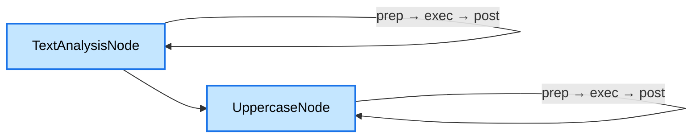
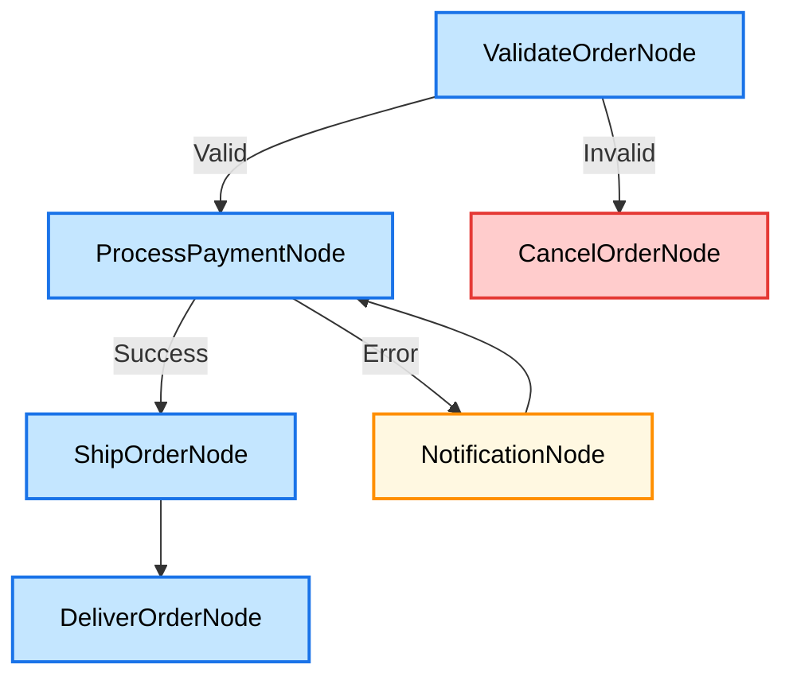
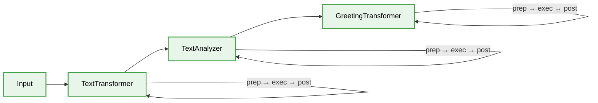
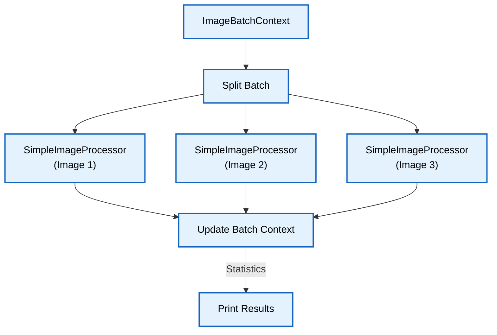
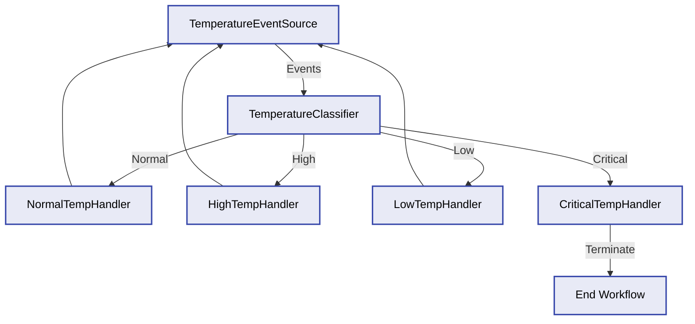
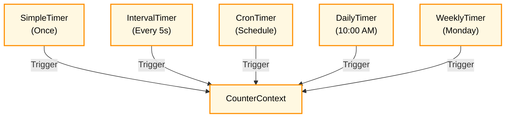
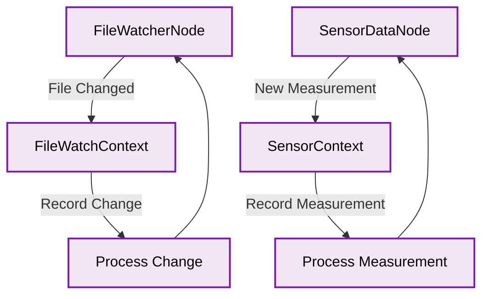
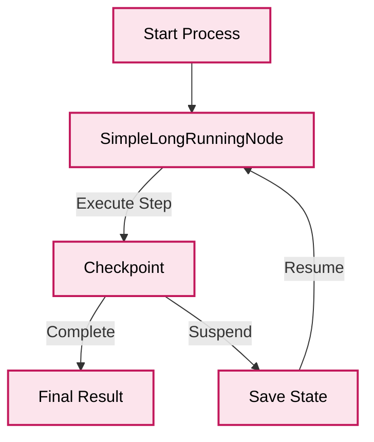
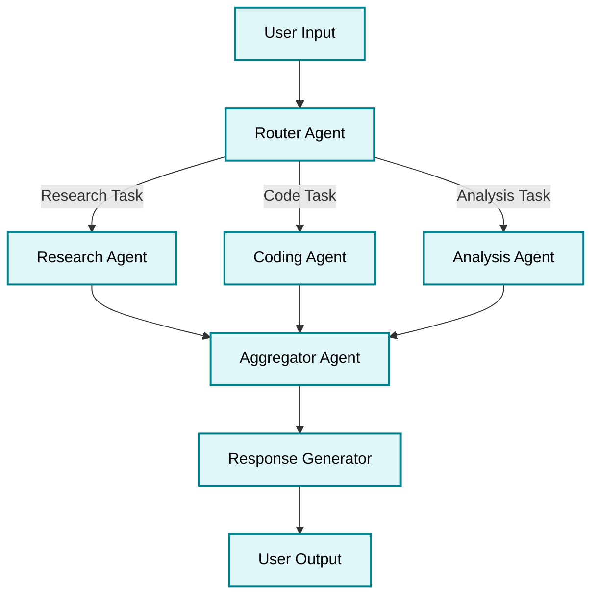

# 🚀 Floxide: The Power of Workflows in Rust

[](https://github.com/aitoroses/floxide/actions/workflows/ci.yml)
[](https://crates.io/crates/floxide-core)
[](https://docs.rs/floxide-core)
[](https://opensource.org/licenses/MIT)

> A type-safe, composable directed graph workflow system written in Rust.

## 💫 Overview

Floxide transforms complex workflow orchestration into a delightful experience. Built with Rust's powerful type system at its core, Floxide provides a flexible, performant, and type-safe way to create sophisticated workflow graphs with crystal-clear transitions between steps.

## ✨ Key Features

- **🔒 Type-Safe By Design**: Leverage Rust's type system for compile-time workflow correctness
- **🧩 Composable Architecture**: Build complex workflows from simple, reusable components
- **⚡ Async First**: Native support for asynchronous execution with Tokio
- **🔄 Advanced Patterns**: Support for batch processing, event-driven workflows, and more
- **💾 State Management**: Built-in serialization for workflow persistence
- **🔍 Observability**: Comprehensive tracing and monitoring capabilities
- **🧪 Testable**: Design your workflows for easy testing and verification

## 📐 Architectural Decisions

Floxide is built on a foundation of carefully considered architectural decisions, each documented in our project documentation. These decisions form the backbone of our design philosophy and guide the evolution of the framework.

### Core Design Philosophy

At the heart of Floxide lies a commitment to **type safety**, **composability**, and **performance**. Our architecture embraces Rust's powerful type system to catch errors at compile time rather than runtime, while providing flexible abstractions that can be composed to create complex workflows.

Key architectural principles include:

- **Trait-based polymorphism** over inheritance
- **Ownership-aware design** that leverages Rust's borrowing system
- **Zero-cost abstractions** that compile to efficient code
- **Explicit error handling** with rich error types
- **Async-first approach** with Tokio integration

### Documentation Resources

For detailed information about Floxide's architecture and implementation:

- **[API Documentation](https://docs.rs/floxide/latest/floxide/)** - Comprehensive Rust API docs with detailed explanations of types, traits, and functions
- **[Project Documentation](https://aitoroses.github.io/floxide/)** - User guides, tutorials, and architectural overviews

Our architecture is not static—it evolves through a rigorous process of evaluation and refinement. Each new feature or enhancement is preceded by careful design consideration that documents the context, decision, and consequences, ensuring that our architectural integrity remains strong as the framework grows.

This approach has enabled us to build a framework that is both powerful and flexible, capable of handling everything from simple linear workflows to complex event-driven systems with parallel processing capabilities.

## 🚀 Quick Start

Add Floxide to your project:

```toml
[dependencies]
floxide = { version = "1.0.0", features = ["transform", "event"] }
```

Create your first workflow:

```rust
use floxide::{lifecycle_node, LifecycleNode, Workflow, DefaultAction, FloxideError};
use async_trait::async_trait;
use std::sync::Arc;

// Define your context type
#[derive(Debug, Clone)]
struct MessageContext {
    input: String,
    result: Option<String>,
}

// Create a node using the convenience function
fn create_processor_node() -> impl LifecycleNode<MessageContext, DefaultAction> {
    lifecycle_node(
        Some("processor"), // Node ID
        |ctx: &mut MessageContext| async move {
            // Preparation phase
            println!("Preparing to process: {}", ctx.input);
            Ok(ctx.input.clone())
        },
        |input: String| async move {
            // Execution phase
            println!("Processing message...");
            Ok(format!("✅ Processed: {}", input))
        },
        |_prep, exec_result, ctx: &mut MessageContext| async move {
            // Post-processing phase
            ctx.result = Some(exec_result);
            Ok(DefaultAction::Next)
        },
    )
}

#[tokio::main]
async fn main() -> Result<(), Box<dyn std::error::Error>> {
    // Create a context
    let mut context = MessageContext {
        input: "Hello, Floxide!".to_string(),
        result: None,
    };

    // Create a node and workflow
    let node = Arc::new(create_processor_node());
    let mut workflow = Workflow::new(node);

    // Execute the workflow
    workflow.execute(&mut context).await?;

    // Print the result
    println!("Result: {:?}", context.result);

    Ok(())
}
```

## 📦 Feature Flags

Floxide uses feature flags to allow you to include only the functionality you need:

| Feature | Description | Dependencies |
|---------|-------------|-------------|
| `core` | Core abstractions and functionality (default) | None |
| `transform` | Transform node implementations | `core` |
| `event` | Event-driven workflow functionality | `core` |
| `timer` | Time-based workflow functionality | `core` |
| `longrunning` | Long-running process functionality | `core` |
| `reactive` | Reactive workflow functionality | `core` |
| `full` | All features | All of the above |

Example of using specific features:

```toml
# Only include core and transform functionality
floxide = { version = "1.0.0", features = ["transform"] }

# Include event-driven and timer functionality
floxide = { version = "1.0.0", features = ["event", "timer"] }

# Include all functionality
floxide = { version = "1.0.0", features = ["full"] }
```

## 🧩 Workflow Pattern Examples

Floxide supports a wide variety of workflow patterns through its modular crate system. Each pattern is designed to solve specific workflow challenges:

### 🔄 Simple Chain (Linear Workflow)

A basic sequence of nodes executed one after another. This is the foundation of all workflows.



**Example:** [lifecycle_node.rs](https://github.com/aitoroses/floxide/blob/main/examples/lifecycle_node.rs) - Demonstrates a workflow with preparation, execution, and post-processing phases.

### 🌲 Conditional Branching

Workflows that make decisions based on context data or node results, directing flow through different paths.



**Example:** [order_processing.rs](https://github.com/aitoroses/floxide/blob/main/examples/order_processing.rs) - Implements a complete order processing workflow with validation, payment, shipping, and error handling.

### 🔄 Transform Pipeline

A specialized workflow for data transformation, where each node transforms input to output in a functional style.



**Examples:** 
- [transform_node.rs](https://github.com/aitoroses/floxide/blob/main/examples/transform_node.rs) - Basic implementation of the Transform Node pattern
- [transform_node.rs](https://github.com/aitoroses/floxide/blob/main/examples/transform_node.rs) - Advanced examples of transform nodes with multiple implementation approaches

### 🔀 Parallel Batch Processing

Process multiple items concurrently with controlled parallelism, ideal for high-throughput data processing.



**Example:** [batch_processing.rs](https://github.com/aitoroses/floxide/blob/main/examples/batch_processing.rs) - Demonstrates parallel processing of images with controlled concurrency and resource management.

### 📡 Event-Driven Flow

Workflows that respond to external events, ideal for building reactive systems that process events as they arrive.



**Example:** [event_driven_workflow.rs](https://github.com/aitoroses/floxide/blob/main/examples/event_driven_workflow.rs) - Implements a temperature monitoring system that processes events from multiple sensors and triggers appropriate actions.

### ⏱️ Time-Based Workflows

Workflows that execute based on time schedules, supporting one-time, interval, and calendar-based scheduling.



**Example:** [timer_node.rs](https://github.com/aitoroses/floxide/blob/main/examples/timer_node.rs) - Shows how to create and use timer nodes with different scheduling options (one-time, interval, and cron).

### 🔄 Reactive Workflows

Workflows that react to changes in external data sources, such as files, databases, or streams.



**Example:** [reactive_node.rs](https://github.com/aitoroses/floxide/blob/main/examples/reactive_node.rs) - Demonstrates how to build reactive nodes that respond to changes in data sources and trigger appropriate actions.

### ⏸️ Long-Running Processes

Workflows for processes that can be suspended and resumed, with state persistence between executions.



**Example:** [longrunning_node.rs](https://github.com/aitoroses/floxide/blob/main/examples/longrunning_node.rs) - Shows how to implement long-running processes with checkpointing and resumption capabilities.

### 🤖 Multi-Agent LLM System

A workflow pattern for orchestrating multiple AI agents that collaborate to solve complex tasks.



This pattern demonstrates how to build a multi-agent LLM system where specialized agents handle different aspects of a task. Each agent is implemented as a node in the workflow, with the router determining which agents to invoke based on the task requirements. The aggregator combines results from multiple agents before generating the final response.

**Implementation Example:**

```rust
// Define agent context
#[derive(Debug, Clone)]
struct AgentContext {
    user_query: String,
    agent_responses: HashMap<String, String>,
    final_response: Option<String>,
}

// Create router agent node
fn create_router_agent() -> impl LifecycleNode<AgentContext, AgentAction> {
    lifecycle_node(
        Some("router"),
        |ctx: &mut AgentContext| async move {
            // Preparation: analyze the query
            println!("Router analyzing query: {}", ctx.user_query);
            Ok(ctx.user_query.clone())
        },
        |query: String| async move {
            // Execution: determine which agents to invoke
            let requires_research = query.contains("research") || query.contains("information");
            let requires_coding = query.contains("code") || query.contains("program");
            let requires_analysis = query.contains("analyze") || query.contains("evaluate");

            Ok((requires_research, requires_coding, requires_analysis))
        },
        |_prep, (research, coding, analysis), ctx: &mut AgentContext| async move {
            // Post-processing: route to appropriate agents
            if research {
                return Ok(AgentAction::Research);
            } else if coding {
                return Ok(AgentAction::Code);
            } else if analysis {
                return Ok(AgentAction::Analyze);
            }
            Ok(AgentAction::Aggregate) // Default if no specific routing
        },
    )
}

// Similar implementations for research_agent, coding_agent, analysis_agent, and aggregator_agent
```

## 📚 Examples & Documentation

Explore our extensive examples and documentation:

- [Complete API Documentation](https://docs.rs/floxide-core)
- [Example Workflows](https://github.com/aitoroses/floxide/tree/main/examples)
- [Architectural Decision Records](https://github.com/aitoroses/floxide/tree/main/docs/adrs)

Try our examples directly:

```bash
git clone https://github.com/aitoroses/floxide.git
cd floxide
cargo run --example lifecycle_node
```

## 🤝 Contributing

We welcome contributions of all kinds! Whether you're fixing a bug, adding a feature, or improving documentation, your help is appreciated.

See our [Contributing Guidelines](CONTRIBUTING.md) for more details on how to get started.

## 📄 License

Floxide is available under the MIT License - see the [LICENSE](LICENSE) file for details.

## 🙏 Acknowledgments

- The Rust community for their excellent crates and support
- Our amazing contributors who help make Floxide better every day
<!-- Trigger rebuild: martes, 25 de febrero de 2025, 18:49:33 CET -->
