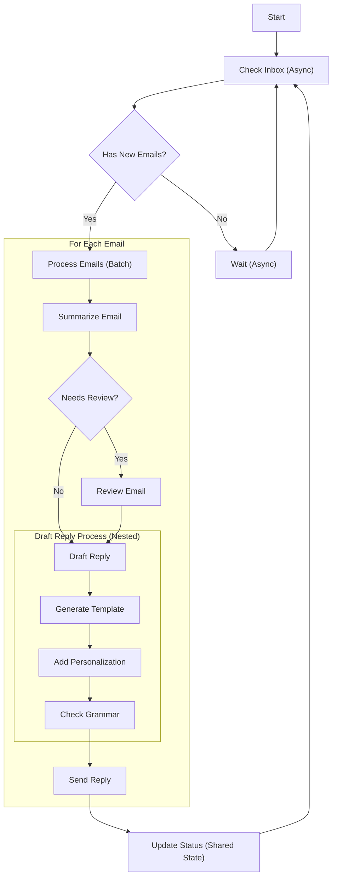

# ADR-0013: Workflow Patterns

## Status

Accepted

## Date

2024-02-25

## Context

The Flowrs framework is designed as a directed graph workflow system that can support various workflow patterns. To provide a comprehensive and flexible framework, we need to define and document the core workflow patterns that the framework will support. These patterns represent common use cases and architectural approaches for building workflows.

Users of the framework need clear guidance on how to implement different types of workflows to solve various business problems. By defining these patterns explicitly, we can ensure the framework's design accommodates all these use cases and provides appropriate abstractions.

## Decision

We will support eight core workflow patterns in the Flowrs framework, each addressing different workflow requirements:

### 1. Node

**Description**: A single step operation that processes input and produces output.

**Implementation**: This is the most basic building block, implemented through the `Node` trait.

```rust
pub trait Node<Context, A: ActionType> {
    type Output;

    async fn process(&self, context: &mut Context) -> Result<NodeOutcome<Self::Output, A>, FlowrsError>;
}
```

**Example Use Case**: A node that summarizes an email as a standalone operation.

### 2. Chain

**Description**: A sequence of connected nodes where the output of one node becomes the input to the next.

**Implementation**: Implemented through the `chain` combinator function that connects nodes sequentially.

```rust
pub fn chain<C, A, N1, N2>(first: N1, second: N2) -> impl Node<C, A>
where
    N1: Node<C, A>,
    N2: Node<C, A>,
    A: ActionType,
{
    // Implementation details
}
```

**Example Use Case**: A workflow that first summarizes an email and then drafts a reply based on that summary.

### 3. Batch

**Description**: Repeats the same processing step across multiple inputs in parallel.

**Implementation**: Implemented through the `BatchFlow` struct that processes multiple contexts with the same node.

```rust
pub struct BatchFlow<N, C, A> {
    node: N,
    _phantom: PhantomData<(C, A)>,
}

impl<N, C, A> BatchFlow<N, C, A>
where
    N: Node<C, A> + Clone,
    C: Clone,
    A: ActionType,
{
    pub fn new(node: N) -> Self {
        // Implementation details
    }

    pub async fn execute_all(&self, contexts: &mut [C]) -> Vec<Result<N::Output, FlowrsError>> {
        // Implementation details
    }
}
```

**Example Use Case**: Summarizing multiple emails simultaneously, improving throughput for repetitive tasks.

### 4. Async

**Description**: Handles operations that involve waiting for I/O or external events.

**Implementation**: Leverages Rust's async/await syntax and the Tokio runtime for asynchronous execution.

```rust
pub async fn execute<C, A>(&self, context: &mut C) -> Result<Self::Output, FlowrsError>
where
    A: ActionType,
{
    // Implementation details with async/await
}
```

**Example Use Case**: Checking an inbox (which involves I/O wait) and then processing new emails when they arrive.

### 5. Shared

**Description**: Enables communication between nodes through shared state.

**Implementation**: Uses shared references or Arc<Mutex<T>> for state that needs to be accessed by multiple nodes.

```rust
pub struct SharedState<T> {
    inner: Arc<Mutex<T>>,
}

impl<T> SharedState<T> {
    pub fn new(value: T) -> Self {
        // Implementation details
    }

    pub async fn read<F, R>(&self, f: F) -> R
    where
        F: FnOnce(&T) -> R,
    {
        // Implementation details
    }

    pub async fn write<F, R>(&self, f: F) -> R
    where
        F: FnOnce(&mut T) -> R,
    {
        // Implementation details
    }
}
```

**Example Use Case**: The "Summarize Email" node writes an email summary to a shared state, and the "Draft Reply" node reads from that shared state rather than receiving direct input from the previous node.

### 6. Branch

**Description**: Implements conditional logic to determine the next step based on certain criteria.

**Implementation**: Uses the `ActionType` enum to determine which branch to take based on the node outcome.

```rust
pub fn branch<C, A, N1, N2, N3>(
    condition_node: N1,
    true_branch: N2,
    false_branch: N3,
) -> impl Node<C, A>
where
    N1: Node<C, A, Output = bool>,
    N2: Node<C, A>,
    N3: Node<C, A>,
    A: ActionType,
{
    // Implementation details
}
```

**Example Use Case**: After summarizing an email, we determine if it needs review. If it does, it goes to the "Review" node and then to "Draft Reply" after approval. If review is not needed, it goes directly to "Draft Reply".

### 7. Nesting

**Description**: Allows workflows to be composed of other workflows, creating reusable components.

**Implementation**: Workflows can be nested by creating a node that contains another workflow.

```rust
pub struct NestedWorkflow<W, C, A> {
    workflow: W,
    _phantom: PhantomData<(C, A)>,
}

impl<W, C, A> Node<C, A> for NestedWorkflow<W, C, A>
where
    W: Workflow<C, A>,
    A: ActionType,
{
    type Output = W::Output;

    async fn process(&self, context: &mut C) -> Result<NodeOutcome<Self::Output, A>, FlowrsError> {
        // Implementation details
    }
}
```

**Example Use Case**: A "Coding Task" node that triggers a nested workflow for software development. This nested workflow includes writing tests, writing code, verifying code, and analyzing complexity.

### 8. Looping

**Description**: Implements repetitive processes that continue until a condition is met.

**Implementation**: Uses recursion or a loop combinator to repeat a node until a condition is met.

```rust
pub fn loop_until<C, A, N, F>(
    node: N,
    condition: F,
) -> impl Node<C, A>
where
    N: Node<C, A> + Clone,
    F: Fn(&N::Output) -> bool + Send + Sync + 'static,
    A: ActionType,
{
    // Implementation details
}
```

**Example Use Case**: A long-running workflow that starts with "Get Question", proceeds to "Answer Question", and then loops back to "Get Question" to continue the cycle indefinitely.

## Pattern Composition

A key architectural decision is to support the composition of these patterns to create more complex workflows. The framework is designed to allow these patterns to be combined in various ways:

### Composition Strategies

1. **Hierarchical Composition**: Patterns can be nested within each other, such as a Branch pattern within a Loop, or a Chain within a Nested workflow.

2. **Sequential Composition**: Patterns can be chained together, with the output of one pattern becoming the input to another.

3. **Parallel Composition**: Multiple patterns can be executed in parallel using the Batch pattern.

4. **State-Sharing Composition**: Different patterns can communicate through shared state.

### Common Composition Patterns

Based on real-world use cases, we've identified several common composition patterns:

1. **Chain + Branch**: Create sequential workflows with decision points

   ```rust
   let workflow = chain(
       summarize_email_node,
       branch(
           needs_review_node,
           review_node,
           draft_reply_node
       )
   );
   ```

2. **Batch + Async**: Process multiple items in parallel while handling I/O operations

   ```rust
   let batch_workflow = BatchFlow::new(
       async_node(check_inbox_and_process)
   );
   ```

3. **Nesting + Shared**: Build reusable workflow components that communicate through shared state

   ```rust
   let shared_state = SharedState::new(EmailSummary::default());

   let nested_workflow = NestedWorkflow::new(
       chain(
           write_to_shared_state(shared_state.clone(), summarize_email_node),
           read_from_shared_state(shared_state, draft_reply_node)
       )
   );
   ```

4. **Looping + Branch**: Implement iterative processes with exit conditions
   ```rust
   let workflow = loop_until(
       chain(
           get_question_node,
           answer_question_node,
           branch(
               is_final_question_node,
               complete_node,
               continue_node
           )
       ),
       |outcome| outcome.is_complete()
   );
   ```

### Implementation Considerations

When implementing pattern composition, we need to ensure:

1. **Type Safety**: Composed patterns should maintain Rust's strong type safety.
2. **Error Propagation**: Errors should propagate correctly through composed patterns.
3. **Performance**: Composition should not introduce significant overhead.
4. **Readability**: The API for composing patterns should be intuitive and readable.

## Visual Workflow Representation

An important aspect of workflow design is the ability to visualize workflows. We've decided to adopt a standardized visual representation for each pattern to help users design and communicate their workflow architectures:

### Visual Pattern Language

Each pattern has a distinct visual representation:

1. **Node**: Single rectangle labeled with the operation (e.g., "Summarize Email") and noted as "Single step"

2. **Chain**: Connected rectangles with directional arrows (e.g., "Summarize Email" → "Draft Reply") and noted as "Multiple steps"

3. **Batch**: Multiple stacked rectangles representing parallel instances of the same node (e.g., stacked "Summarize Email" boxes) and noted as "Repeat steps"

4. **Async**: Rectangle with a clock icon indicating waiting for events (e.g., "Check Inbox" with clock) and noted as "I/O wait"

5. **Shared**: Connected nodes with a dashed rectangle for shared state and dotted arrows indicating read/write operations (e.g., "Email summary" state between nodes with write/read arrows) and noted as "Communication"

6. **Branch**: Node with multiple outgoing paths based on conditions (e.g., "Need review" vs. direct paths) and noted as "Conditional step"

7. **Nesting**: Node that expands to reveal a contained workflow within a dashed border (e.g., "Coding Task" expanding to reveal test/code/verify/analyze steps) and noted as "Reusable step"

8. **Looping**: Nodes with return arrows forming a cycle (e.g., "Get Question" → "Answer Question" with return arrow) and noted as "Long running step"

For paradigm patterns, we use additional visual indicators:

1. **Workflow**: Simple directed path with sequential nodes, labeled "Directed Path"

2. **Map-Reduce**: Batch + Merge pattern showing data chunking, parallel processing, and result aggregation

3. **Chat**: Single node with self-loop and shared state for history, labeled "Loop (+ chat history store)"

4. **RAG**: Nodes with vector database as shared state, labeled "(+ Vector DB store)"

5. **Chain of Thought**: Single node with self-loop and history tracking, labeled "Loop (+ think history store)"

6. **Agent**: Nodes with branching and feedback loops, labeled "Loop + Branching"

7. **Multi-Agent**: Complex interconnected graph with shared pub/sub communication, labeled "Loop + Branching (+ pub/sub)"

8. **Supervisor**: Nested workflow with approval/rejection paths, labeled "Nesting"

### Complex Workflow Example

Here's an example of a complex email processing workflow that combines multiple patterns:



This visualization demonstrates how multiple patterns can be combined to create a comprehensive workflow solution.

### Benefits of Visual Representation

1. **Communication**: Facilitates discussion about workflow design among team members
2. **Documentation**: Provides clear documentation of workflow architecture
3. **Design**: Helps identify optimization opportunities and potential issues
4. **Onboarding**: Makes it easier for new developers to understand existing workflows

### Implementation

While the framework itself doesn't include visualization tools, we recommend using Mermaid or similar tools to create workflow diagrams following our visual pattern language. These diagrams can be included in documentation and design discussions.

## Paradigm Patterns

In addition to the core workflow patterns, we recognize that the framework will be used to implement specialized workflow types for AI and automation applications. These specialized workflows can be built by combining the core patterns in specific ways:

### 1. Standard Workflow

**Description**: Simple directed path workflow with sequential processing.

**Implementation**: Primarily uses the Chain pattern for a direct processing path.

**Example Use Case**: Email processing with "Summarize Email" followed by "Draft Reply".

### 2. Chat Workflow

**Description**: Looping conversation flow with state management for chat history.

**Implementation**: Combines Looping pattern with Shared State to maintain conversation context.

**Example Use Case**: Chat system with a single "Chat" node that loops back to itself, writing to and reading from a "chat history" shared store.

### 3. RAG (Retrieval Augmented Generation)

**Description**: Workflows that integrate document storage and retrieval for question answering.

**Implementation**: Combines Shared State (for vector database) with processing nodes for upload and question answering.

**Example Use Case**: A system with "Upload documents" node that writes to a "Vector DB" shared store, and an "Answer Questions" node that reads from it.

### 4. Chain of Thought (CoT)

**Description**: Single "thinking" step that loops and maintains reasoning history.

**Implementation**: Combines Looping with Shared State to store thinking steps and intermediate reasoning.

**Example Use Case**: Reasoning system with a single "Think" node that loops back to itself, writing to and reading from a "think history" shared store.

### 5. Map Reduce

**Description**: Batch processing of data chunks followed by aggregation of results.

**Implementation**: Combines Batch (for mapping chunks) with a reduction node that aggregates results.

**Example Use Case**: System that uses "Map Chunks" to distribute work to multiple "Summarize Chunk" operations in parallel, then aggregates results with "Reduce Summaries".

### 6. Agent

**Description**: Autonomous workflows with branching decision logic and feedback loops.

**Implementation**: Combines Looping and Branch patterns to create a decision-action cycle.

**Example Use Case**: Email processing agent that summarizes an email, branches to either "Review" or "Draft Reply" based on content, and continues processing.

### 7. Multi-agent

**Description**: Complex interconnected workflows with multiple processing nodes and publish/subscribe communication.

**Implementation**: Uses multiple Node workflows with pub/sub shared state for coordination and communication.

**Example Use Case**: Distributed system where multiple nodes communicate through a shared pub/sub message bus, creating a complex processing graph.

### 8. Supervisor

**Description**: Nested workflows with oversight that can approve or reject work.

**Implementation**: Combines Nesting pattern with Branch for approval/rejection decisions.

**Example Use Case**: Quality control system where a "Supervise" node reviews the output of a nested workflow and can either approve it to continue or reject it back for rework.

## Consequences

### Positive

1. **Comprehensive Framework**: By supporting these eight patterns, Flowrs can address a wide range of workflow requirements.
2. **Clear Documentation**: Explicitly defining these patterns provides clear guidance to users on how to implement different types of workflows.
3. **Consistent Design**: Having these patterns defined upfront ensures the framework's design is consistent and accommodates all these use cases.
4. **Flexibility**: The combination of these patterns allows for complex workflow designs that can solve real-world problems.

### Negative

1. **Implementation Complexity**: Supporting all these patterns increases the complexity of the framework implementation.
2. **Learning Curve**: Users need to understand multiple patterns to effectively use the framework.
3. **Maintenance Overhead**: More patterns mean more code to maintain and test.

### Neutral

1. **Pattern Combinations**: These patterns can be combined in various ways, which provides flexibility but also requires careful design.
2. **Performance Considerations**: Different patterns may have different performance characteristics that users need to be aware of.

## Alternatives Considered

1. **Simplified Pattern Set**: We considered supporting fewer patterns for simplicity, but decided that the comprehensive set provides more value to users.
2. **Different Implementation Approaches**: For each pattern, we considered multiple implementation approaches before settling on the current design.
3. **External DSL**: We considered creating an external DSL for workflow definition but decided that a code-based approach using Rust's type system provides better safety and flexibility.

## References

- [Workflow Patterns Initiative](http://www.workflowpatterns.com/)
- [Enterprise Integration Patterns](https://www.enterpriseintegrationpatterns.com/)
- [Rust Async Book](https://rust-lang.github.io/async-book/)
