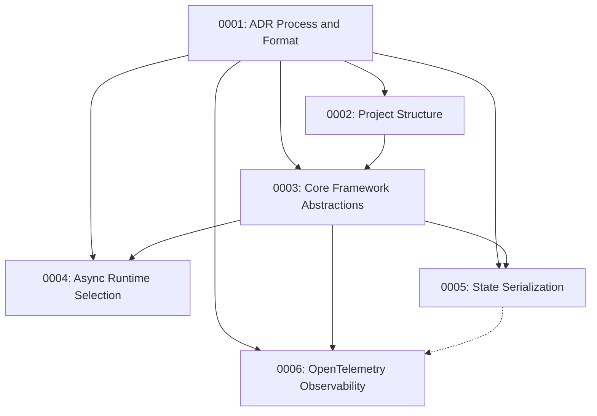

# Architectural Decision Records (ADRs)

This directory contains the Architectural Decision Records (ADRs) for the flowrs framework. ADRs document significant architectural decisions, their context, and their consequences.

## Index of ADRs

| ADR                                                     | Title                                           | Status   | Date       | Summary                                                                             |
| ------------------------------------------------------- | ----------------------------------------------- | -------- | ---------- | ----------------------------------------------------------------------------------- |
| [ADR-0007](0007-batch-processing-implementation.md)     | Batch Processing Implementation                 | Accepted | 2024-02-25 | Defines the approach for parallel batch processing using Tokio tasks and semaphores |
| [ADR-0008](0008-node-lifecycle-methods.md)              | Node Lifecycle Methods                          | Accepted | 2024-02-25 | Defines the three-phase lifecycle (prep/exec/post) for nodes and adapter patterns   |
| [ADR-0009](0009-cloneable-traits-for-batch-contexts.md) | Cloneable Types for Batch Processing            | Accepted | 2024-02-25 | Requires item types in batch processing to implement Clone                          |
| [ADR-0010](0010-workflow-cloning-strategy.md)           | Workflow Cloning Strategy                       | Accepted | 2024-02-25 | Defines an approach for cloning workflows using Arc<dyn Node>                       |
| [ADR-0011](0011-closure-lifetime-management.md)         | Closure Lifetime Management in Async Contexts   | Accepted | 2024-02-25 | Outlines strategies for managing lifetimes in async closures                        |
| [ADR-0012](0012-test-implementation-patterns.md)        | Testing Patterns for Async Node Implementations | Accepted | 2024-02-26 | Defines patterns for testing async code with concrete trait implementations         |

## How to Create a New ADR

1. Copy the template from `adr-template.md` to `####-descriptive-title.md` where `####` is the next available number
2. Fill in the sections: Status, Context, Decision, Consequences, etc.
3. Add the new ADR to the index table above
4. Submit the ADR for review before implementing significant changes

## ADR Format

Each ADR follows this structure:

- **Title**: Clear, descriptive title prefixed with the ADR number
- **Status**: Proposed, Accepted, Deprecated, or Superseded
- **Date**: When the ADR was created
- **Context**: Problem description and background information
- **Decision**: The solution that addresses the context
- **Consequences**: Positive and negative effects of the decision
- **Alternatives Considered**: Other approaches that were evaluated
- **Implementation Notes**: Practical guidance for implementers

## ADR Process

1. **Proposal**: Create a new ADR describing the architectural change
2. **Discussion**: Review the ADR with the team
3. **Acceptance**: Mark as Accepted once consensus is reached
4. **Implementation**: Build according to the accepted ADR
5. **Maintenance**: Update the ADR if understanding evolves

## Overview

These ADRs document the key architectural decisions made during the development of the flowrs framework. Each ADR provides context, the decision made, consequences, and alternatives considered.

## Index

1. [ADR-0001: ADR Process and Format](0001-adr-process-and-format.md)

   - Establishes the format and process for creating and maintaining ADRs
   - Serves as a template for all future ADRs

2. [ADR-0002: Project Structure and Crate Organization](0002-project-structure-and-crate-organization.md) _(Accepted)_

   - Defines the Cargo workspace structure
   - Establishes crate boundaries and relationships

3. [ADR-0003: Core Framework Abstractions](0003-core-framework-abstractions.md) _(Accepted)_

   - Documents the core traits and structs that form the framework's foundation
   - Defines the Node trait with a single process method
   - Establishes ActionType as a trait for user-defined action types
   - Provides a practical example of using type-safe action types in a workflow

4. [ADR-0004: Async Runtime Selection](0004-async-runtime-selection.md) _(Accepted)_

   - Justifies the selection of Tokio with full features
   - Documents the use of async_trait for trait methods
   - Establishes patterns for async execution

5. [ADR-0005: State Serialization and Deserialization](0005-state-serialization-deserialization.md) _(Accepted)_

   - Defines how workflow state is serialized for persistence and restoration
   - Establishes storage abstractions for workflow snapshots
   - Provides mechanisms for workflow checkpointing and resumption

6. [ADR-0006: Workflow Observability](0006-workflow-observability.md) _(Accepted)_
   - Adopts OpenTelemetry as the primary observability solution
   - Designs an event-based system integrated with OpenTelemetry traces and metrics
   - Provides tools for debugging, monitoring, and visualizing workflow execution

## ADR Statuses

- **Proposed**: Initial draft state
- **Accepted**: Approved for implementation
- **Rejected**: Declined, with reasons documented
- **Superseded**: Replaced by a newer ADR
- **Amended**: Modified after implementation
- **Discarded**: Determined to be unnecessary or redundant

## Process

Please refer to [ADR-0001](0001-adr-process-and-format.md) for details on how ADRs are created, reviewed, and maintained in this project.

## Relationships

_Note: This diagram shows the dependencies between ADRs. Each subsequent ADR builds upon the decisions established in the previous ones. The dotted line indicates that the observability system can utilize the state serialization system for event persistence._
