# Flowrs Version Bump and Release Process

```mermaid
flowchart TD
    A[Developer initiates version bump] --> B[Update workspace.package.version in Cargo.toml]
    B --> C1[Run update_subcrate_versions.sh script]
    C1 --> C2[Script ensures all subcrates use workspace inheritance]
    C2 --> D[Run update_dependency_versions.sh script]
    D --> E[Script updates all internal dependency versions]
    E --> F[Commit changes and create git tag]
    F --> G[Push tag to GitHub]
    
    G --> H[GitHub Actions workflow triggered by tag]
    
    H --> I[Checkout code at tag ref]
    I --> J[Verify tag version matches Cargo.toml version]
    J --> K[Run tests with all features]
    K --> L1[Run update_subcrate_versions.sh again]
    L1 --> L2[Run update_dependency_versions.sh again]
    
    L2 --> M[Publish flowrs-core subcrate]
    M --> N[Wait for crates.io indexing]
    N --> O[Publish flowrs-transform subcrate]
    O --> P[Wait for crates.io indexing]
    P --> Q[Publish flowrs-event subcrate]
    Q --> R[Wait for crates.io indexing]
    R --> S[Publish flowrs-timer subcrate]
    S --> T[Wait for crates.io indexing]
    T --> U[Publish flowrs-longrunning subcrate]
    U --> V[Wait for crates.io indexing]
    V --> W[Publish flowrs-reactive subcrate]
    W --> X[Wait for crates.io indexing]
    
    X --> Y[Publish root flowrs crate]
    Y --> Z[Create GitHub Release]
```

## Explanation

### 1. Version Bump Phase (Local Development)

- **Developer initiates version bump**: When it's time for a new release, a developer updates the version in the workspace.
- **Update workspace.package.version**: The version is updated in the `[workspace.package]` section of the root Cargo.toml.
- **Run update_subcrate_versions.sh**: This script ensures all subcrates use workspace inheritance for their versions.
- **Run update_dependency_versions.sh**: This script updates all internal dependency versions in the root Cargo.toml to match the workspace version.
- **Commit and tag**: Changes are committed and a git tag (e.g., `v1.0.3`) is created.
- **Push tag**: The tag is pushed to GitHub, which triggers the release workflow.

### 2. Release Workflow (CI/CD)

- **Workflow triggered**: The GitHub Actions workflow is triggered by the new tag.
- **Checkout code**: The workflow checks out the code at the tag reference.
- **Verify versions**: It verifies that the tag version matches the version in Cargo.toml.
- **Run tests**: All tests are run with all features enabled to ensure everything works.
- **Run update scripts again**: Both scripts are run again to ensure all versions are correct.

### 3. Publication Phase (CI/CD)

- **Publish subcrates in order**: The workflow publishes each subcrate in a specific order:
  1. `flowrs-core`
  2. `flowrs-transform`
  3. `flowrs-event`
  4. `flowrs-timer`
  5. `flowrs-longrunning`
  6. `flowrs-reactive`
- **Wait for indexing**: After each subcrate is published, the workflow waits for crates.io to index it.
- **Publish root crate**: Finally, the root `flowrs` crate is published, which depends on all the subcrates.
- **Create GitHub Release**: A GitHub Release is created with release notes.

### Key Points

1. **Version Synchronization**: The scripts ensure all versions are synchronized:
   - Subcrates use workspace inheritance (`version.workspace = true`)
   - Root crate dependencies have explicit versions that match the workspace version
2. **Publication Order**: Subcrates must be published before the root crate to ensure dependencies are available on crates.io.
3. **Waiting Periods**: The workflow includes waiting periods to allow crates.io to index each published crate.
4. **Verification**: The workflow verifies that the tag version matches the Cargo.toml version to prevent mismatches.

This process ensures that all crates in the workspace are published with consistent versions and that dependencies are available when needed during the publication process. 