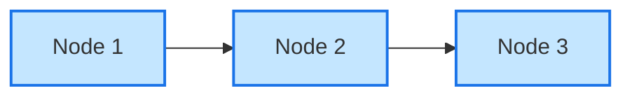
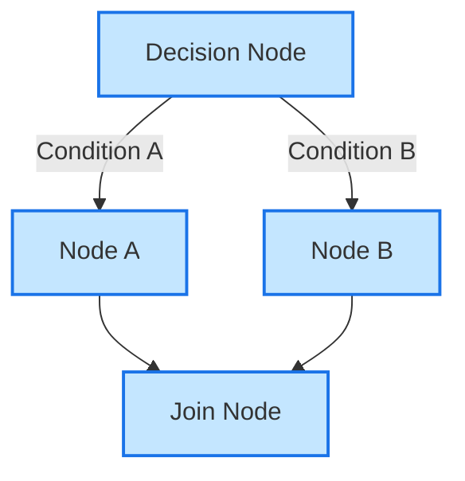
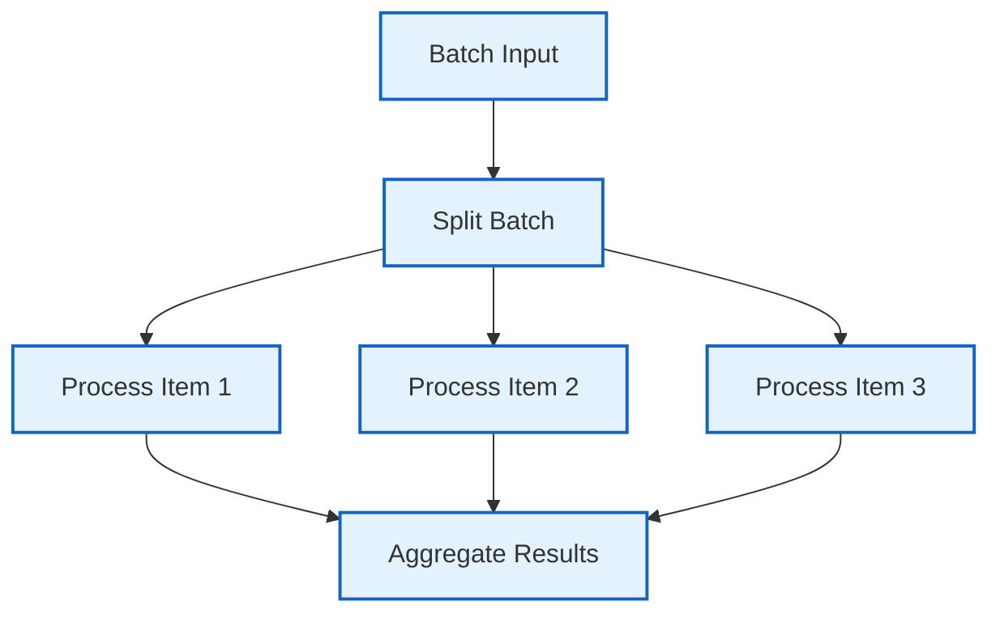
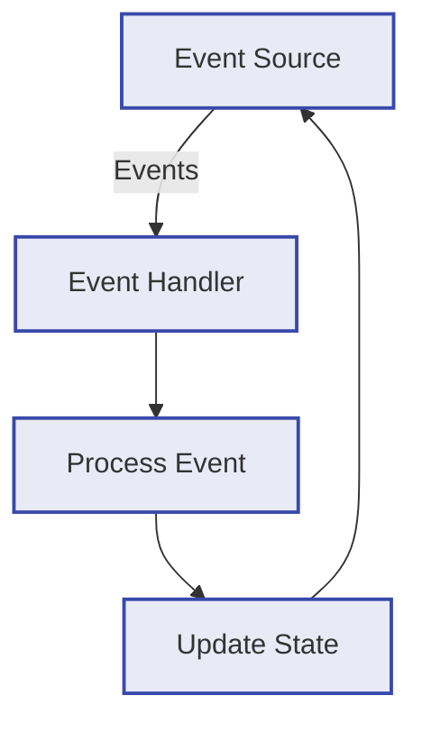

# Core Concepts Overview

Floxide is built around a set of core concepts that form the foundation of the framework. Understanding these concepts is essential for effectively using Floxide to build workflows.

## Key Abstractions

Floxide is designed with a trait-based architecture that provides flexibility and type safety. The key abstractions are:

### Nodes

[Nodes](nodes.md) are the fundamental building blocks of workflows. Each node represents a discrete unit of work that can be executed as part of a workflow. Nodes implement the `Node` trait, which defines the interface for executing a node.

The most common type of node is the `LifecycleNode`, which follows a three-phase lifecycle:

1. **Preparation**: Extract data from the context
2. **Execution**: Process the data
3. **Post-processing**: Update the context with the result and determine the next action

### Workflows

[Workflows](workflows.md) orchestrate the execution of nodes. A workflow is a directed graph of nodes, where the edges represent transitions between nodes. Workflows are responsible for:

- Managing the execution flow between nodes
- Handling errors and retries
- Providing observability and monitoring

### Actions

[Actions](actions.md) determine the flow of execution in a workflow. After a node completes its execution, it returns an action that indicates what should happen next. Actions can be:

- `Next`: Continue to the next node in the workflow
- `Branch`: Take a specific branch in the workflow
- `Stop`: Stop the workflow execution
- Custom actions: User-defined actions for specific workflow patterns

### Contexts

[Contexts](contexts.md) hold the state of a workflow execution. Each workflow operates on a context, which is passed from node to node. Contexts are user-defined types that implement the necessary traits for the workflow to operate on them.

## Workflow Patterns

Floxide supports various workflow patterns through its modular crate system:

### Linear Workflows

The simplest workflow pattern is a linear sequence of nodes, where each node is executed in order.

### Conditional Branching

Workflows can include conditional branching, where the execution path depends on the result of a node.

### Batch Processing

Batch processing allows for parallel execution of nodes on a collection of items.

### Event-Driven Workflows

Event-driven workflows respond to external events, allowing for reactive systems.

## Type Safety

One of the key features of Floxide is its emphasis on type safety. The framework leverages Rust's type system to ensure that:

- Nodes can only be connected if their input and output types are compatible
- Actions are type-checked at compile time
- Contexts are properly typed for each node in the workflow

This type safety helps catch errors at compile time rather than runtime, leading to more robust workflows.

## Async Execution

Floxide is built with asynchronous execution in mind. All node execution is asynchronous, allowing for efficient handling of I/O-bound operations. The framework uses Tokio as its async runtime, providing a solid foundation for concurrent execution.

## Next Steps

Now that you understand the core concepts of Floxide, you can explore each concept in more detail:

- [Nodes](nodes.md): Learn about the different types of nodes and how to create them
- [Workflows](workflows.md): Understand how to build and execute workflows
- [Actions](actions.md): Explore how actions control the flow of execution
- [Contexts](contexts.md): Learn how to define and use contexts in your workflows
