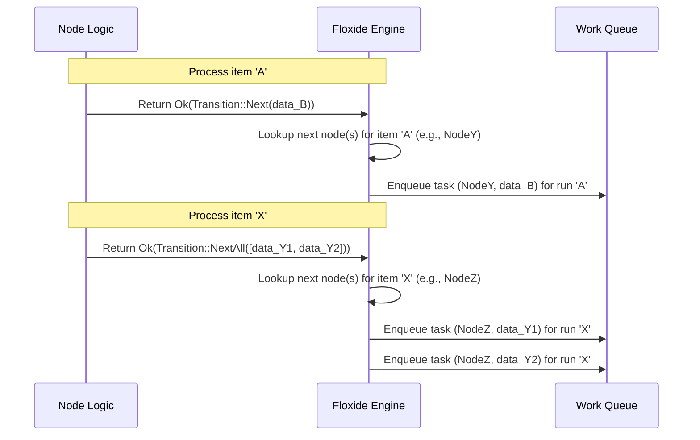

# Chapter 1: `Transition` Enum

Welcome to the Floxide tutorial! Floxide is designed to make building distributed workflows easy. Imagine you have a complex task, like processing a large video file. You might break it down into steps: download the video, extract audio, generate subtitles, re-encode, and upload. Floxide helps you define these steps and run them, potentially across many computers working together. This "distributed" nature is Floxide's superpower!

In this first chapter, we'll look at a fundamental building block: the `Transition` enum.

## What's the Big Idea? Controlling the Flow

Think about an assembly line in a factory. Each station performs a task on an item. When a worker finishes their task, they need to signal what should happen next.

*   Should the item move to the *next* station?
*   Did the task produce *multiple* items that need to go to the next stations? (Maybe splitting a large task?)
*   Does the item need to *wait* at the current station?
*   Did something go *wrong*, requiring the whole line to stop?

In Floxide, each step in your workflow is called a "Node" (we'll cover this in the [next chapter](02__node__trait____node___macro_.md)). When a Node finishes processing an item, it needs to signal the outcome, just like the assembly line worker. This signal is represented by the `Transition` enum. It tells the Floxide engine how the workflow should proceed.

## The `Transition` Enum: Signals for Your Workflow

The `Transition` enum has four possible variants, each representing a different signal:

1.  **`Transition::Next(output)`**: "All good! Pass this single item to the next step(s)."
    *   **Analogy:** The worker finishes assembling a part and puts the single completed part onto the conveyor belt for the next station.
    *   `output`: This is the data produced by the current Node that the next Node(s) will receive as input.

2.  **`Transition::NextAll(outputs)`**: "I've split the work! Send each of these multiple items to the next step(s)."
    *   **Analogy:** The worker takes a large sheet of metal, cuts it into several smaller pieces, and puts *all* those pieces onto the belt for the next stations.
    *   `outputs`: This is a `Vec` (a list) of data items. Floxide will typically create a separate task for *each* item in the list, potentially running them in parallel across different workers. This is key for distributed processing!
    *   **Distributed Emphasis:** This is how you can achieve parallelism. One Node can generate many pieces of work to be processed independently.

3.  **`Transition::Hold`**: "Wait! Keep this item here for now."
    *   **Analogy:** The worker needs to wait for glue to dry or for another part to arrive before continuing. The item stays at their station.
    *   The workflow pauses processing for *this specific item* at this Node. It might be resumed later (though mechanisms for resumption are more advanced topics).

4.  **`Transition::Abort(error)`**: "Emergency Stop! Something went wrong."
    *   **Analogy:** The worker discovers a critical defect or their machine breaks down. They hit the emergency stop button for the whole assembly line.
    *   `error`: Contains information about what went wrong.
    *   This typically stops the execution of the entire workflow run associated with this item.

## How Do Nodes Use `Transition`?

Nodes are the individual processing steps in your workflow. In Floxide, a Node is essentially a function (or more precisely, an object with a processing method) that takes some input and returns a `Result` containing a `Transition`.

Let's imagine a very simple Node that just adds 1 to a number.

```rust
use floxide_core::transition::Transition;
use floxide_core::error::FloxideError;

// This is a simplified function representing a Node's logic.
// It takes an input number `i32`.
// It returns Ok(Transition<i32>) on success or Err(FloxideError) on failure.
fn process_number(input: i32) -> Result<Transition<i32>, FloxideError> {
    let result = input + 1;
    println!("Processed {} -> {}", input, result);

    // Signal that processing is done, and pass the 'result' to the next step.
    Ok(Transition::Next(result))
}

// --- Example Usage ---
let outcome = process_number(5);
// outcome will be Ok(Transition::Next(6))
println!("{:?}", outcome);
```

This simple function calculates `result` and then returns `Ok(Transition::Next(result))`. This tells the Floxide engine: "Success! The result is `6`. Send this value (`6`) to the next Node(s) in the workflow."

Now, let's see how other transitions might look:

**Example: Returning `NextAll` (Splitting Work)**

Imagine a Node that takes a sentence and splits it into words.

```rust
use floxide_core::transition::Transition;
use floxide_core::error::FloxideError;

// Simplified Node logic: takes a sentence, returns individual words.
fn split_sentence(sentence: String) -> Result<Transition<String>, FloxideError> {
    let words: Vec<String> = sentence.split_whitespace().map(String::from).collect();

    if words.is_empty() {
        // If there are no words, maybe that's an error condition?
        Err(FloxideError::Generic("Input sentence was empty".to_string()))
    } else {
        println!("Splitting '{}' into: {:?}", sentence, words);
        // Signal to send *each word* as a separate item to the next step(s).
        Ok(Transition::NextAll(words))
    }
}

// --- Example Usage ---
let outcome = split_sentence("Floxide is distributed".to_string());
// outcome will be Ok(Transition::NextAll(vec!["Floxide".to_string(), "is".to_string(), "distributed".to_string()]))
println!("{:?}", outcome);
```

Here, `Transition::NextAll(words)` tells the engine: "I've produced multiple results (`Floxide`, `is`, `distributed`). Create separate tasks for each of these and send them to the next Node(s)." This is powerful for distributing the processing of each word.

**Example: Returning `Abort`**

```rust
use floxide_core::transition::Transition;
use floxide_core::error::FloxideError;

// Simplified Node logic: checks if a number is too large.
fn check_number(input: i32) -> Result<Transition<i32>, FloxideError> {
    if input > 100 {
        println!("Input {} is too large! Aborting.", input);
        // Signal that a critical error occurred.
        Ok(Transition::Abort(FloxideError::Generic("Value exceeded threshold".to_string())))
    } else {
        println!("Input {} is okay. Proceeding.", input);
        // Signal to proceed normally.
        Ok(Transition::Next(input)) // Pass the original input along
    }
}

// --- Example Usage ---
let outcome1 = check_number(50);  // Ok(Transition::Next(50))
let outcome2 = check_number(150); // Ok(Transition::Abort(FloxideError::Generic(...)))
println!("Outcome 1: {:?}", outcome1);
println!("Outcome 2: {:?}", outcome2);
```

If the input is too large, `Transition::Abort` signals that the workflow run should stop due to an error.

## How Floxide Uses the `Transition` Signal

So, your Node returns a `Transition`. What does the Floxide engine *do* with it?

1.  **Receive:** The engine calls your Node's processing logic and gets back the `Result<Transition<Output>, FloxideError>`.
2.  **Check Result:** It first checks if the `Result` itself is an `Err`. If so, it usually treats it like an `Abort`.
3.  **Interpret Transition:** If the `Result` is `Ok(transition)`, the engine looks at the `transition` variant:
    *   **`Next(output)`:** The engine looks up which Node(s) should run next according to your workflow definition ([`workflow!` macro](04__workflow__trait____workflow___macro_.md)). It then prepares a new task for the next Node(s), giving them the `output` data. In a distributed setup, it might place this task onto a shared [`WorkQueue`](05__workqueue__trait_.md).
    *   **`NextAll(outputs)`:** Similar to `Next`, but it iterates through the `outputs` list. For *each* item in the list, it prepares a new task for the next Node(s) and adds it to the [`WorkQueue`](05__workqueue__trait_.md). This fans out the work.
    *   **`Hold`:** The engine notes that this item is paused at this Node. No further tasks are scheduled for this item immediately.
    *   **`Abort(error)`:** The engine stops processing for this specific workflow run. It logs the error (perhaps using a distributed [`ErrorStore`](09_distributed_stores___runinfostore____metricsstore____errorstore____livenessstore____workitemstatestore___.md)) and potentially cleans up resources.

Here's a simplified diagram showing how the engine reacts to `Next` and `NextAll`:



This diagram illustrates how `Next` leads to one new task, while `NextAll` leads to multiple new tasks, enabling parallel and distributed execution.

## Under the Hood: The Enum Definition

The actual definition in Floxide is straightforward:

```rust
// From: crates/floxide-core/src/transition.rs

/// Transition result of a node.
pub enum Transition<Output> {
    /// Emit a single output to successors.
    Next(Output),
    /// Emit multiple outputs to successors (split / fan-out).
    NextAll(Vec<Output>),
    /// Hold this work item; do not emit any outputs until a condition is met.
    Hold,
    /// Abort the workflow with an error.
    Abort(crate::error::FloxideError),
}
```

*   It's a standard Rust `enum`.
*   It's generic over `<Output>`. This means the `Next` and `NextAll` variants can carry any type of data needed for the next step, as long as that type is specified by the Node. `Hold` and `Abort` don't carry a successful output, so they don't use the `Output` type.
*   `Abort` carries a `FloxideError`, which is Floxide's standard error type.

## Conclusion

The `Transition` enum is the fundamental way that individual steps (Nodes) in a Floxide workflow communicate their outcome and control the flow of execution. By returning `Next`, `NextAll`, `Hold`, or `Abort`, a Node tells the Floxide engine whether to proceed with a single item, split the work into multiple items (crucial for distributed processing), pause, or stop due to an error.

Now that you understand how a Node signals its result, let's dive into how to actually define these Nodes!

**Next:** [Chapter 2: `Node` Trait & `node!` Macro](02__node__trait____node___macro_.md)
