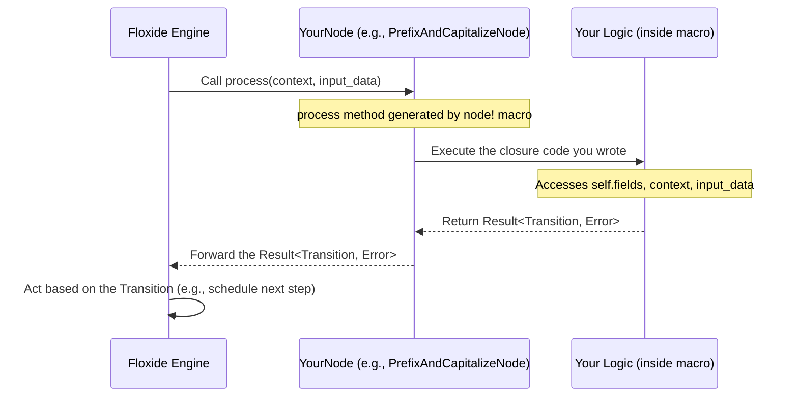

# Chapter 2: `Node` Trait & `node!` Macro

In the [previous chapter](01__transition__enum_.md), we learned about the `Transition` enum, which is like a signal sent by a workflow step to tell the Floxide engine what to do next. Now, let's talk about the *source* of that signal: the **Node**.

## What's the Problem? Defining the Steps

Imagine our video processing workflow again: Download -> Extract Audio -> Generate Subtitles -> Re-encode -> Upload. Each of these actions is a distinct step. We need a way to define:

1.  What specific task does this step perform? (e.g., "Extract Audio")
2.  What kind of data does it need to start? (e.g., a path to the downloaded video file)
3.  What kind of data does it produce? (e.g., a path to the extracted audio file)
4.  Does it need any shared information? (e.g., API keys for an external service)

In Floxide, the **`Node`** is the fundamental building block that represents exactly such a single, self-contained step or task within your workflow. Think of it as one specific station on our distributed assembly line.

## What is a `Node`?

A `Node` is essentially a piece of code that:

*   **Receives an input:** The data it needs to work on.
*   **Performs processing:** Runs its specific logic (like capitalizing text, calling an API, processing a file chunk).
*   **Uses Context (Optional):** Might access shared information available to the whole workflow run (we'll cover this in detail in [Chapter 3: `WorkflowCtx` & `Context` Trait](03__workflowctx_____context__trait_.md)).
*   **Returns a `Transition`:** Signals the outcome ([`Transition::Next(output)`](01__transition__enum_.md), [`Transition::NextAll(outputs)`](01__transition__enum_.md), etc.), potentially including the output data for the next step(s).

**Distributed Emphasis:** Each `Node` defines a unit of work. When you run a Floxide workflow, especially in a distributed manner, different Nodes (or different instances of the same Node processing different data items) can be executed by different [`DistributedWorker`](07__distributedworker__.md) processes, potentially running on separate machines. This is how Floxide distributes the workload.

## The `Node` Trait: The Blueprint

How does Floxide know what a "Node" looks like? It uses a Rust `trait`. A trait is like a contract or a blueprint that defines a set of methods a type must implement. The `Node` trait specifies the core functionality required for any workflow step.

The most important part of the `Node` trait is the `process` method signature (simplified):

```rust
// Simplified concept
trait Node<Context> {
    type Input;  // What data type does this Node expect?
    type Output; // What data type does this Node produce?

    // The core logic: takes context and input, returns a Transition
    async fn process(&self, ctx: &Context, input: Self::Input)
        -> Result<Transition<Self::Output>, FloxideError>;
}
```

This tells us:

*   A `Node` is associated with a specific `Context` type (shared info).
*   It defines an `Input` type and an `Output` type.
*   It has an `async fn process` method. This method:
    *   Is `async` because Nodes often perform I/O (like network requests or file access) which benefits from asynchronous execution.
    *   Receives a reference to the `Context` (`ctx`) and the `Input` data (`input`).
    *   Returns a `Result` which, on success (`Ok`), contains a [`Transition`](01__transition__enum_.md) carrying the `Output` data, or an `Err` containing a `FloxideError` if something went wrong during processing.

You *could* implement this trait manually for your structs, but Floxide provides a much easier way!

## The `node!` Macro: Your Node-Building Assistant

Manually implementing the `Node` trait for every step can be repetitive. Floxide offers the `node!` macro to streamline this process significantly. It lets you define the Node's structure (its data fields), its input/output types, the context it needs, and its processing logic all in one place.

Here's the basic syntax:

```rust
// General syntax of the node! macro
node! {
  // 1. Define the struct (visibility, name, fields)
  pub struct MyNode {
    // Fields store configuration or state for this node instance
    config_value: String,
    retry_count: u32,
  }
  // 2. Specify the Context type this node needs
  context = MyWorkflowContext;
  // 3. Specify the Input data type
  input   = InputDataType;
  // 4. Specify the Output data type (inside Transition::Next/NextAll)
  output  = OutputDataType;

  // 5. Define the processing logic as a closure
  // |context_arg, input_arg| -> Result<Transition<OutputDataType>, FloxideError>
  |ctx, data| {
    // Access node fields using `self.field_name`
    println!("Config: {}", self.config_value);

    // Access context using the `ctx` argument
    // let shared_info = ctx.get_shared_info();

    // Access input using the `data` argument
    println!("Processing input: {:?}", data);

    // --- Your Node's specific logic goes here ---
    let result = perform_task(data)?; // Example task

    // Return a Transition
    Ok(Transition::Next(result))
  }
}
```

Let's break down the key parts:

1.  **Struct Definition:** `pub struct MyNode { ... }` defines a regular Rust struct. You can add fields here to store configuration specific to this Node instance (like an API key, a file path template, retry settings, etc.).
2.  **`context = Type;`**: Specifies the type of the shared workflow context this Node expects. We'll cover context in the [next chapter](03__workflowctx_____context__trait_.md). For simple nodes, you might use `()` (the unit type, meaning no context).
3.  **`input = Type;`**: Specifies the data type the `process` logic will receive as input.
4.  **`output = Type;`**: Specifies the data type that will be inside the `Transition::Next` or `Transition::NextAll` if the Node succeeds.
5.  **Processing Logic Closure:** `|ctx, data| { ... }` is where you write the core logic of your Node.
    *   The arguments (`ctx`, `data`) give you access to the workflow context and the input data. Their types match what you specified in `context = ...` and `input = ...`.
    *   Inside the closure, you can access the Node's own fields using `self` (e.g., `self.config_value`).
    *   The closure *must* return a `Result<Transition<OutputType>, FloxideError>`, matching the `Node` trait's `process` signature.

## Example: A Simple `CapitalizeTextNode`

Let's create a Node that takes a `String`, capitalizes it, and passes it on.

```rust
// Needed imports for the example
use floxide::node; // The macro itself
use floxide::Node; // The trait (needed for type bounds)
use floxide::Context; // Trait for context types
use floxide::Transition; // The enum from Chapter 1
use floxide::FloxideError; // Standard error type

// Define a simple empty context struct (more in Chapter 3)
#[derive(Clone, Debug)]
struct SimpleContext {}
impl Context for SimpleContext {} // Mark it as a valid context type

// Use the node! macro to define our capitalizing node
node! {
  pub struct CapitalizeTextNode {} // No fields needed for this simple node
  context = SimpleContext; // Uses our simple context
  input   = String;        // Expects a String as input
  output  = String;        // Produces a String as output

  // The processing logic:
  |ctx, text| { // We get context (ctx) and input (text)
    println!("Node: Capitalizing '{}'", text);
    let capitalized_text = text.to_uppercase();

    // Signal success and pass the capitalized text to the next step
    Ok(Transition::Next(capitalized_text))
  }
}

// --- How you might use it (conceptual) ---
// let node_instance = CapitalizeTextNode {};
// let context_instance = SimpleContext {};
// let input_data = "hello distributed world".to_string();
//
// // Floxide engine would call this internally:
// // let result = node_instance.process(&context_instance, input_data).await;
// // result would be Ok(Transition::Next("HELLO DISTRIBUTED WORLD".to_string()))
```

**Explanation:**

1.  We define `CapitalizeTextNode` with no fields.
2.  We specify it uses `SimpleContext` (an empty context for now), takes a `String` input, and produces a `String` output.
3.  The closure `|ctx, text| { ... }` receives the context and the input string (`text`).
4.  Inside, it performs the `to_uppercase()` operation.
5.  It returns `Ok(Transition::Next(capitalized_text))`, signaling success and providing the result for the next Node(s).

**Distributed Emphasis:** When this `CapitalizeTextNode` is part of a larger workflow, the Floxide engine can schedule its execution. If you use `Transition::NextAll` in a *previous* node to generate many strings, the engine could potentially run multiple instances of `CapitalizeTextNode` in parallel on different workers, each capitalizing a different string.

## Example: Using Node Fields for Configuration

Let's make the previous example slightly more complex. We'll add a prefix that the Node should add before capitalizing. This prefix will be stored in a field.

```rust
use floxide::{node, Node, Context, Transition, FloxideError};

#[derive(Clone, Debug)]
struct SimpleContext {}
impl Context for SimpleContext {}

node! {
  // Define the struct with a field
  pub struct PrefixAndCapitalizeNode {
    prefix: String, // Store the prefix here
  }
  context = SimpleContext;
  input   = String;
  output  = String;

  |ctx, text| {
    // Access the node's field using `self.prefix`
    println!("Node: Adding prefix '{}' and capitalizing '{}'", self.prefix, text);
    let combined = format!("{}: {}", self.prefix, text);
    let result = combined.to_uppercase();

    Ok(Transition::Next(result))
  }
}

// --- How you might use it (conceptual) ---
// let node_instance = PrefixAndCapitalizeNode {
//     prefix: "LOG".to_string(), // Configure the node instance!
// };
// let context_instance = SimpleContext {};
// let input_data = "task completed".to_string();
//
// // Floxide engine calls:
// // let result = node_instance.process(&context_instance, input_data).await;
// // result would be Ok(Transition::Next("LOG: TASK COMPLETED".to_string()))
```

**Explanation:**

1.  We added a `prefix: String` field to the `PrefixAndCapitalizeNode` struct definition within the macro.
2.  Inside the processing logic closure, we can now access this field using `self.prefix`.
3.  When creating an instance of this Node (`PrefixAndCapitalizeNode { ... }`), we provide the specific prefix value. This allows different instances of the same *type* of Node to behave differently based on their configuration.

## Under the Hood: What Does `node!` Do?

The `node!` macro is a piece of "metaprogramming" – code that writes code. When you use `node!`, the Rust compiler expands it into more detailed code *before* compiling the rest of your program.

Essentially, `node!` generates two main things:

1.  **The Struct:** The `pub struct YourNodeName { ... }` definition you provided.
2.  **The `impl Node` Block:** It automatically writes the `impl Node<ContextType> for YourNodeName { ... }` block for you. It fills in the `Input` and `Output` associated types and creates the `async fn process(...)` method, placing the closure code you wrote inside that method's body.

Here's a simplified view of the generated code for `PrefixAndCapitalizeNode`:

```rust
// --- Code GENERATED by the `node!` macro (conceptual) ---

// 1. The struct definition
#[derive(Clone, Debug)] // Attributes added by the macro
pub struct PrefixAndCapitalizeNode {
    pub prefix: String, // Fields become public
}

// 2. The implementation of the Node trait
#[::async_trait::async_trait] // Macro adds async_trait support
impl ::floxide_core::node::Node<SimpleContext> for PrefixAndCapitalizeNode
where
    SimpleContext: Clone + Send + Sync // Adds necessary trait bounds
{
    type Input = String;   // Sets the Input type
    type Output = String;  // Sets the Output type

    // Defines the process method
    async fn process(
        &self, // `self` gives access to fields like `self.prefix`
        ctx: &SimpleContext, // Context argument
        text: String       // Input argument (matches `input = ...`)
    ) -> Result<::floxide_core::transition::Transition<String>, ::floxide_core::error::FloxideError>
    {
        // Your closure code is placed inside here!
        let ctx = ctx; // Makes args available by original names
        let text = text;

        // --- Your logic from the macro ---
        println!("Node: Adding prefix '{}' and capitalizing '{}'", self.prefix, text);
        let combined = format!("{}: {}", self.prefix, text);
        let result = combined.to_uppercase();
        Ok(Transition::Next(result))
        // --- End of your logic ---
    }
}
// --- End of generated code ---
```

You don't need to write this boilerplate code yourself; the `node!` macro handles it for you!

Here's a diagram showing how the engine interacts with a Node created by the macro:



The actual macro implementation lives in `floxide-macros/src/node.rs` and the `Node` trait definition is in `floxide-core/src/node.rs`.

## Conclusion

The `Node` is the core unit of work in a Floxide workflow, representing a single processing step. The `Node` trait defines the contract for these steps, specifying their input, output, context needs, and the essential `process` method.

While you can implement the `Node` trait manually, the `node!` macro provides a convenient and concise way to define a Node's structure (fields) and its processing logic all at once, generating the necessary boilerplate code for you. These Nodes are the building blocks that Floxide can distribute across different workers for parallel execution.

Now that we know how to define individual steps (Nodes), how do they access shared information relevant to the entire workflow run? That's where context comes in.

**Next:** [Chapter 3: `WorkflowCtx` & `Context` Trait](03__workflowctx_____context__trait_.md)
