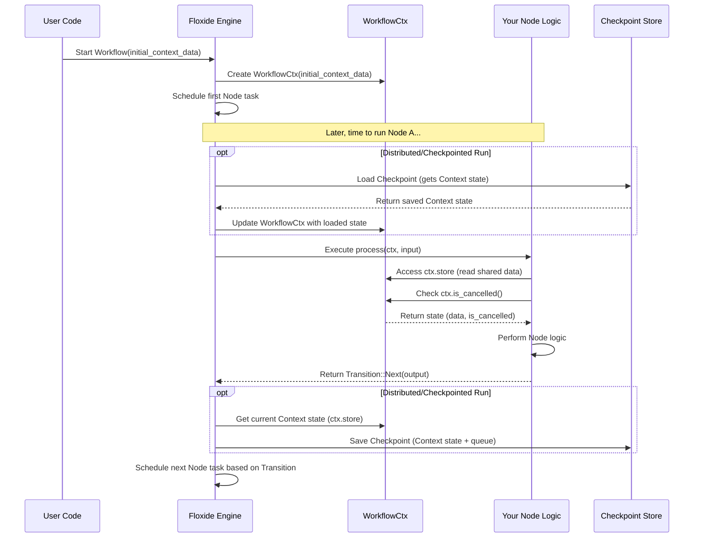

# Chapter 3: `WorkflowCtx` & `Context` Trait

In the [previous chapter](02__node__trait____node___macro_.md), we learned how to define individual steps in our workflow using the `Node` trait and the handy `node!` macro. Each Node performs a specific task. But what if different Nodes in our workflow need to access the same piece of information, or share some common resources?

Imagine our video processing workflow again. Maybe multiple steps (Nodes) need the same API key to talk to an external service, or perhaps we want to keep a running count of processed frames across different steps. How can we share this information safely, especially when our workflow might be running distributed across many computers?

This is where the concepts of `Context` and `WorkflowCtx` come in!

## What's the Problem? Sharing Information Between Steps

Think of our distributed assembly line. Each worker (Node) operates independently, maybe even in different buildings (computers).

*   How do they all know which *version* of the product they are building? (Shared configuration)
*   How do they access shared tools, like a specific calibration device? (Shared resources like database connections)
*   How does the manager tell everyone to stop if there's a major issue? (Cancellation signal)
*   How do we ensure everyone finishes before a deadline? (Timeout)

We need a mechanism for:

1.  **Shared Data/Resources:** A common place to store information that all Nodes in a *single run* of the workflow might need.
2.  **Control Signals:** Ways to manage the workflow run as a whole, like stopping it early.

Floxide provides this through the `Context` trait and the `WorkflowCtx` struct.

## The `Context` Trait: Your Shared Toolbox Blueprint

The `Context` trait itself is very simple. It doesn't *define* what goes into the shared toolbox, it just marks a Rust struct or type as *being suitable* to be used *as* the shared toolbox content for a workflow run.

**You**, the developer, define the actual struct that holds the shared data. This struct needs to implement certain standard Rust traits (like `Clone`, `Debug`, `Serialize`, `Deserialize`, `Send`, `Sync`, `Default`) so that Floxide can manage it effectively. Why?

*   `Clone`: Floxide might need to copy the context.
*   `Serialize`/`Deserialize`: Crucial for **distributed workflows**! The context needs to be saved (checkpointed) and potentially sent over the network to different workers. Serde is the standard Rust library for this.
*   `Send`/`Sync`: Necessary for safely using the context across different threads or async tasks.
*   `Default`: Needed to create an initial empty context when a workflow starts.

Luckily, if your context struct only contains fields that *also* satisfy these traits, you can often just derive them!

```rust
// Needed imports for Serde and Floxide's Context trait
use serde::{Serialize, Deserialize};
use floxide_core::context::Context; // The trait itself

// Define YOUR shared data structure
#[derive(Clone, Debug, Default, Serialize, Deserialize)]
pub struct MyWorkflowData {
    api_key: String,
    processed_items_count: u32,
    // Add any other shared data your nodes need
}

// By deriving the traits above, MyWorkflowData automatically
// satisfies the requirements of the Context trait!
// Floxide provides a "blanket implementation":
// impl<T: Default + ...> Context for T {}
// So, we don't need to write `impl Context for MyWorkflowData {}` explicitly.
```

In this example, `MyWorkflowData` is our custom "toolbox". It holds an API key and a counter. Because we used `#[derive(...)]`, it meets the requirements to be used as a Floxide `Context`.

## `WorkflowCtx`: The Toolbox Holder with Controls

Okay, so we've defined *what* goes in our shared toolbox (`MyWorkflowData`). Now, how does Floxide manage it and add those control signals (like cancellation)?

Floxide wraps your custom `Context` type inside its own struct called `WorkflowCtx<C>`. Think of `WorkflowCtx` as the manager holding your toolbox (`C` represents *your* context type, like `MyWorkflowData`) and also carrying walkie-talkies (cancellation) and a stopwatch (timeout).

Here's a conceptual look at `WorkflowCtx`:

```rust
// Simplified structure of WorkflowCtx
pub struct WorkflowCtx<C: Context> { // Generic over YOUR context type C
    // 1. Your shared data store
    pub store: C,

    // 2. Cancellation signal (like a walkie-talkie)
    cancel: CancellationToken, // From the 'tokio-util' crate

    // 3. Optional overall deadline (stopwatch)
    timeout: Option<Duration>,
}
```

**Key Parts:**

1.  `store: C`: This public field holds the actual instance of *your* `Context` struct (e.g., an instance of `MyWorkflowData`). Nodes will access your shared data through `ctx.store`.
2.  `cancel: CancellationToken`: This is used internally to signal if the workflow should be stopped prematurely. Nodes can check this token.
3.  `timeout: Option<Duration>`: An optional overall time limit for the workflow run.

**Distributed Emphasis:** When a workflow step runs on a remote worker, Floxide ensures that worker gets the *correct* `WorkflowCtx`, including the potentially updated `store` (often loaded from a [`Checkpoint` & `CheckpointStore` Trait](06__checkpoint_____checkpointstore__trait_.md)) and the shared cancellation signal. This allows coordination across the distributed system.

## How Nodes Use `WorkflowCtx`

Remember the `node!` macro from [Chapter 2](02__node__trait____node___macro_.md)? We specified the context type there:

```rust
use floxide::node;
use floxide::Transition;
use floxide::FloxideError;
use serde::{Serialize, Deserialize};
use floxide_core::context::Context; // Make sure Context is in scope

// Our custom context from before
#[derive(Clone, Debug, Default, Serialize, Deserialize)]
pub struct MyWorkflowData {
    api_key: String,
    processed_items_count: u32,
}

// Let's define a Node that uses this context
node! {
  pub struct ProcessDataItemNode {
    // Node-specific config, if any
    item_multiplier: u32,
  }
  // *** Tell the node which context type to expect ***
  context = MyWorkflowData;
  input   = i32; // Example input: some data value
  output  = ();  // Example output: nothing significant

  // The closure now receives `WorkflowCtx<MyWorkflowData>` as `ctx`
  |ctx, data_value| {
    // --- Accessing Context Data ---
    // Get read-only access to the shared store
    let current_count = ctx.store.processed_items_count;
    let api_key = &ctx.store.api_key; // Borrow the API key

    println!("Node: Processing value {}. Current count: {}. Using API key starting with: {}",
        data_value,
        current_count,
        api_key.chars().take(5).collect::<String>() // Show first 5 chars
    );

    // --- Using Context Control Features ---
    // Check if the workflow run has been cancelled elsewhere
    if ctx.is_cancelled() {
        println!("Node: Workflow cancelled, stopping processing.");
        // Abort this step if cancellation was requested
        return Err(FloxideError::Cancelled);
    }

    // --- Node's Own Logic ---
    // Do some work... (using api_key if needed)
    let _work_result = data_value * self.item_multiplier;
    println!("Node: Finished processing value {}.", data_value);

    // --- Modifying Context (Important!) ---
    // To modify context, you often need mutable access.
    // Direct mutation `ctx.store.counter += 1` might not work directly
    // depending on how the context is shared (Arc, Mutex etc.).
    // Floxide's checkpointing mechanism is the standard way state
    // changes are saved and propagated in distributed runs.
    // For simplicity here, we'll assume direct modification is possible,
    // BUT be aware this requires careful handling in real apps.
    // A common pattern involves using helper types like SharedState or
    // ensuring the context is checkpointed after modification.

    // *Conceptual* update (real implementation might differ):
    // let mut mutable_store = ctx.store.clone(); // Clone to modify
    // mutable_store.processed_items_count += 1;
    // // The engine needs to save this updated context later (checkpointing)

    // For this example, let's just signal completion
    Ok(Transition::Next(())) // Pass nothing significant forward
  }
}
```

**Explanation:**

1.  **`context = MyWorkflowData;`**: We tell `node!` that `ProcessDataItemNode` expects a context of type `MyWorkflowData`.
2.  **`|ctx, data_value|`**: The first argument to our processing closure is `ctx`. Its type is `&WorkflowCtx<MyWorkflowData>`.
3.  **`ctx.store.field_name`**: We access our shared data fields (like `processed_items_count` and `api_key`) through `ctx.store`.
4.  **`ctx.is_cancelled()`**: We can call methods on `WorkflowCtx` itself, like `is_cancelled()`, to check the global state of the workflow run. This allows a Node to stop early if requested.
5.  **Modifying Context**: Modifying shared state, especially in a distributed system, is complex. Simply changing `ctx.store.processed_items_count` in one worker might not be seen by others unless the change is saved (checkpointed) and reloaded. Floxide manages this propagation primarily through its checkpointing system ([`Checkpoint` & `CheckpointStore` Trait](06__checkpoint_____checkpointstore__trait_.md)).

## How `WorkflowCtx` Enables Distribution

1.  **Serialization:** Because your `Context` struct must be `Serialize` and `Deserialize`, Floxide can save its state (along with the state of the queue) to a [`CheckpointStore`](06__checkpoint_____checkpointstore__trait_.md).
2.  **State Loading:** When a [`DistributedWorker`](07__distributedworker__.md) picks up a task, it can load the latest relevant checkpoint, which includes the state of your `Context` (`store`) at that point in the workflow. This ensures the worker has the necessary shared information.
3.  **Cancellation Propagation:** The `CancellationToken` mechanism within `WorkflowCtx` can be triggered externally (e.g., by an orchestrator). While the token itself might not be directly serialized easily across process boundaries, the *state* (cancelled or not) can be checked when loading checkpoints or communicated through other means managed by Floxide's distributed components. When a worker checks `ctx.is_cancelled()`, it's effectively checking if a "stop" signal has been globally registered for that workflow run.

## Under the Hood: Creation and Usage

1.  **Instantiation:** When you start a workflow run (e.g., using methods we'll see in [Chapter 4: `Workflow` Trait & `workflow!` Macro](04__workflow__trait____workflow___macro_.md)), you typically provide an initial instance of your `Context` struct. Floxide wraps this into a `WorkflowCtx`.
2.  **Passing to Nodes:** The Floxide engine takes care of passing the appropriate `&WorkflowCtx` to each Node's `process` method when it's executed.
3.  **Checkpointing:** In checkpointed or distributed runs, after a Node finishes, the engine often saves the current state of the `WorkflowCtx` (specifically, your `store` part) and the work queue to the [`CheckpointStore`](06__checkpoint_____checkpointstore__trait_.md).
4.  **Resuming/Distributed Step:** When resuming or when a distributed worker starts a step, the engine loads the saved state from the [`CheckpointStore`](06__checkpoint_____checkpointstore__trait_.md) to reconstruct the `WorkflowCtx` for that point in the workflow.



This diagram shows how the `WorkflowCtx` is created, potentially updated from a store in distributed runs, passed to the node logic, and its state saved back for future steps.

Looking at the code (`floxide-core/src/context.rs`):

The `Context` trait is just a marker:

```rust
// From: crates/floxide-core/src/context.rs
use serde::{Serialize, de::DeserializeOwned};
use std::fmt::Debug;

// Marker trait for user-defined context types
pub trait Context: Default + DeserializeOwned + Serialize + Debug + Clone + Send + Sync {}

// Blanket implementation: Any type meeting the bounds IS a Context
impl<T: Default + DeserializeOwned + Serialize + Debug + Clone + Send + Sync > Context for T {}
```

The `WorkflowCtx` struct holds the store and controls:

```rust
// From: crates/floxide-core/src/context.rs (simplified)
use std::time::Duration;
use tokio_util::sync::CancellationToken; // For cancellation

// The wrapper struct
#[derive(Clone, Debug)]
pub struct WorkflowCtx<S: Context> { // Generic over the user's Context type 'S'
    /// The store for the workflow. Holds the user's data.
    pub store: S,
    /// The cancellation token for the workflow.
    cancel: CancellationToken,
    /// The optional timeout for the workflow.
    timeout: Option<Duration>,
}

impl<S: Context> WorkflowCtx<S> {
    /// Creates a new context with the user's initial store data.
    pub fn new(store: S) -> Self {
        Self {
            store,
            cancel: CancellationToken::new(), // Create a new token
            timeout: None,                  // No timeout initially
        }
    }

    /// Returns true if the workflow has been cancelled.
    pub fn is_cancelled(&self) -> bool {
        self.cancel.is_cancelled()
    }

    /// Cancel the workflow execution.
    pub fn cancel(&self) {
        self.cancel.cancel();
    }

    // ... other methods for timeouts, running futures with cancellation ...
}
```

This shows the core structure: your `store` is held alongside Floxide's control mechanisms like the `CancellationToken`.

## Conclusion

The `Context` trait and `WorkflowCtx` struct are essential for managing shared state and control across the Nodes of a workflow run in Floxide.

*   You define your shared data in a struct that implements the `Context` trait requirements (often via `#[derive(...)]`).
*   Floxide wraps your context data in `WorkflowCtx`, adding control features like cancellation tokens and timeouts.
*   Nodes declare the `Context` type they expect using `context = ...` in the `node!` macro.
*   Inside a Node's logic, the `ctx` argument provides access to both your shared data (`ctx.store`) and the control methods (`ctx.is_cancelled()`).
*   The requirement for `Context` to be `Serialize`/`Deserialize` is key for enabling distributed execution and checkpointing, allowing state to be saved and loaded across different workers and runs.

Now that we understand individual steps (`Node`) and how they share information (`WorkflowCtx`), how do we actually connect these Nodes together to define the sequence and structure of our entire workflow?

**Next:** [Chapter 4: `Workflow` Trait & `workflow!` Macro](04__workflow__trait____workflow___macro_.md)
