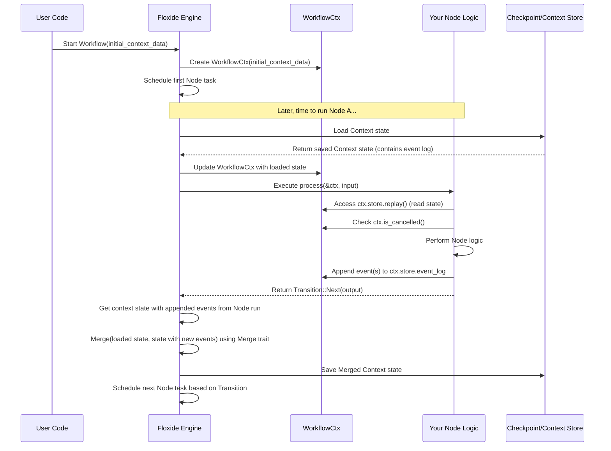

# Chapter 3: `WorkflowCtx` & `Context` Trait

In the [previous chapter](02__node__trait____node___macro_.md), we learned how to define individual steps in our workflow using the `Node` trait and the handy `node!` macro. Each Node performs a specific task. But what if different Nodes in our workflow need to access the same piece of information, or share some common resources?

Imagine our video processing workflow again. Maybe multiple steps (Nodes) need the same API key to talk to an external service, or perhaps we want to keep a running count of processed frames across different steps. How can we share this information safely, especially when our workflow might be running distributed across many computers?

This is where the concepts of `Context` and `WorkflowCtx` come in!

## What's the Problem? Sharing Information Between Steps

Think of our distributed assembly line. Each worker (Node) operates independently, maybe even in different buildings (computers).

*   How do they all know which *version* of the product they are building? (Shared configuration)
*   How do they access shared tools, like a specific calibration device? (Shared resources like database connections)
*   How does the manager tell everyone to stop if there's a major issue? (Cancellation signal)
*   How do we ensure everyone finishes before a deadline? (Timeout)

We need a mechanism for:

1.  **Shared Data/Resources:** A common place to store information that all Nodes in a *single run* of the workflow might need.
2.  **Control Signals:** Ways to manage the workflow run as a whole, like stopping it early.

Floxide provides this through the `Context` trait and the `WorkflowCtx` struct.

## The `Context` Trait: Your Shared Toolbox Blueprint

The `Context` trait itself is very simple. It doesn't *define* what goes into the shared toolbox, it just marks a Rust struct or type as *being suitable* to be used *as* the shared toolbox content for a workflow run.

**You**, the developer, define the actual struct that holds the shared data. This struct needs to implement certain standard Rust traits so that Floxide can manage it effectively:

*   `Clone`: Floxide might need to copy the context.
*   `Debug`: For logging and debugging.
*   `Serialize`/`Deserialize`: Crucial for saving state ([`CheckpointStore`](06__checkpoint_____checkpointstore__trait_.md)) and for **distributed workflows**! The context needs to be saved and potentially sent over the network to different workers. `serde` is the standard Rust library for this.
*   `Send`/`Sync`: Necessary for safely using the context across different threads or async tasks.
*   `Default`: Needed to create an initial empty context when a workflow starts.
*   **`floxide_core::merge::Merge`**: This is vital, especially for distributed workflows. It defines how to combine different versions of the context. For example, if two parallel steps modify the context, the `Merge` trait dictates how those changes are consolidated into a single, consistent state. Floxide provides a derive macro `floxide_macros::Merge` to help implement this.

### Structuring Context Data: Event Sourcing & Merging

How should you structure the data inside your context? While you *could* put simple mutable fields like `processed_items_count: u32`, this quickly becomes problematic, especially in distributed scenarios. How do you safely increment a counter when multiple workers might try to do it concurrently?

A more robust and recommended approach is **Event Sourcing**:

1.  **Events:** Define an `enum` representing all possible *changes* or *facts* that can occur in your workflow's shared state (e.g., `ItemProcessed(ItemId)`, `ApiKeySet(String)`).
2.  **Event Log:** Store a log of these events within your context struct. Floxide provides `floxide_core::distributed::event_log::EventLog<YourEventEnum>` for this.
3.  **State Reconstruction:** Instead of storing the *current* state directly (like the count), store the log of events. The current state can be reconstructed at any time by "replaying" the events from the log.
4.  **Modification:** Nodes don't *modify* state directly; they *append* new events to the log.

**Why Event Sourcing?**

*   **Concurrency:** Appending to a log is often easier to make safe and efficient than directly modifying shared values.
*   **Merging:** The `EventLog` implements the `Merge` trait intelligently. When merging two versions of a context (e.g., from parallel branches), it combines their event logs, often preserving the history from both.
*   **Audit Trail:** The event log provides a complete history of how the shared state evolved.

### The `Merge` Trait and `Fixed` Wrapper

The `Merge` trait is key to handling concurrent updates. `EventLog` implements it. What about simple configuration values like an API key that shouldn't change or be merged in complex ways?

Floxide provides `floxide_core::merge::Fixed<T>`. If you wrap a field in `Fixed` (e.g., `api_key: Fixed<String>`), its `Merge` implementation will simply keep the *first* value it encountered. This is useful for configuration set at the start.

You can implement `Merge` manually for your context struct, but the `floxide_macros::Merge` derive macro handles the common case: it merges each field using that field's own `Merge` implementation (like `EventLog`'s or `Fixed`'s merge).

```rust
// Needed imports
use serde::{Serialize, Deserialize};
use floxide_core::context::Context; // The trait itself
use floxide_core::distributed::event_log::EventLog;
use floxide_core::merge::{Merge, Fixed};
use floxide_macros::Merge; // The derive macro

// 1. Define the events that can happen
#[derive(Clone, Debug, PartialEq, Eq, Serialize, Deserialize)]
pub enum MyWorkflowEvent {
    ItemProcessed(u32), // Record which item ID was processed
    ProcessingStarted,
    // Add other relevant events
}

// 2. Define YOUR shared data structure using EventLog and Fixed
#[derive(Clone, Debug, Default, Serialize, Deserialize, Merge)] // <-- Derive Merge!
pub struct MyWorkflowData {
    // Configuration set once - use Fixed
    #[merge(strategy = "fixed")] // Optional: Explicitly use Fixed strategy via attribute
    pub api_key: Fixed<String>,

    // Log of changes - use EventLog
    pub event_log: EventLog<MyWorkflowEvent>,

    // Other fields MUST also implement Merge or be wrapped (e.g., in Fixed)
}

// 3. Optionally, add a helper to get the current state from the log
#[derive(Default, Debug)] // Temporary struct to hold the calculated state
pub struct CurrentState {
    pub processed_items_count: u32,
    pub started: bool,
}

impl MyWorkflowData {
    // Replays events to calculate the current state
    pub fn replay(&self) -> CurrentState {
        self.event_log.apply_all_default(|event, state: &mut CurrentState| {
            match event {
                MyWorkflowEvent::ItemProcessed(_) => state.processed_items_count += 1,
                MyWorkflowEvent::ProcessingStarted => state.started = true,
            }
        })
    }
}

// MyWorkflowData now satisfies the requirements of the Context trait
// because it derives/impls Clone, Debug, Default, Serde, Merge,
// and EventLog/Fixed handle Send/Sync internally.
```

In this improved example:
*   We define `MyWorkflowEvent`.
*   `MyWorkflowData` uses `Fixed<String>` for the unchanging `api_key` and `EventLog<MyWorkflowEvent>` for the history.
*   We derive `Merge` for `MyWorkflowData`.
*   We add a `replay` method to calculate the `CurrentState` on demand.

## `WorkflowCtx`: The Toolbox Holder with Controls

Okay, so we've defined *what* goes in our shared toolbox (`MyWorkflowData`). Now, how does Floxide manage it and add those control signals (like cancellation)?

Floxide wraps your custom `Context` type inside its own struct called `WorkflowCtx<C>`. Think of `WorkflowCtx` as the manager holding your toolbox (`C` represents *your* context type, like `MyWorkflowData`) and also carrying walkie-talkies (cancellation) and a stopwatch (timeout).

Here's a conceptual look at `WorkflowCtx`:

```rust
// Simplified structure of WorkflowCtx
pub struct WorkflowCtx<C: Context> { // Generic over YOUR context type C
    // 1. Your shared data store
    pub store: C,

    // 2. Cancellation signal (like a walkie-talkie)
    cancel: CancellationToken, // From the 'tokio-util' crate

    // 3. Optional overall deadline (stopwatch)
    timeout: Option<Duration>,
}
```

**Key Parts:**

1.  `store: C`: This public field holds the actual instance of *your* `Context` struct (e.g., an instance of `MyWorkflowData`, likely containing an `EventLog`). Nodes interact with your context primarily through this field.
2.  `cancel: CancellationToken`: This is used internally to signal if the workflow should be stopped prematurely. Nodes can check this token via `ctx.is_cancelled()`.
3.  `timeout: Option<Duration>`: An optional overall time limit for the workflow run.

**Distributed Emphasis:** When a workflow step runs on a remote worker, Floxide ensures that worker gets the *correct* `WorkflowCtx`, including the potentially updated `store` (often loaded from a [`Checkpoint` & `CheckpointStore` Trait](06__checkpoint_____checkpointstore__trait_.md)) and the shared cancellation signal. This allows coordination across the distributed system.

## How Nodes Use `WorkflowCtx`

Remember the `node!` macro from [Chapter 2](02__node__trait____node___macro_.md)? Let's update the example using our event-sourced context:

```rust
use floxide::node;
use floxide::{Transition, FloxideError};
use serde::{Serialize, Deserialize};
use floxide_core::context::Context;
use floxide_core::distributed::event_log::EventLog;
use floxide_core::merge::{Merge, Fixed};
use floxide_macros::Merge; // The derive macro
use std::sync::Arc; // Needed if api_key is behind Arc in Fixed

// --- Assume MyWorkflowEvent, MyWorkflowData, CurrentState from above ---
#[derive(Clone, Debug, PartialEq, Eq, Serialize, Deserialize)]
pub enum MyWorkflowEvent { ItemProcessed(u32), ProcessingStarted }
#[derive(Default, Debug)]
pub struct CurrentState { pub processed_items_count: u32, pub started: bool }
#[derive(Clone, Debug, Default, Serialize, Deserialize, Merge)]
pub struct MyWorkflowData {
    #[merge(strategy = "fixed")] pub api_key: Fixed<Arc<String>>, // Use Arc for cheap clones
    pub event_log: EventLog<MyWorkflowEvent>,
}
impl MyWorkflowData {
    pub fn replay(&self) -> CurrentState {
        self.event_log.apply_all_default(|event, state: &mut CurrentState| {
            match event {
                MyWorkflowEvent::ItemProcessed(_) => state.processed_items_count += 1,
                MyWorkflowEvent::ProcessingStarted => state.started = true,
            }
        })
    }
     // Helper to create a new context
     pub fn new(api_key: String) -> Self {
        Self {
            api_key: Fixed::new(Arc::new(api_key)),
            event_log: EventLog::new(),
        }
    }
}
// --- End of Context Definition ---


// Let's define a Node that uses this context
node! {
  pub struct ProcessDataItemNode {
    // Node-specific config, if any
    item_id: u32, // Let's assume the node knows which item ID it's processing
  }
  // *** Tell the node which context type to expect ***
  context = MyWorkflowData;
  input   = (); // Example input: maybe just a trigger
  output  = ();  // Example output: nothing significant

  // The closure now receives `&WorkflowCtx<MyWorkflowData>` as `ctx`
  async |ctx, _input| { // Make it async if needed (e.g., for replay potentially)
    // --- Accessing Current State (via Replay) ---
    let current_state = ctx.store.replay();
    let api_key = ctx.store.api_key.get(); // Get the Arc<String> from Fixed

    println!(
        "Node [Item {}]: Processing. Current count: {}. Using API key starting with: {}",
        self.item_id,
        current_state.processed_items_count,
        api_key.chars().take(5).collect::<String>() // Show first 5 chars
    );

    // --- Using Context Control Features ---
    // Check if the workflow run has been cancelled elsewhere
    if ctx.is_cancelled() {
        println!("Node [Item {}]: Workflow cancelled, stopping processing.", self.item_id);
        // Abort this step if cancellation was requested
        // Optionally, append a 'Cancelled' event to the log here?
        // ctx.store.event_log.append(MyWorkflowEvent::ProcessingCancelled(self.item_id));
        return Err(FloxideError::Cancelled);
    }

    // --- Node's Own Logic ---
    // Do some work... (using api_key if needed)
    println!("Node [Item {}]: Finished processing.", self.item_id);
    // Simulating work
    tokio::time::sleep(std::time::Duration::from_millis(10)).await;

    // --- Modifying Context (Append Event) ---
    // Instead of direct mutation, append an event to the log.
    // The actual context object `ctx.store` is immutable here (&WorkflowCtx).
    // The engine handles taking this event and merging it into the
    // persistent context state using the Merge trait.
    ctx.store.event_log.append(MyWorkflowEvent::ItemProcessed(self.item_id));

    // We don't return the modified context directly. Floxide handles
    // persisting the appended events via CheckpointStore or ContextStore.

    Ok(Transition::Next(())) // Pass nothing significant forward
  }
}
```

**Explanation:**

1.  **`context = MyWorkflowData;`**: Still tells `node!` the context type.
2.  **`|ctx, _input|`**: Receives `&WorkflowCtx<MyWorkflowData>`.
3.  **Reading State**: We call `ctx.store.replay()` to get the calculated `CurrentState`. We access configuration via `ctx.store.api_key.get()`.
4.  **`ctx.is_cancelled()`**: Works as before.
5.  **Modifying Context**: This is the key change! We call `ctx.store.event_log.append(...)` to record what happened. We **do not** directly change fields in `ctx.store`. The Floxide engine uses the `Merge` implementation of `MyWorkflowData` (which uses the `Merge` impl of `EventLog`) to combine these appended events with the state saved in the [`CheckpointStore`](06__checkpoint_____checkpointstore__trait_.md) or [`ContextStore`](09_distributed_stores___runinfostore____metricsstore____errorstore____livenessstore____workitemstatestore___.md) after the node successfully completes.

## How `WorkflowCtx` Enables Distribution (Revisited)

1.  **Serialization:** Still relies on `serde`, now serializing the `EventLog` and other `Merge`-able fields within your context.
2.  **State Loading:** When a worker loads state (from `CheckpointStore` or `ContextStore`), it gets the context including the event log up to that point.
3.  **Concurrency & Merging:** This is where the `Merge` trait shines. If parallel branches of a workflow run, or if retries occur, Floxide uses the `Merge` implementation of your context struct (and thus the `Merge` impl of `EventLog`) to correctly combine the different histories or updates into a consistent state in the persistent store. `EventLog`'s merge strategy helps ensure events aren't lost or unnecessarily duplicated.
4.  **Cancellation Propagation:** Works as previously described.

## Under the Hood: Creation and Usage (Updated)

1.  **Instantiation:** When you start a workflow run (e.g., using methods we'll see in [Chapter 4: `Workflow` Trait & `workflow!` Macro](04__workflow__trait____workflow___macro_.md)), you typically provide an initial instance of your `Context` struct. Floxide wraps this into a `WorkflowCtx`.
2.  **Passing to Nodes:** The Floxide engine takes care of passing the appropriate `&WorkflowCtx` to each Node's `process` method when it's executed.
3.  **Node Execution & Event Appending:** The engine passes `&WorkflowCtx` to the node. The node appends events to `ctx.store.event_log` (or other `Merge`-able fields).
4.  **State Persistence & Merging:** After a node finishes successfully, the engine takes the original context state loaded at the beginning of the step and the *new context state containing the appended events* (as returned conceptually by the node logic) and uses the `Merge` trait to combine them. This merged state is then saved back to the `CheckpointStore` (for local runs) or `ContextStore` (for distributed runs).
5.  **Resuming/Distributed Step:** When resuming or starting the next step (potentially on another worker), the engine loads the latest *merged* state from the store, ensuring the effects of the previous step (the appended events) are included.



The updated diagram emphasizes that the node appends events, and the engine performs a merge operation before saving the state back.

Looking at the code (`floxide-core/src/context.rs`):

The `Context` trait definition likely remains the same marker trait, but the *expectation* is that the type `T` implementing it *also* implements `floxide_core::merge::Merge`.

```rust
// From: crates/floxide-core/src/context.rs
use serde::{Serialize, de::DeserializeOwned};
use std::fmt::Debug;
use floxide_core::merge::Merge; // Import Merge

// Marker trait for user-defined context types
// Note: Merge is now implicitly expected for robust use.
pub trait Context: Default + DeserializeOwned + Serialize + Debug + Clone + Send + Sync + Merge {}

// Blanket implementation: Any type meeting the bounds IS a Context
impl<T: Default + DeserializeOwned + Serialize + Debug + Clone + Send + Sync + Merge> Context for T {}
```
*(Self-correction: Need to check if the official Context trait actually requires Merge now, or if it's just a strong recommendation/necessity for types used with ContextStore/CheckpointStore merge operations)*. A quick check of `floxide-core` source might be needed to confirm the exact trait bound. Assuming `Merge` is essential for now.

The `WorkflowCtx` struct holds the store and controls:

```rust
// From: crates/floxide-core/src/context.rs (simplified)
use std::time::Duration;
use tokio_util::sync::CancellationToken; // For cancellation

// The wrapper struct
#[derive(Clone, Debug)]
pub struct WorkflowCtx<S: Context> { // Generic over the user's Context type 'S'
    /// The store for the workflow. Holds the user's data.
    pub store: S,
    /// The cancellation token for the workflow.
    cancel: CancellationToken,
    /// The optional timeout for the workflow.
    timeout: Option<Duration>,
}

impl<S: Context> WorkflowCtx<S> {
    /// Creates a new context with the user's initial store data.
    pub fn new(store: S) -> Self {
        Self {
            store,
            cancel: CancellationToken::new(), // Create a new token
            timeout: None,                  // No timeout initially
        }
    }

    /// Returns true if the workflow has been cancelled.
    pub fn is_cancelled(&self) -> bool {
        self.cancel.is_cancelled()
    }

    /// Cancel the workflow execution.
    pub fn cancel(&self) {
        self.cancel.cancel();
    }

    // ... other methods for timeouts, running futures with cancellation ...
}
```

This shows the core structure: your `store` is held alongside Floxide's control mechanisms like the `CancellationToken`.

## Conclusion

The `Context` trait and `WorkflowCtx` struct are essential for managing shared state and control across the Nodes of a workflow run in Floxide.

*   You define your shared data in a struct that implements the `Context` trait requirements (often via `#[derive(...)]`).
*   Floxide wraps your context data in `WorkflowCtx`, adding control features like cancellation tokens and timeouts.
*   Nodes declare the `Context` type they expect using `context = ...` in the `node!` macro.
*   Inside a Node's logic, the `ctx` argument provides access to both your shared data (`ctx.store`) and the control methods (`ctx.is_cancelled()`).
*   The requirement for `Context` to be `Serialize`/`Deserialize` is key for enabling distributed execution and checkpointing, allowing state to be saved and loaded across different workers and runs.

Now that we understand individual steps (`Node`) and how they share information (`WorkflowCtx`), how do we actually connect these Nodes together to define the sequence and structure of our entire workflow?

**Next:** [Chapter 4: `Workflow` Trait & `workflow!` Macro](04__workflow__trait____workflow___macro_.md)
