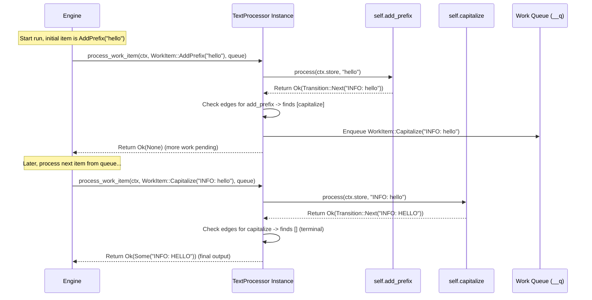

# Chapter 4: `Workflow` Trait & `workflow!` Macro

In the [previous chapter](03__workflowctx_____context__trait_.md), we learned how individual steps ([`Node`s](02__node__trait____node___macro_.md)) can share information using `WorkflowCtx` and the `Context` trait. We now have building blocks (Nodes) and a way to share data (Context). But how do we connect these blocks together to form a complete process? How does Floxide know that after Node A finishes, Node B should start? Especially when these nodes might be running on different computers?

## What's the Problem? Defining the Assembly Line Layout

Imagine you have designed all the individual stations (`Node`s) for your assembly line (like "Download Video", "Extract Audio", "Upload Result"). You also have a way for workers at these stations to access shared tools or instructions (`Context`). Now, you need the master blueprint that shows:

1.  Which station is the *first* one?
2.  When station A finishes successfully, which station(s) should the item go to next?
3.  What if station A produces multiple items ([`Transition::NextAll`](01__transition__enum_.md))? Where do they all go?
4.  What if station A fails or needs special handling ([`Transition::Abort`](01__transition__enum_.md))? Is there a fallback path?
5.  How does the whole system know when the *entire* process is finished?

This blueprint is crucial, especially in a **distributed** system. Without a clear map, how would a worker on computer X know that the output it just produced needs to be picked up by a worker on computer Y running the next step?

Floxide uses the **`Workflow`** concept to represent this master blueprint.

## What is a `Workflow`?

A `Workflow` in Floxide defines the complete structure and flow of tasks. It's the top-level container that holds all the individual [`Node`s](02__node__trait____node___macro_.md) and specifies exactly how they are connected (the "edges" between them).

Key responsibilities of a Workflow definition:

*   **Contains Nodes:** Holds instances of all the Node structs that make up the workflow.
*   **Specifies Start:** Declares which Node is the entry point.
*   **Defines Context:** Specifies the type of shared [`Context`](03__workflowctx_____context__trait_.md) the workflow uses.
*   **Maps Connections (Edges):** Explicitly defines the paths between Nodes. This includes:
    *   Simple connections: Output of Node A goes to Node B.
    *   Fan-out: Output of Node A goes to Node B *and* Node C.
    *   Conditional branching: If Node A returns variant X, go to Node B; if it returns variant Y, go to Node C.
    *   Fallback paths: If Node A fails, maybe trigger Node F (e.g., an error handler).
*   **Identifies End:** Implicitly defines the terminal Node(s) – those with no further connections.

## The `Workflow` Trait: The Contract

Like the `Node` trait, Floxide uses a `Workflow` trait to define the standard capabilities expected of any workflow structure. This trait ensures that the Floxide engine knows how to interact with your workflow definition, regardless of how complex it is.

Some key methods defined by the `Workflow` trait (simplified concept):

```rust
// Simplified concept from floxide-core/src/workflow.rs
#[async_trait]
trait Workflow<C: Context> {
    type Input;  // Data type the *start* node expects
    type Output; // Data type the *terminal* node produces
    type WorkItem; // An internal type representing a task (Node + Input)

    // Run the whole workflow locally
    async fn run(&self, ctx: &WorkflowCtx<C>, input: Self::Input)
        -> Result<Self::Output, FloxideError>;

    // Run with saving state after each step
    async fn run_with_checkpoint<CS>(...)
        -> Result<Self::Output, FloxideError>;

    // Resume from a saved state
    async fn resume<CS>(...)
        -> Result<Self::Output, FloxideError>;

    // --- Distributed Primitives ---

    // Prepare a distributed run (Orchestrator)
    async fn start_distributed<CS, Q>(...) -> Result<(), FloxideError>;

    // Execute one step in a distributed run (Worker)
    async fn step_distributed<CS, Q>(...)
        -> Result<Option<(String, Self::Output)>, StepError<Self::WorkItem>>;

    // Process a single WorkItem (Internal helper for routing)
    async fn process_work_item(...)
        -> Result<Option<Self::Output>, FloxideError>;

    // Get a visual representation
    fn to_dot(&self) -> &'static str;
}
```

This trait provides methods for different execution modes: simple local runs (`run`), resumable runs (`run_with_checkpoint`, `resume`), and the core primitives for **distributed** execution (`start_distributed`, `step_distributed`). The `process_work_item` method is crucial internally for handling the routing logic based on the defined edges.

Manually implementing this trait would be very complex! Thankfully, Floxide provides a macro to do the heavy lifting.

## The `workflow!` Macro: Your Workflow Designer

The `workflow!` macro is the high-level tool you'll use to define your workflow's structure. It takes care of generating the necessary struct, the internal `WorkItem` enum (which tracks which node needs to run with what data), and the implementation of the `Workflow` trait, including all the complex routing logic.

Here's the basic syntax:

```rust
// General syntax of the workflow! macro
workflow! {
  // 1. Define the struct holding the Nodes
  pub struct MyWorkflow {
    // Fields are instances of your Nodes
    step_a: NodeAInstance,
    step_b: NodeBInstance,
    step_c: NodeCInstance,
    // You can also include retry policies here if needed
    // retry_policy: MyRetryPolicy,
  }
  // 2. Specify the Context type
  context = MyWorkflowContext;
  // 3. Specify the starting Node field
  start = step_a;
  // 4. Define the connections (edges)
  edges {
    // If step_a succeeds, its output goes to step_b
    step_a => [step_b];

    // If step_b succeeds, its output goes to step_c
    // (Example: can also have conditional or fallback edges)
    step_b => [step_c];

    // step_c is the last step (terminal node)
    step_c => []; // Empty list means it's an end point
  };
}
```

Let's break it down:

1.  **Struct Definition:** `pub struct MyWorkflow { ... }` defines a struct that will hold instances of your [`Node`s](02__node__trait____node___macro_.md). Give each Node instance a field name (e.g., `step_a`, `step_b`).
2.  **`context = Type;`**: Specifies the shared [`Context`](03__workflowctx_____context__trait_.md) type this workflow uses (e.g., `MyWorkflowData` from Chapter 3).
3.  **`start = field_name;`**: Tells Floxide which field in your struct represents the first Node to execute (e.g., `step_a`).
4.  **`edges { ... };`**: This is the core mapping section.
    *   `source_field => [target_field_1, target_field_2, ...];` defines where the output of the `source_field` Node should go upon successful completion ([`Transition::Next`](01__transition__enum_.md) or [`Transition::NextAll`](01__transition__enum_.md)). An empty list `[]` means this Node is a terminal point.
    *   (Advanced: The macro also supports conditional branching based on Node output variants and fallback paths using `on_failure`, but we'll stick to simple cases here).

## Example: A Simple Text Processing Workflow

Let's combine the Nodes from Chapter 2 into a simple workflow: `PrefixAndCapitalizeNode` -> `CapitalizeTextNode`.

```rust
use floxide::{workflow, node, Workflow, Node, Context, Transition, FloxideError};
use serde::{Serialize, Deserialize};
use std::sync::Arc; // Needed for callbacks in distributed step

// --- Define Context (from Chapter 3) ---
#[derive(Clone, Debug, Default, Serialize, Deserialize)]
struct SimpleContext {}
// No need for `impl Context for SimpleContext {}` if deriving required traits

// --- Define Nodes (from Chapter 2, simplified) ---
node! {
  #[derive(Clone, Debug)] // Add Clone/Debug
  pub struct PrefixNode { prefix: String }
  context = SimpleContext; input = String; output = String;
  |ctx, text| {
    let result = format!("{}: {}", self.prefix, text);
    println!("PrefixNode: {} -> {}", text, result);
    Ok(Transition::Next(result))
  }
}

node! {
  #[derive(Clone, Debug)] // Add Clone/Debug
  pub struct CapitalizeNode {}
  context = SimpleContext; input = String; output = String;
  |ctx, text| {
    let result = text.to_uppercase();
    println!("CapitalizeNode: {} -> {}", text, result);
    Ok(Transition::Next(result))
  }
}

// --- Define the Workflow using the workflow! macro ---
workflow! {
  // Struct holds instances of our nodes
  #[derive(Clone, Debug)] // Workflow struct should also be Clone/Debug
  pub struct TextProcessor {
    add_prefix: PrefixNode, // Instance of PrefixNode
    capitalize: CapitalizeNode, // Instance of CapitalizeNode
  }
  // Use our simple context
  context = SimpleContext;
  // Start with the 'add_prefix' node
  start = add_prefix;
  // Define the flow: add_prefix -> capitalize -> end
  edges {
    add_prefix => [capitalize]; // Output of add_prefix goes to capitalize
    capitalize => [];          // capitalize is the terminal node
  };
}

// --- How you might use it (conceptual) ---
// #[tokio::main]
// async fn main() -> Result<(), FloxideError> {
//     // 1. Create instances of the Nodes
//     let prefixer = PrefixNode { prefix: "INFO".to_string() };
//     let capitalizer = CapitalizeNode {};
//
//     // 2. Create an instance of the Workflow struct
//     let my_workflow = TextProcessor {
//         add_prefix: prefixer,
//         capitalize: capitalizer,
//     };
//
//     // 3. Create the initial context
//     let initial_context_data = SimpleContext {};
//     let wf_ctx = floxide::WorkflowCtx::new(initial_context_data);
//
//     // 4. Run the workflow (using the 'run' method from the Workflow trait)
//     let input_text = "hello world".to_string();
//     println!("Starting workflow with input: '{}'", input_text);
//     let final_result = my_workflow.run(&wf_ctx, input_text).await?;
//
//     println!("Workflow finished. Final result: '{}'", final_result);
//     // Expected output:
//     // Starting workflow with input: 'hello world'
//     // PrefixNode: hello world -> INFO: hello world
//     // CapitalizeNode: INFO: hello world -> INFO: HELLO WORLD
//     // Workflow finished. Final result: 'INFO: HELLO WORLD'
//
//     Ok(())
// }

```

**Explanation:**

1.  We defined our `SimpleContext` and two Nodes (`PrefixNode`, `CapitalizeNode`).
2.  We used `workflow!` to define `TextProcessor`.
    *   The struct holds fields `add_prefix` and `capitalize`.
    *   We set `context = SimpleContext`.
    *   We set `start = add_prefix`.
    *   In `edges`, we defined `add_prefix => [capitalize];` (output of `add_prefix` goes to `capitalize`) and `capitalize => [];` ( `capitalize` is the end).
3.  In the conceptual usage:
    *   We create instances of the Nodes and the `TextProcessor` workflow struct.
    *   We create the initial [`WorkflowCtx`](03__workflowctx_____context__trait_.md).
    *   We call the `run` method (which the `workflow!` macro generated for us!) with the context and initial input.
    *   The macro-generated code handles calling `add_prefix`, taking its output, calling `capitalize` with that output, and finally returning the result from `capitalize` because it's the terminal node.

**Distributed Emphasis:** If we were running this distributed (using `start_distributed` and `step_distributed`), the `edges` definition is absolutely critical. When `add_prefix` finishes on Worker 1, the macro-generated `process_work_item` logic consults the `edges`. It sees that `capitalize` is next. It then wraps the output of `add_prefix` into a `WorkItem` representing the `capitalize` task and places it onto the shared [`WorkQueue`](05__workqueue__trait_.md). Worker 2 (or maybe even Worker 1 again later) can then pick up this `capitalize` task from the queue and execute it. The `workflow!` macro essentially compiles your visual blueprint into executable routing logic.

## Under the Hood: What Does `workflow!` Generate?

The `workflow!` macro is a code generator. It takes your high-level definition and expands it into more detailed Rust code, saving you from writing a lot of boilerplate.

1.  **Workflow Struct:** It generates the struct you defined (e.g., `pub struct TextProcessor { ... }`).
2.  **`WorkItem` Enum:** It creates a hidden helper enum (e.g., `TextProcessorWorkItem`). This enum has one variant for each Node field in your workflow struct. This enum is how Floxide keeps track of "what work needs to be done next".
    ```rust
    // Simplified generated code (conceptual)
    #[derive(Debug, Clone, Serialize, Deserialize, PartialEq, Eq)]
    enum TextProcessorWorkItem {
        AddPrefix(String), // Carries input for PrefixNode
        Capitalize(String), // Carries input for CapitalizeNode
    }
    // Also implements Display for unique IDs, needed for WorkItem trait
    impl std::fmt::Display for TextProcessorWorkItem { /* ... */ }
    impl floxide_core::workflow::WorkItem for TextProcessorWorkItem { /* ... */ }
    ```
3.  **`impl Workflow`:** It generates the implementation of the [`Workflow`](04__workflow__trait____workflow___macro_.md) trait for your struct (`impl Workflow<SimpleContext> for TextProcessor { ... }`). This implementation includes:
    *   Definitions for `Input`, `Output`, and `WorkItem` associated types.
    *   Implementations for `run`, `run_with_checkpoint`, `resume`, `start_distributed`, `step_distributed`, and `to_dot`.
    *   The **crucial `process_work_item` method**. This method contains a `match` statement on the generated `WorkItem` enum. Each arm corresponds to a Node in your workflow. Inside the arm, it:
        *   Calls the actual `process` method of the corresponding Node instance (e.g., `self.add_prefix.process(...)`).
        *   Examines the returned [`Transition`](01__transition__enum_.md).
        *   Based on the `Transition` and your `edges` definition, it creates the *next* `WorkItem`(s) (e.g., `TextProcessorWorkItem::Capitalize(...)`) and pushes them onto the work queue (`__q`) provided to it.
        *   If a terminal node finishes, it returns `Ok(Some(output))`. Otherwise, it returns `Ok(None)`.

Here's a simplified look at the generated `process_work_item` logic for our example:

```rust
// Simplified generated code for process_work_item (conceptual)
async fn _process_work_item<'a>(
    &'a self,
    ctx: &'a floxide_core::WorkflowCtx<SimpleContext>,
    item: TextProcessorWorkItem, // Input is the generated enum
    __q: &mut std::collections::VecDeque<TextProcessorWorkItem> // Output queue
) -> Result<Option<String>, floxide_core::error::FloxideError>
{
    use floxide_core::transition::Transition;
    match item {
        TextProcessorWorkItem::AddPrefix(input_string) => {
            // Call the actual node's process method
            let transition = self.add_prefix.process(&ctx.store, input_string).await?;
            match transition {
                Transition::Next(output_string) => {
                    // Look up edges for add_prefix: finds [capitalize]
                    // Create the next work item
                    let next_item = TextProcessorWorkItem::Capitalize(output_string);
                    // Add it to the queue
                    __q.push_back(next_item);
                    Ok(None) // More work to do
                }
                Transition::NextAll(outputs) => { /* Handle fan-out similarly */ Ok(None) }
                Transition::Abort(e) => Err(e),
                Transition::Hold => Ok(None), // Do nothing for Hold
            }
        }
        TextProcessorWorkItem::Capitalize(input_string) => {
            // Call the actual node's process method
            let transition = self.capitalize.process(&ctx.store, input_string).await?;
            match transition {
                Transition::Next(output_string) => {
                    // Look up edges for capitalize: finds [] (terminal)
                    // Return the final output
                    Ok(Some(output_string))
                }
                Transition::NextAll(outputs) => { /* Handle fan-out */ Ok(None) } // Might still be terminal
                Transition::Abort(e) => Err(e),
                Transition::Hold => Ok(None),
            }
        }
    }
}
```

This generated code directly translates your `edges` definition into the runtime logic that connects the Nodes.

Here's a sequence diagram showing how the engine uses the generated `process_work_item` method during a run:



The real implementation of the macro lives in `floxide-macros/src/workflow.rs` and the `Workflow` trait definition is in `floxide-core/src/workflow.rs`.

## Conclusion

The `Workflow` trait and the `workflow!` macro are central to defining the overall structure and execution flow in Floxide.

*   A `Workflow` acts as the master blueprint, holding all [`Node`s](02__node__trait____node___macro_.md) and defining their connections (edges).
*   The `Workflow` trait defines the standard interface for executing workflows in various modes (local, checkpointed, distributed).
*   The `workflow!` macro provides a convenient way to declare the workflow struct, its Nodes, the starting point, the shared [`Context`](03__workflowctx_____context__trait_.md), and the crucial edge mappings.
*   The macro generates the necessary Rust code, including the `Workflow` trait implementation and the internal routing logic (`process_work_item`), which translates your high-level definition into executable steps.
*   This explicit definition of structure and edges is vital for enabling reliable **distributed execution**, as it provides the map the engine needs to route tasks across different workers via a shared work queue.

Now that we have defined our Nodes, Context, and the overall Workflow structure, how does Floxide manage the list of tasks waiting to be executed, especially in a distributed environment? That's the role of the `WorkQueue`.

**Next:** [Chapter 5: `WorkQueue` Trait](05__workqueue__trait_.md)
