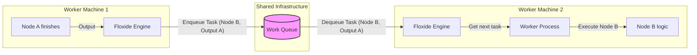
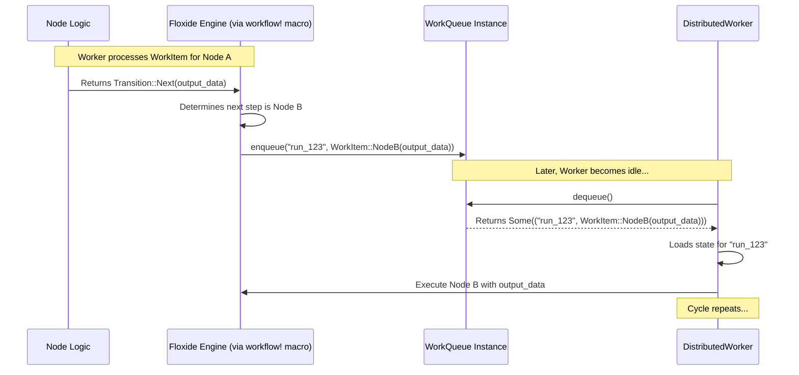

# Chapter 5: `WorkQueue` Trait

In the [previous chapter](04__workflow__trait____workflow___macro_.md), we learned how to define the entire structure of our workflow using the `Workflow` trait and the `workflow!` macro. This blueprint tells Floxide which step ([`Node`](02__node__trait____node___macro_.md)) follows which, creating the map of our distributed assembly line.

But now, think about the items moving on that assembly line. When one station finishes its task, how does the item physically get to the *next* station? Especially if the next station is handled by a different worker, possibly on a completely different computer? We need a delivery system!

## What's the Problem? Distributing the Work

Imagine our video processing workflow running across several computers (workers).
*   Worker 1 finishes downloading a video chunk (`DownloadNode`).
*   The workflow blueprint says the next step is `ExtractAudioNode`.
*   Worker 2 is free and ready to extract audio.

How does Worker 2 know that Worker 1 just finished a download and needs audio extraction? How does it get the information about *which* video chunk to process?

In a single program on one computer, this is easy – you just call the next function. But in a **distributed** system, where workers are independent processes, maybe even on different machines, they need a shared place to coordinate tasks.

This is where the `WorkQueue` comes in. It's the central dispatch system for tasks in Floxide.

## What is a `WorkQueue`? The Digital Bulletin Board

Think of the `WorkQueue` as a shared, digital bulletin board or a job list that all workers can see.

*   **Work Item:** Each task waiting to be done is represented by a `WorkItem`. A `WorkItem` contains information like:
    *   Which workflow run does this task belong to? (e.g., "process_video_123")
    *   Which [`Node`](02__node__trait____node___macro_.md) needs to be executed? (e.g., `ExtractAudioNode`)
    *   What input data does that Node need? (e.g., the path to the downloaded video chunk)
    *   (Internally, Floxide uses the `WorkItem` enum generated by the [`workflow!` macro](04__workflow__trait____workflow___macro_.md) to represent this).
*   **Enqueue:** When a Node finishes its processing and the workflow definition indicates the next step(s), the Floxide engine takes the output and creates one or more new `WorkItem`s. It then "posts" these `WorkItem`s onto the shared bulletin board. This is called **enqueuing**.
*   **Dequeue:** Workers are constantly checking this bulletin board for new tasks. When a worker is free, it grabs the next available `WorkItem` from the board, effectively saying "I'll take this job!". This is called **dequeuing**. Once dequeued, the worker can execute the specified Node with the provided input data.

**Distributed Emphasis:** The `WorkQueue` is the *heart* of task distribution in Floxide. It decouples the Node that *produces* work from the worker that *consumes* it. This allows different parts of the workflow to run on different machines, coordinated only through this shared queue.



## The `WorkQueue` Trait: The Contract for Queues

Floxide needs a standard way to interact with *any* kind of queueing system. Whether you use a simple in-memory list, a powerful Redis database, or a streaming platform like Kafka, Floxide needs to know how to put tasks in (`enqueue`) and take tasks out (`dequeue`).

This is defined by the `WorkQueue` trait. It's a Rust contract specifying the essential operations.

Here's a simplified view of the trait:

```rust
// Simplified concept from floxide-core/src/distributed/work_queue.rs
use async_trait::async_trait;
use crate::context::Context;
use crate::workflow::WorkItem;
use crate::distributed::WorkQueueError; // Error type for queue operations

#[async_trait]
pub trait WorkQueue<C: Context, WI: WorkItem>: Clone + Send + Sync + 'static {
    // Put a work item onto the queue for a specific workflow run.
    async fn enqueue(&self, workflow_id: &str, work: WI)
        -> Result<(), WorkQueueError>;

    // Get the next available work item from the queue (from any run).
    // Returns None if the queue is empty.
    async fn dequeue(&self)
        -> Result<Option<(String, WI)>, WorkQueueError>;

    // Remove all pending work items for a specific workflow run.
    // Useful for cancellation or cleanup.
    async fn purge_run(&self, run_id: &str)
        -> Result<(), WorkQueueError>;

    // (Other methods like getting pending work might exist)
}
```

**Explanation:**

*   **`#[async_trait]`**: These methods are asynchronous (`async`) because interacting with external queue systems (like Redis or Kafka) involves network I/O.
*   **`WorkQueue<C: Context, WI: WorkItem>`**: The trait is generic. It works with any [`Context`](03__workflowctx_____context__trait_.md) type `C` and any `WorkItem` type `WI` defined by your [`Workflow`](04__workflow__trait____workflow___macro_.md).
*   **`enqueue(&self, workflow_id: &str, work: WI)`**: Adds a `work` item associated with `workflow_id` to the queue.
*   **`dequeue(&self)`**: Attempts to retrieve the next available work item. It returns the `workflow_id` and the `WorkItem` itself, or `None` if no tasks are waiting.
*   **`purge_run(&self, run_id: &str)`**: Clears out any waiting tasks specifically for the given `run_id`.

You typically don't implement this trait yourself unless you're integrating a custom queueing system. Floxide (or related crates) will provide implementations for common backends.

## How the System Uses the `WorkQueue`

You, as the workflow developer using the [`node!`](02__node__trait____node___macro_.md) and [`workflow!`](04__workflow__trait____workflow___macro_.md) macros, usually don't call `enqueue` or `dequeue` directly. The Floxide engine and the [`DistributedWorker`](07__distributedworker__.md) handle this behind the scenes.

1.  **Engine (Processing Step):** After a Node returns `Transition::Next(output)` or `Transition::NextAll(outputs)`, the engine (specifically, the code generated by `workflow!`) determines the next Node(s) based on the `edges`. For each successor Node, it creates a `WorkItem` and calls `queue.enqueue(...)`.
2.  **Worker (Idle):** A [`DistributedWorker`](07__distributedworker__.md) process, when idle, calls `queue.dequeue()`.
3.  **Worker (Gets Task):** If `dequeue` returns `Some((run_id, work_item))`, the worker gets the `run_id` and the `work_item`.
4.  **Worker (Executes Task):** The worker loads the necessary state ([`Checkpoint`](06__checkpoint_____checkpointstore__trait_.md)) for that `run_id`, finds the correct Node implementation based on the `work_item`, and executes its `process` method.
5.  **Repeat:** The worker finishes, and the engine (running within that worker) potentially enqueues new tasks, continuing the cycle.



## Different Flavors of Queues (Implementations)

The power of using a trait (`WorkQueue`) is that you can swap out the underlying queue implementation without changing your core workflow logic.

*   **`InMemoryWorkQueue`:** Floxide provides a simple queue that just uses standard Rust collections (like a `HashMap` mapping run IDs to `VecDeque`s) stored in the computer's memory.
    *   **Pros:** Very fast, easy for testing and local development, requires no external services.
    *   **Cons:** Not truly distributed (only works if all workers are threads within the *same* process), state is lost if the process crashes.
*   **Redis Queue:** An implementation could use Redis LISTs. `enqueue` uses `LPUSH`, `dequeue` uses `BRPOP`.
    *   **Pros:** Persistent (if Redis persistence is configured), shared across multiple processes/machines, mature technology.
    *   **Cons:** Requires a separate Redis server, slightly higher latency than in-memory.
*   **Kafka Queue:** An implementation could use Kafka topics. `enqueue` produces a message, `dequeue` consumes a message (often using consumer groups for load balancing).
    *   **Pros:** Highly scalable, durable, good for high-throughput scenarios, supports complex streaming patterns.
    *   **Cons:** Requires a Kafka cluster, more complex setup than Redis.
*   **Database Queue:** You could even implement a queue using a relational database table with locking.
    *   **Pros:** Leverages existing database infrastructure.
    *   **Cons:** Can be less performant than dedicated queues, requires careful handling of locking to avoid contention.

The choice of implementation depends on your application's needs for scalability, persistence, and fault tolerance. For distributed execution, you'll need something other than `InMemoryWorkQueue`.

## Under the Hood: `InMemoryWorkQueue` Example

Let's peek at how the simple `InMemoryWorkQueue` might implement the trait. It uses a `Mutex` (to handle concurrent access from multiple threads/tasks) around a `HashMap`. The `HashMap` keys are the `run_id` strings, and the values are `VecDeque`s (double-ended queues) holding the `WorkItem`s for that run.

```rust
// Simplified from floxide-core/src/distributed/work_queue.rs

use std::collections::{HashMap, VecDeque};
use std::sync::Arc;
use tokio::sync::Mutex;
// ... other imports: WorkItem, Context, WorkQueue, WorkQueueError, async_trait

// The struct holds the shared, mutable state protected by a Mutex
#[derive(Clone)]
pub struct InMemoryWorkQueue<WI: WorkItem>(Arc<Mutex<HashMap<String, VecDeque<WI>>>>);

impl<WI: WorkItem> InMemoryWorkQueue<WI> {
    pub fn new() -> Self {
        Self(Arc::new(Mutex::new(HashMap::new()))) // Start with empty map
    }
}

#[async_trait]
impl<C: Context, WI: WorkItem + 'static> WorkQueue<C, WI> for InMemoryWorkQueue<WI> {
    async fn enqueue(&self, workflow_id: &str, work: WI) -> Result<(), WorkQueueError> {
        // 1. Lock the mutex to get exclusive access to the map
        let mut map = self.0.lock().await;
        // 2. Find the queue for this workflow_id, or create it if it doesn't exist
        // 3. Add the work item to the end of that queue
        map.entry(workflow_id.to_string())
            .or_default()
            .push_back(work);
        // 4. Unlock happens automatically when 'map' goes out of scope
        Ok(())
    }

    async fn dequeue(&self) -> Result<Option<(String, WI)>, WorkQueueError> {
        // 1. Lock the mutex
        let mut map = self.0.lock().await;
        // 2. Iterate through all known workflow runs
        for (run_id, q) in map.iter_mut() {
            // 3. Try to remove an item from the front of the run's queue
            if let Some(item) = q.pop_front() {
                // 4. If successful, return the run_id and the item
                return Ok(Some((run_id.clone(), item)));
            }
        }
        // 5. If no items were found in any queue, return None
        Ok(None)
    }

    async fn purge_run(&self, run_id: &str) -> Result<(), WorkQueueError> {
        let mut map = self.0.lock().await;
        // Remove the entry for this run_id, discarding all its items
        map.remove(run_id);
        Ok(())
    }

    // ... other methods ...
}
```

**Explanation:**

*   `Arc<Mutex<...>>`: This combination allows safe shared access to the `HashMap` from multiple asynchronous tasks. `Arc` allows multiple owners, `Mutex` ensures only one task accesses the data at a time.
*   `lock().await`: Acquires the lock. If another task holds the lock, this task waits (`await`s).
*   `map.entry(...).or_default().push_back(work)`: A concise way to get the `VecDeque` for a `workflow_id` (creating it if needed) and add the `work` item.
*   `map.iter_mut()`: Allows iterating through the runs and modifying their queues.
*   `q.pop_front()`: Removes and returns the first item from the `VecDeque`, if any.
*   `map.remove(run_id)`: Removes the entire queue for the specified run.

This simple implementation fulfills the `WorkQueue` contract using standard Rust tools, making it suitable for single-process scenarios. For true distribution, you'd use a different implementation backed by a service like Redis or Kafka.

## Conclusion

The `WorkQueue` trait defines the standard interface for the task distribution mechanism in Floxide. It acts as the central coordinator in a distributed workflow, allowing Nodes finishing on one worker to enqueue tasks (`WorkItem`s) that can be dequeued and processed by other available workers.

*   It's the **core component enabling distributed execution**.
*   It decouples task producers (Nodes finishing) from task consumers (Workers starting).
*   The `WorkQueue` trait provides standard `enqueue` and `dequeue` operations.
*   Different implementations (in-memory, Redis, Kafka) can be used depending on requirements, all conforming to the same trait.

While the queue manages *what* tasks need to be run, how does a worker resuming a task, or picking up a task mid-workflow, know the *state* of the shared [`Context`](03__workflowctx_____context__trait_.md) or exactly which tasks have already been completed? We need a way to save and load the workflow's progress.

**Next:** [Chapter 6: `Checkpoint` & `CheckpointStore` Trait](06__checkpoint_____checkpointstore__trait_.md)
