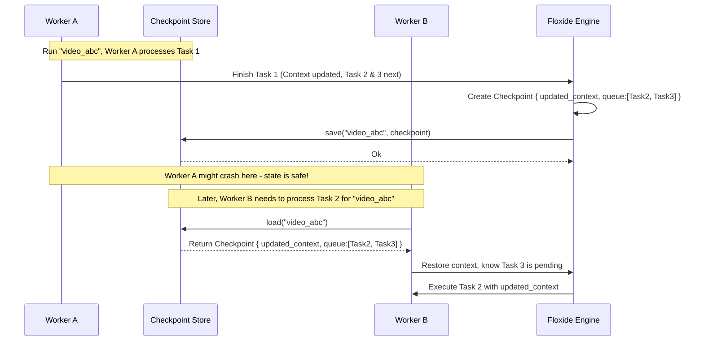

# Chapter 6: `Checkpoint` & `CheckpointStore` Trait

In the [previous chapter](05__workqueue__trait_.md), we saw how the [`WorkQueue`](05__workqueue__trait_.md) acts like a central bulletin board, allowing different workers to pick up tasks in a distributed workflow. This is great for distributing the *work*, but what happens if something goes wrong? Or how does a worker know the *current state* of the shared information ([`WorkflowCtx`](03__workflowctx_____context__trait_.md)) when it picks up a task mid-way through a long workflow?

## What's the Problem? Remembering Where We Left Off

Imagine playing a long video game. You wouldn't want to start from the very beginning every time you turn the game off or if the power suddenly goes out! You need a way to **save your progress**.

Similarly, workflows, especially distributed ones, can be long-running and complex.
*   What if a worker processing a crucial video segment crashes? Do we lose all the work done so far?
*   If Worker A finishes processing step 1 and puts a task for step 2 onto the [`WorkQueue`](05__workqueue__trait_.md), how does Worker B (which might be on a different computer) know the latest value of the shared `api_key` or `processed_items_count` from the workflow's [`Context`](03__workflowctx_____context__trait_.md) when it picks up the step 2 task?

We need a mechanism to:
1.  **Save the current state** of a running workflow at specific points.
2.  **Load that state back** to resume the workflow later, either after a crash or when a different worker takes over.

This mechanism is called **checkpointing**, and it's absolutely essential for fault tolerance and effective state management in distributed systems like Floxide.

**Important Scope Note:** The `Checkpoint` struct and `CheckpointStore` trait described in this chapter are the primary mechanisms for saving and resuming the complete state (shared data *and* pending tasks) of a workflow run. This is particularly useful for **single-process workflows** where you want to be able to stop and resume later, or for scenarios where you are manually managing the execution flow (like the `checkpoint_example.rs`). For fully **distributed workflows** managed by Floxide's `Orchestrator` and `WorkerPool`, a different set of more granular storage traits (`ContextStore`, `WorkQueue`, etc., discussed in [Chapter 9](09_distributed_stores___runinfostore____metricsstore____errorstore____livenessstore____workitemstatestore___.md)) are typically used for better efficiency and control in a multi-worker environment. We will focus on the core `Checkpoint`/`CheckpointStore` mechanism here.

## `Checkpoint`: The Workflow Snapshot

A `Checkpoint` in Floxide is like taking a snapshot of your workflow's current progress. It captures two critical pieces of information at a particular moment in time for a specific workflow run:

1.  **The Shared Context:** The current state of your custom data stored inside the [`WorkflowCtx::store`](03__workflowctx_____context__trait_.md). This ensures that when the workflow resumes, it has the correct shared information (like API keys, counters, configuration loaded mid-way, etc.).
2.  **The Pending Work Queue:** The list of [`WorkItem`s](04__workflow__trait____workflow___macro_.md) that are still waiting to be processed *for this specific workflow run*. This ensures the workflow knows which steps are next.

Think of it like saving your game: the save file contains your character's stats, inventory (like the context), and the list of quests you still need to do (like the pending work queue).

Floxide defines a simple struct to hold this snapshot:

```rust
// Simplified from crates/floxide-core/src/checkpoint.rs

use std::collections::VecDeque; // A type of queue
use crate::context::Context;
use crate::workflow::WorkItem;

/// A snapshot of a workflow's pending work and its context.
#[derive(Debug, Clone)] // Allows copying and printing
pub struct Checkpoint<C: Context, WI: WorkItem> {
    /// The user-provided context for the workflow
    pub context: C,
    /// The queue of pending work items for this run
    pub queue: VecDeque<WI>,
}
```

*   `context: C`: Holds the actual instance of your shared [`Context`](03__workflowctx_____context__trait_.md) data (e.g., `MyWorkflowData` from Chapter 3).
*   `queue: VecDeque<WI>`: Holds the list of [`WorkItem`s](04__workflow__trait____workflow___macro_.md) generated by the [`workflow!` macro](04__workflow__trait____workflow___macro_.md) that haven't been processed yet for this run.

By using a trait, Floxide allows you to choose the storage backend that fits your needs:
*   **`InMemoryCheckpointStore`**: Stores checkpoints in memory (simple, good for tests, but not persistent or distributed).
*   **Database Store**: Could store checkpoints as rows in a database table.
*   **File System Store**: Could save checkpoints as files on disk.
*   **Cloud Storage Store**: Could save checkpoints to services like AWS S3 or Google Cloud Storage.
*   **(Distributed Alternative)**: As mentioned, dedicated stores like `RedisContextStore`, `RedisWorkQueue` (using different traits) are used for scalable distributed setups.

## Checkpointing vs. Distributed Stores (`ContextStore`, `WorkQueue`)

It's important to understand the distinction between the `Checkpoint`/`CheckpointStore` mechanism described here and the storage approach used in fully managed distributed Floxide applications (using `Orchestrator` and `WorkerPool`, covered later).

*   **`Checkpoint`:** Bundles the **shared `Context`** *and* the **pending `WorkItem` queue** for a specific run into a single snapshot.
*   **`CheckpointStore`:** Saves and loads this combined snapshot.

This approach is simple and effective for saving the entire state of a run to resume it later in the *same process* or under *manual control*.

However, in a large distributed system with many workers:
*   Workers often only need the latest shared `Context` to perform their task. Loading the potentially large list of *all* pending `WorkItem`s for the entire run along with the context can be inefficient.
*   Task distribution is typically handled globally by a central `WorkQueue`, not by each worker loading a run-specific queue from a checkpoint.

Therefore, for distributed execution, Floxide uses a set of more specialized store traits (detailed in [Chapter 9](09_distributed_stores___runinfostore____metricsstore____errorstore____livenessstore____workitemstatestore___.md)):

*   **`ContextStore`:** Manages *only* the saving, loading, and merging of the shared `Context` data for a run.
*   **`WorkQueue`:** Handles the global enqueueing and dequeueing of `WorkItem`s across all runs and workers.
*   **`WorkItemStateStore`:** Tracks the status (e.g., pending, in-progress, completed, failed) and retry attempts for individual `WorkItem` instances within a run.
*   **Other Stores:** `RunInfoStore`, `MetricsStore`, `ErrorStore`, `LivenessStore` handle other aspects of monitoring and managing distributed runs.

This separation allows for more efficient state management in a distributed environment, as workers fetch only the specific state they need (e.g., context via `ContextStore`, next task via `WorkQueue`).

**In summary:** Use `CheckpointStore` for local persistence/resumption. Use the distributed store collection (`ContextStore`, `WorkQueue`, etc.) when building scalable, multi-worker applications with `Orchestrator` and `WorkerPool`.

## How Checkpointing Enables Fault-Tolerant Workflows (Local/Manual Context)

Let's see how the `Checkpoint` and `CheckpointStore` work together, especially in a distributed setup.

1.  **Start:** A workflow run starts (e.g., run ID "video_abc"). An initial checkpoint might be saved with the starting context and the first task in the queue.
2.  **Worker A Takes Task 1:** Worker A loads the checkpoint for "video_abc". It gets the context and sees Task 1 is next. It processes Task 1.
3.  **Worker A Finishes Task 1:** Let's say Task 1 updated the context (e.g., incremented a counter) and produced Task 2 and Task 3.
4.  **Worker A Saves Checkpoint:** The Floxide engine (running within Worker A) creates a *new* `Checkpoint` containing:
    *   The *updated* context.
    *   The *remaining* work queue (now containing Task 2 and Task 3).
    *   It calls `store.save("video_abc", new_checkpoint)`. The old checkpoint is overwritten.
5.  **Crash! (Optional):** Worker A crashes immediately after saving. No work is lost because the progress is saved!
6.  **Worker B Takes Task 2:** Some time later, Worker B (maybe on a different machine) dequeues Task 2 from the main [`WorkQueue`](05__workqueue__trait_.md).
7.  **Worker B Loads Checkpoint:** Before processing Task 2, Worker B calls `store.load("video_abc")`. It receives the checkpoint saved by Worker A in step 4.
8.  **Worker B Resumes:** Worker B now has the correct, *updated* context (with the incremented counter) and knows that Task 3 is also pending (from the checkpoint's queue). It proceeds to execute Task 2.



This save/load cycle ensures that state is consistently passed between steps, even across different workers or process restarts.

## Example: `InMemoryCheckpointStore`

Floxide provides a basic `InMemoryCheckpointStore` for testing and simple cases. It uses a standard Rust `HashMap` protected by a `RwLock` (allowing multiple readers or one writer) to store checkpoints in memory.

```rust
// Simplified from crates/floxide-core/src/checkpoint.rs

use std::collections::HashMap;
use std::sync::{Arc, RwLock}; // For thread-safe sharing
// ... other imports

#[derive(Clone)]
pub struct InMemoryCheckpointStore<C: Context, WI: WorkItem> {
    // Arc allows sharing ownership across threads/tasks
    // RwLock allows multiple readers or one writer at a time
    inner: Arc<RwLock<HashMap<String, Checkpoint<C, WI>>>>,
    // PhantomData might be needed depending on generic usage
    _phantom: std::marker::PhantomData<(C, WI)>,
}

// --- Implementation of the CheckpointStore trait ---

#[async_trait]
impl<C: Context, WI: WorkItem> CheckpointStore<C, WI> for InMemoryCheckpointStore<C, WI> {
    async fn save(
        &self,
        workflow_id: &str,
        checkpoint: &Checkpoint<C, WI>,
    ) -> Result<(), CheckpointError> {
        // Get write access to the map (blocks other writers/readers)
        let mut map = self.inner.write().unwrap(); // .unwrap() simplifies error handling here
        // Insert a clone of the checkpoint into the map
        map.insert(workflow_id.to_string(), checkpoint.clone());
        Ok(())
        // Lock is released automatically when 'map' goes out of scope
    }

    async fn load(&self, workflow_id: &str) -> Result<Option<Checkpoint<C, WI>>, CheckpointError> {
        // Get read access to the map (blocks writers, allows other readers)
        let map = self.inner.read().unwrap();
        // Get the checkpoint, clone it if found
        let maybe_checkpoint = map.get(workflow_id).map(|ck| ck.clone());
        Ok(maybe_checkpoint)
        // Lock is released automatically when 'map' goes out of scope
    }
}
```

*   `Arc<RwLock<HashMap<...>>>`: The standard Rust way to share mutable data safely across asynchronous tasks.
*   `inner.write().unwrap()`: Acquires a write lock on the map.
*   `inner.read().unwrap()`: Acquires a read lock.
*   `map.insert(...)` / `map.get(...)`: Standard `HashMap` operations.
*   `.clone()`: We clone the `Checkpoint` when saving and loading to avoid ownership issues with the map. This requires `C` and `WI` to be `Clone`.

This implementation is simple but effective for single-process scenarios. For real distributed systems, you'd use an implementation backed by Redis, a database, or another shared storage mechanism, likely implementing the more granular distributed store traits (`ContextStore`, etc.).

## Under the Hood: Serialization is Key

How does the `CheckpointStore` actually save your custom `Context` data (`C`) and the `WorkItem` (`WI`)? It relies on **serialization**.

*   **Serialization:** Converting the in-memory Rust structs (`Checkpoint`, your `Context`, your `WorkItem`) into a format that can be stored or transmitted (like JSON, MessagePack, Protobuf, etc.).
*   **Deserialization:** Converting the stored format back into the Rust structs.

Floxide leverages the powerful `serde` library for this. Remember in [Chapter 3](03__workflowctx_____context__trait_.md), we required your `Context` struct to derive `Serialize` and `Deserialize`? And the [`workflow!` macro](04__workflow__trait____workflow___macro_.md) automatically derives them for the `WorkItem` enum it generates.

The `CheckpointStore` implementation (like `InMemoryCheckpointStore`, or a hypothetical `RedisCheckpointStore`) is responsible for:
1.  **During `save`:** Taking the `Checkpoint<C, WI>` struct and using `serde` (e.g., `serde_json::to_string` or `serde_json::to_vec`) to turn it into a byte array or string. Then, storing those bytes/string in its backend (e.g., the in-memory `HashMap`, a Redis key, a database BLOB).
2.  **During `load`:** Retrieving the stored bytes/string from the backend. Then, using `serde` (e.g., `serde_json::from_slice` or `serde_json::from_str`) to parse it back into a `Checkpoint<C, WI>` struct.

This serialization is what allows complex Rust data structures representing your workflow's state to be saved, shared across machines, and loaded back reliably.

## Conclusion

Checkpoints are the "save game" mechanism for Floxide workflows.

*   A **`Checkpoint`** is a snapshot containing the current shared [`Context`](03__workflowctx_____context__trait_.md) and the list of pending [`WorkItem`s](04__workflow__trait____workflow___macro_.md) for a specific run, primarily used for local/manual persistence.
*   The **`CheckpointStore`** trait defines the standard interface (`save`, `load`) for persisting and retrieving these snapshots.
*   Implementations of `CheckpointStore` (like `InMemoryCheckpointStore`) handle the actual storage and rely on `serde` for serialization.
*   Checkpointing is **crucial for fault tolerance** in single-process or manually managed runs.
*   For **distributed execution**, Floxide uses a different set of stores (`ContextStore`, `WorkQueue`, etc.) for better scalability and separation of concerns.

Now that we have the core pieces for basic execution and local persistence, let's explore how Floxide manages execution in a fully distributed environment.

**Next:** [Chapter 7: `DistributedWorker`](07__distributedworker__.md) (Focuses on the worker component which uses the *distributed* stores)
**See Also:** [Chapter 9: Distributed Stores](09_distributed_stores___runinfostore____metricsstore____errorstore____livenessstore____workitemstatestore___.md) (Details the stores like `ContextStore` used by workers/orchestrators)
