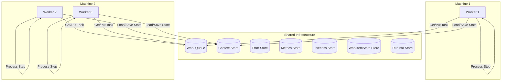
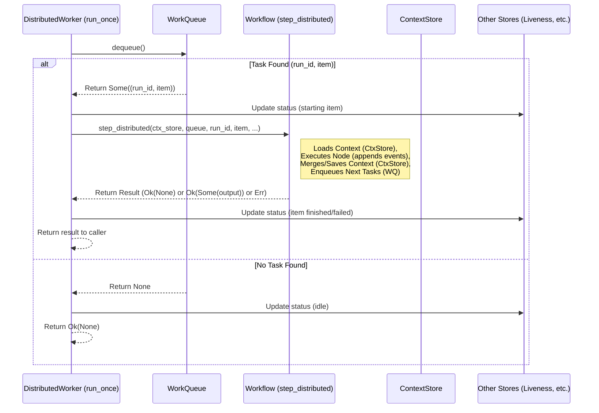

# Chapter 7: `DistributedWorker`

In the [previous chapter](06__checkpoint_____checkpointstore__trait_.md), we learned about `Checkpoint` and `CheckpointStore`, the "save game" system for Floxide workflows. This allows us to save the state of a workflow run (its shared [`Context`](03__workflowctx_____context__trait_.md) and pending tasks) so we can resume later or recover from crashes.

But who actually *does* the work in a distributed setup? We have the blueprint ([`Workflow`](04__workflow__trait____workflow___macro_.md)), the task list ([`WorkQueue`](05__workqueue__trait_.md), and the save system ([`CheckpointStore`](06__checkpoint_____checkpointstore__trait_.md)). Now we need the actual *employees* who run the assembly line stations.

## What's the Problem? Actively Processing Tasks

Imagine our distributed video processing factory. We have:
*   A list of jobs (the [`WorkQueue`](05__workqueue__trait_.md)).
*   Instructions for each job (the [`Node`](02__node__trait____node___macro_.md) logic within the [`Workflow`](04__workflow__trait____workflow___macro_.md) blueprint).
*   A way to save shared project state (the [`ContextStore`](09_distributed_stores___runinfostore____metricsstore____errorstore____livenessstore____workitemstatestore___.md)).
*   Other ledgers for tracking progress, errors, etc. (the other [Distributed Stores](09_distributed_stores___runinfostore____metricsstore____errorstore____livenessstore____workitemstatestore___.md)).

But nothing happens on its own! We need programs – workers – that actively:
1.  Look at the job list.
2.  Pick up the next available job.
3.  Figure out the current state of the project (load the latest shared [`Context`](03__workflowctx_____context__trait_.md) using the `ContextStore`).
4.  Do the work for that job step.
5.  Save the updated project state.
6.  Potentially add new follow-up jobs to the list.
7.  Go back to step 1 and repeat.

This tireless entity is what Floxide calls a `DistributedWorker`.

## What is a `DistributedWorker`? The Engine's Employee

A `DistributedWorker` is an independent process or task whose main job is to execute workflow steps in a distributed Floxide setup. It's like an employee who performs the core work cycle:

1.  **Check Queue:** Repeatedly asks the shared [`WorkQueue`](05__workqueue__trait_.md): "Any jobs available?"
2.  **Get Task:** If a task (`WorkItem`) is available, the worker takes it.
3.  **Load State:** Reads the latest shared [`Context`](03__workflowctx_____context__trait_.md) for the specific workflow run this task belongs to using the `ContextStore`.
4.  **Execute Step:** Runs the processing logic defined by the corresponding [`Node`](02__node__trait____node___macro_.md) (using the [`Workflow`](04__workflow__trait____workflow___macro_.md) definition to find the right code). The node might append events to the context it received.
5.  **Handle Outcome:** Based on the [`Transition`](01__transition__enum_.md) returned by the Node:
    *   Enqueues new tasks onto the [`WorkQueue`](05__workqueue__trait_.md) for subsequent steps.
    *   Updates the status of the current work item in the `WorkItemStateStore`.
6.  **Save State:** Merges the changes made to the context (the appended events) with the previously loaded state and saves the result back to the `ContextStore` using its `merge` capability. Also updates metrics (`MetricsStore`) and potentially logs errors (`ErrorStore`).
7.  **Repeat:** Goes back to checking the queue for the next job.

**Distributed Emphasis:** The magic happens when you run *multiple* `DistributedWorker` instances. They can run on the same machine or, more importantly, on *different machines*. They all connect to the *same* shared `WorkQueue` and distributed stores (`ContextStore`, `ErrorStore`, etc.). This allows them to work together in parallel, processing different tasks for different workflow runs (or even different tasks for the *same* run if a step used `Transition::NextAll`). This parallel, distributed processing is Floxide's core strength.



## How a `DistributedWorker` Uses Floxide Components

The `DistributedWorker` doesn't do everything from scratch. It relies heavily on the other abstractions we've learned about:

*   [`Workflow`](04__workflow__trait____workflow___macro_.md): The worker needs the workflow definition to know *which* Node logic to execute for a given `WorkItem` and how to handle transitions based on the defined `edges`. It primarily uses the `step_distributed` method provided by the `Workflow` trait implementation (generated by the `workflow!` macro).
*   [`WorkQueue`](05__workqueue__trait_.md): The worker constantly interacts with the queue to `dequeue` tasks to process and `enqueue` subsequent tasks.
*   [`ContextStore`](09_distributed_stores___runinfostore____metricsstore____errorstore____livenessstore____workitemstatestore___.md): Before executing a step, the worker `get`s the current context state. After successful execution, it `merge`s the changes (appended events) back into the store.
*   [Other Distributed Stores (Chapter 9)](09_distributed_stores___runinfostore____metricsstore____errorstore____livenessstore____workitemstatestore___.md): Workers also interact with these stores to report their status (`LivenessStore`), record errors (`ErrorStore`), update metrics (`MetricsStore`), track run status (`RunInfoStore`), and manage the state of individual work items (`WorkItemStateStore`). This provides observability and control.
*   [`RetryPolicy` (Chapter 10)](10__retrypolicy_____retrynode__.md): The worker can be configured with a retry policy to automatically handle transient errors during step execution.

## The Worker Loop in Action (Simplified)

Let's walk through a single cycle for one worker (Worker #42):

1.  **Dequeue:** Worker #42 calls `queue.dequeue()`.
2.  **Result:** It receives `Some(("video_abc", WorkItem::ExtractAudio("chunk_3.mp4")))`. (It got a job!)
3.  **Load Context:** Worker #42 calls `context_store.get("video_abc")`. It gets back the latest `MyWorkflowData` context (perhaps with an event log indicating `processed_chunks: 2`).
4.  **Execute Step:** The worker looks at `WorkItem::ExtractAudio`. Using the `Workflow` definition, it finds the `ExtractAudioNode` logic. It calls the `process` method of that Node, passing the loaded `Context` (via `WorkflowCtx`) and the input `"chunk_3.mp4"`.
5.  **Node Returns & Appends Event:** The `ExtractAudioNode` finishes and returns `Ok(Transition::Next("chunk_3.aac"))`. Internally, it also called `ctx.store.event_log.append(MyWorkflowEvent::AudioExtracted(...))`.
6.  **Handle Transition:** The worker sees `Transition::Next`. It checks the `Workflow`'s `edges` for `ExtractAudioNode`. Let's say the edge points to `GenerateSubtitlesNode`.
7.  **Enqueue Next:** The worker creates `WorkItem::GenerateSubtitles("chunk_3.aac")` (using the output from step 5) and calls `queue.enqueue("video_abc", new_work_item)`.
8.  **Merge & Save Context:** The worker takes the context returned from the node execution (containing the new `AudioExtracted` event) and calls `context_store.merge("video_abc", context_with_new_event)`. The `ContextStore` implementation uses the `Merge` trait on `MyWorkflowData` (and `EventLog`) to combine this correctly with any other concurrent changes.
9.  **Update Other Stores:** The worker might also call `metrics_store.update_metrics(...)`, `work_item_state_store.set_status(...)`, etc.
10. **Loop:** Worker #42 goes back to step 1, ready for the next job.

If in step 2, `queue.dequeue()` returned `None`, the worker would typically wait for a short period and then try again.

## Using `DistributedWorker`

You typically don't interact with the `DistributedWorker` struct directly in your `Node` logic. Instead, you configure and run it as a separate process or task. Floxide provides helpers to build and run workers.

First, you need instances of your workflow definition and all the required store implementations (using appropriate distributed backends like Redis or Kafka, not just in-memory ones for real distribution).

```rust
use floxide::{
    Workflow, DistributedWorker, WorkQueue, ContextStore, Context,
    // Import other store traits: RunInfoStore, MetricsStore, ErrorStore, LivenessStore, WorkItemStateStore
    // Import your specific workflow, context, and store implementations
    // e.g., TextProcessor, SimpleContext, RedisWorkQueue, RedisContextStore etc.
};
use std::sync::Arc;
// Assume these are properly configured instances for distributed use
// let my_workflow: TextProcessor = // ... initialized workflow struct
// let my_queue: RedisWorkQueue<...> = // ... connected queue
// let my_context_store: RedisContextStore<...> = // ... connected context store
// let my_run_info_store: RedisRunInfoStore = // ...
// ... etc for all stores ...

// Create a worker instance using the builder pattern
let worker = DistributedWorker::builder()
    .workflow(my_workflow)
    .queue(my_queue)
    .context_store(my_context_store)
    .run_info_store(my_run_info_store)
    .metrics_store(my_metrics_store)
    .error_store(my_error_store)
    .liveness_store(my_liveness_store)
    .work_item_state_store(my_work_item_state_store)
    .build();

// Optional: Configure retry policy
// worker.set_retry_policy(RetryPolicy::default());

// Define a unique ID for this worker instance (e.g., from hostname/PID)
let worker_id = 42; // Or generate dynamically
```

This code sets up a `DistributedWorker` instance, providing it with everything it needs to operate: the workflow logic, the queue, and various state stores.

Then, you typically run the worker's main loop in an async task:

```rust
// This would usually be run within an async runtime like Tokio

// Clone the worker if needed (it's designed to be Clone-able)
let worker_clone = worker.clone();

// Spawn an async task to run the worker loop forever
tokio::spawn(async move {
    // run_forever loops indefinitely, processing tasks as they appear
    worker_clone.run_forever(worker_id).await;
    // Note: run_forever technically never returns Ok, it runs until cancelled or panics.
});

println!("Worker {} started and polling for tasks...", worker_id);
// Keep the main program alive, or manage worker tasks (e.g., using WorkerPool)
// ...
```

This code starts the worker. The `run_forever` method contains the core loop described earlier (dequeue, load, process, save, enqueue). You would typically launch many such worker tasks, potentially across multiple machines, all configured with the same shared stores and workflow definition.

## Under the Hood: The `step_distributed` Method

The `DistributedWorker` itself doesn't contain the complex logic for loading, executing, saving, and enqueuing based on transitions. It delegates most of this to the [`Workflow`](04__workflow__trait____workflow___macro_.md) trait's `step_distributed` method (which is implemented by the code generated by the [`workflow!` macro](04__workflow__trait____workflow___macro_.md)).

The `worker.run_once(worker_id)` method essentially does this:

1.  Calls `queue.dequeue()`.
2.  If a `work_item` and `run_id` are received:
    *   Updates worker status (liveness, work item state) using the provided stores.
    *   Calls `self.workflow.step_distributed(...)`, passing the `context_store`, `queue`, `run_id`, `work_item`, and potentially other stores needed for state updates within the step execution logic (like metrics/error stores).
    *   The `step_distributed` implementation (generated by `workflow!`) handles:
        *   Loading the context (`context_store.get(run_id)`).
        *   Calling the correct Node's `process` method (using `process_work_item`). Node appends events.
        *   Handling the `Transition` and enqueuing next items (`queue.enqueue(...)`).
        *   Merging and saving the context (`context_store.merge(run_id, ...)`).
    *   Updates worker status based on the result of `step_distributed`.
3.  If no item is dequeued, it indicates idleness.

Here's a simplified sequence diagram of `run_once`:



Let's look at simplified code from `floxide-core/src/distributed/worker.rs`:

The `DistributedWorker` struct holds all the necessary components:

```rust
// Simplified from crates/floxide-core/src/distributed/worker.rs
use crate::distributed::{ ContextStore, ErrorStore, LivenessStore, MetricsStore, RunInfoStore, WorkItemStateStore, WorkQueue };

pub struct DistributedWorker<W, C, Q, CS, RIS, MS, ES, LS, WIS>
where
    W: Workflow<C, WorkItem: 'static>,
    C: Context,
    Q: WorkQueue<C, W::WorkItem>,
    CS: ContextStore<C>,
    RIS: RunInfoStore,
    MS: MetricsStore,
    ES: ErrorStore,
    LS: LivenessStore,
    WIS: WorkItemStateStore<W::WorkItem>,
{
    workflow: W,
    queue: Q,
    context_store: CS,
    run_info_store: RIS,
    metrics_store: MS,
    error_store: ES,
    liveness_store: LS,
    work_item_state_store: WIS,
    retry_policy: Option<RetryPolicy>,
    phantom: std::marker::PhantomData<C>,
}
```

The `run_forever` method loops, calling `run_once`:

```rust
// Simplified from crates/floxide-core/src/distributed/worker.rs
impl<...> DistributedWorker<...> {
    pub async fn run_forever(&self, worker_id: usize) -> std::convert::Infallible {
        loop {
            match self.run_once(worker_id).await {
                Ok(Some((_run_id, _output))) => {
                    // Work was done, loop immediately for more
                }
                Ok(None) => {
                    // No work found, sleep briefly
                    sleep(Duration::from_millis(100)).await;
                }
                Err(e) => {
                    // Error occurred, log and sleep
                    error!(worker_id, error = ?e, "Worker error");
                    sleep(Duration::from_millis(100)).await;
                }
            }
        }
    }
}
```

And `run_once` orchestrates the call to the workflow's core distributed step logic:

```rust
// Simplified CONCEPT from crates/floxide-core/src/distributed/worker.rs
// The actual implementation uses callbacks for state updates.
impl<...> DistributedWorker<...> {
    pub async fn run_once(&self, worker_id: usize) -> Result<Option<(String, W::Output)>, FloxideError> {

        // Update liveness/heartbeat (simplified)
        self.heartbeat(worker_id).await;

        // *** Core Logic: Delegate to Workflow::step_distributed ***
        // This method encapsulates: dequeue, load, process, save, enqueue
        match self.workflow.step_distributed(
            &self.context_store,
            &self.queue,
            worker_id,
            self.build_callbacks(worker_id) // Provides hooks for state updates
        ).await {
            Ok(Some((run_id, output))) => {
                // Workflow run completed!
                // Update status to idle
                self.on_idle_state_updates(worker_id).await?;
                Ok(Some((run_id, output)))
            }
            Ok(None) => {
                // Step processed, but workflow not finished OR queue was empty
                // Update status to idle
                self.on_idle_state_updates(worker_id).await?;
                Ok(None)
            }
            Err(step_error) => {
                // Handle step error (potentially using retry policy logic)
                // Update status to idle or failed
                self.on_idle_state_updates(worker_id).await?;
                Err(step_error.error) // Return the underlying FloxideError
            }
        }
    }

    // Helper to create callback object
    fn build_callbacks(&self, worker_id: usize) -> Arc<dyn StepCallbacks<C, W>> {
        // ... creates an object that updates stores on events ...
    }

    // Helpers for state updates via callbacks (simplified)
    async fn on_idle_state_updates(&self, worker_id: usize) -> Result<(), FloxideError>;
    async fn heartbeat(&self, worker_id: usize);
    // ... other state update helpers for start, success, error ...
}
```

The key takeaway is that the `DistributedWorker` acts as the runner or host process, performing the loop and calling the appropriate methods on the `Workflow`, `WorkQueue`, and `ContextStore` to execute the distributed steps defined by your application.

## Worker Pools

Running and managing individual worker tasks can be tedious. Floxide often provides a `WorkerPool` utility (shown in the provided context code) that simplifies starting, stopping, and monitoring multiple `DistributedWorker` instances concurrently.

## Conclusion

The `DistributedWorker` is the active entity in a Floxide distributed workflow. It's the "employee" that continuously:
*   Pulls tasks from the shared [`WorkQueue`](05__workqueue__trait_.md).
*   Loads the necessary state from the `ContextStore`.
*   Executes the [`Node`](02__node__trait____node___macro_.md) logic defined in the [`Workflow`](04__workflow__trait____workflow___macro_.md) (via `step_distributed`).
*   Saves the updated state back to the `ContextStore`.
*   Enqueues follow-up tasks.

By running multiple workers, potentially across many machines, all interacting with the same shared queue and stores, Floxide achieves parallel and distributed workflow execution.

But how do we *start* a new workflow run in this distributed environment? We can't just call `my_workflow.run()` anymore. We need a way to kick things off, create the initial checkpoint, and put the very first task onto the queue for the workers to find. That's the job of the `DistributedOrchestrator`.

**Next:** [Chapter 8: `DistributedOrchestrator`](08__distributedorchestrator__.md)
