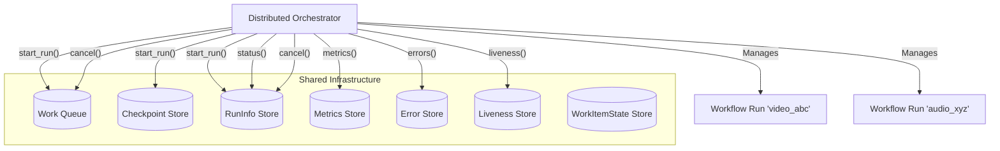
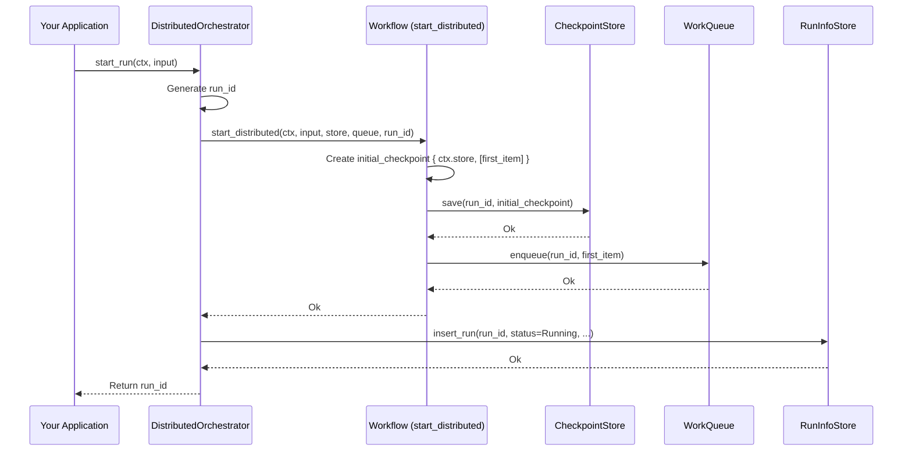

# Chapter 8: `DistributedOrchestrator`

In the [previous chapter](07__distributedworker__.md), we met the `DistributedWorker`. These are the diligent employees in our distributed workflow factory, constantly picking up tasks from the [`WorkQueue`](05__workqueue__trait_.md), processing them using the [`Workflow`](04__workflow__trait____workflow___macro_.md) blueprint, and saving progress using the [`CheckpointStore`](06__checkpoint_____checkpointstore__trait_.md).

But wait... if workers just grab tasks from a queue, who puts the *first* task on the queue? How do we initiate a whole new workflow run? And how do we check on the progress of all these ongoing runs, or maybe stop one if needed?

## What's the Problem? Managing the Factory Floor

Imagine our video processing factory again. We have workers (`DistributedWorker`) ready at their stations, a job board (`WorkQueue`) to list tasks, and a way to save progress (`CheckpointStore`). But we need someone in charge, a **Project Manager**, to:

1.  **Start New Projects:** Say "Okay, let's start processing this new video, 'intro.mp4'. Here's the initial plan." This involves setting up the initial state and putting the very first task (like "Download Video") on the job board.
2.  **Monitor Progress:** Walk around the factory floor (figuratively!) and ask "How's the processing for 'intro.mp4' going? Is it done yet? Did any problems occur?"
3.  **Control Execution:** Maybe decide "Hold on, stop working on 'outro.mp4' for now," or "Cancel the 'test_video.avi' project entirely."
4.  **Gather Reports:** Collect information about how many projects are running, which workers are active, and any errors that have happened.

Without this central management figure, our distributed factory would be chaotic. Workers wouldn't know when new projects start, and we wouldn't know how they're progressing.

In Floxide, this project manager role is filled by the **`DistributedOrchestrator`**.

## What is a `DistributedOrchestrator`? Your Workflow Manager

The `DistributedOrchestrator` is the central control panel for managing your distributed Floxide workflow runs. It doesn't execute the individual steps itself (that's the [`DistributedWorker`](07__distributedworker__.md)'s job), but it provides the interface to interact with the entire distributed system at a higher level.

Think of it as the dashboard and control levers for your workflow factory. Its main responsibilities include:

*   **Starting new workflow runs:** This involves giving the initial input data, creating the initial [`Checkpoint`](06__checkpoint_____checkpointstore__trait_.md), and putting the very first [`WorkItem`](04__workflow__trait____workflow___macro_.md) onto the [`WorkQueue`](05__workqueue__trait_.md). This "seeds" the workflow run, making it available for workers to pick up.
*   **Querying the status of runs:** Asking "Is run 'video_abc' still running, completed, failed, or paused?"
*   **Cancelling or pausing runs:** Sending signals to stop or temporarily halt processing for a specific run.
*   **Retrieving run history and metrics:** Getting information about past and present runs, how long they took, etc.
*   **Checking for errors:** Listing any errors that occurred during a run.
*   **Monitoring worker liveness:** Checking which workers are active and responsive.

**Distributed Emphasis:** The `DistributedOrchestrator` achieves this by interacting with all the shared, distributed stores we've been learning about (and will learn more about in the [next chapter](09_distributed_stores___runinfostore____metricsstore____errorstore____livenessstore____workitemstatestore___.md)). It talks to the `WorkQueue`, `CheckpointStore`, `RunInfoStore`, `MetricsStore`, `ErrorStore`, `LivenessStore`, etc., to get a unified view of the system and exert control.



## How to Use the `DistributedOrchestrator`

You typically use the `DistributedOrchestrator` from your main application code, perhaps in response to a user request, an incoming API call, or a scheduled event.

### 1. Creating an Orchestrator Instance

First, you need to create an instance of `DistributedOrchestrator`. This requires providing instances of your [`Workflow`](04__workflow__trait____workflow___macro_.md) definition and all the necessary distributed store implementations. These stores *must* be implementations designed for distributed use (like Redis-backed stores, database stores, etc.) for the system to work across multiple machines.

```rust
use floxide::{
    DistributedOrchestrator, WorkflowCtx,
    // --- Assume these are your types/implementations ---
    workflow::TextProcessor, // Your workflow struct from workflow! macro
    context::SimpleContext,  // Your context struct
    // Concrete store implementations (using Redis as an example)
    RedisWorkQueue, RedisCheckpointStore, RedisRunInfoStore,
    RedisMetricsStore, RedisErrorStore, RedisLivenessStore,
    RedisWorkItemStateStore,
};
use std::sync::Arc;

// Assume these are fully configured clients connected to your backend services
let my_workflow = TextProcessor { /* ... node instances ... */ };
let redis_queue = RedisWorkQueue::new(/* redis config */).await?;
let redis_checkpoint = RedisCheckpointStore::new(/* redis config */).await?;
let redis_run_info = RedisRunInfoStore::new(/* redis config */).await?;
let redis_metrics = RedisMetricsStore::new(/* redis config */).await?;
let redis_errors = RedisErrorStore::new(/* redis config */).await?;
let redis_liveness = RedisLivenessStore::new(/* redis config */).await?;
let redis_work_item = RedisWorkItemStateStore::new(/* redis config */).await?;

// Create the orchestrator instance
let orchestrator = DistributedOrchestrator::new(
    my_workflow,
    redis_queue,
    redis_checkpoint,
    redis_run_info,
    redis_metrics,
    redis_errors,
    redis_liveness,
    redis_work_item,
);

println!("Orchestrator created successfully!");
```

This code gathers all the necessary components (the workflow logic and connections to all the shared backend stores) and bundles them into an `orchestrator` object.

### 2. Starting a Workflow Run

The most common action is starting a new run. You provide the initial [`Context`](03__workflowctx_____context__trait_.md) and the input data for the first [`Node`](02__node__trait____node___macro_.md).

```rust
// Define the initial shared context data for this specific run
let initial_context_data = SimpleContext {}; // Or MyWorkflowData { api_key: "...", ... }
let wf_ctx = WorkflowCtx::new(initial_context_data);

// Define the input for the very first node in the workflow
let initial_input = "start processing this text".to_string();

// Call start_run on the orchestrator
let run_id = orchestrator.start_run(&wf_ctx, initial_input).await?;

println!("Successfully started workflow run with ID: {}", run_id);
// Example Output:
// Successfully started workflow run with ID: 1e7a3c4f-8b0a-4b1e-8c7f-9d2e1b0a3d5e
```

**What `start_run` Does:**
*   Generates a unique ID (like `1e7a...`) for this specific run.
*   Calls the underlying `workflow.start_distributed(...)` method. This method:
    *   Creates the initial [`Checkpoint`](06__checkpoint_____checkpointstore__trait_.md) containing the `initial_context_data` and the first `WorkItem`(s) based on the `start` node and the `initial_input`.
    *   Saves this checkpoint to the `CheckpointStore`.
    *   Pushes the first `WorkItem`(s) onto the `WorkQueue`.
*   Records the new run's information (ID, status=`Running`, start time) in the `RunInfoStore`.
*   Returns the unique `run_id`.

**Crucially, `start_run` does *not* execute any workflow logic itself.** It just sets everything up and puts the first task on the queue. The [`DistributedWorker`](07__distributedworker__.md)s will eventually see this task on the queue and start processing it.

### 3. Checking Run Status

You can easily check the status of a run using its ID.

```rust
let run_id_to_check = "1e7a3c4f-8b0a-4b1e-8c7f-9d2e1b0a3d5e"; // From previous step

let status = orchestrator.status(run_id_to_check).await?;

println!("Status for run {}: {:?}", run_id_to_check, status);
// Example Output (could be Running, Completed, Failed, Paused, Cancelled):
// Status for run 1e7a...: Running
```

This queries the `RunInfoStore` to get the latest recorded status for that `run_id`.

### 4. Cancelling a Run

If you need to stop a run prematurely:

```rust
let run_id_to_cancel = "1e7a3c4f-8b0a-4b1e-8c7f-9d2e1b0a3d5e";

orchestrator.cancel(run_id_to_cancel).await?;

println!("Requested cancellation for run {}", run_id_to_cancel);

// Later, checking status might show:
// Status for run 1e7a...: Cancelled
```

**What `cancel` Does:**
*   Updates the status in the `RunInfoStore` to `Cancelled`.
*   Calls `queue.purge_run(run_id)` to remove any pending tasks for this run from the `WorkQueue`.
*   (Note: Workers currently processing a task for this run might finish that task, but they won't pick up new ones. Nodes can also check `ctx.is_cancelled()` to stop early).

### 5. Other Management Functions

The `DistributedOrchestrator` provides other useful methods:

*   `list_runs(filter)`: Get a list of all runs, optionally filtering by status.
*   `pause(run_id)` / `resume(run_id)`: Temporarily halt or continue a run.
*   `errors(run_id)`: Retrieve a list of errors recorded for a run from the `ErrorStore`.
*   `metrics(run_id)`: Get performance metrics (like step timings) from the `MetricsStore`.
*   `liveness()` / `list_worker_health()`: Check the status of connected workers via the `LivenessStore`.
*   `pending_work(run_id)`: See what tasks are currently waiting in the queue for a specific run.
*   `checkpoint(run_id)`: Retrieve the last saved checkpoint data.
*   `wait_for_completion(run_id, poll_interval)`: Wait until a run finishes (Completed, Failed, or Cancelled).

These methods allow comprehensive monitoring and control over your distributed workflows.

## Under the Hood: How `start_run` Works

Let's trace the main steps when you call `orchestrator.start_run(ctx, input)`:

1.  **Generate ID:** The `start_run` method creates a unique `run_id` (e.g., using UUIDs).
2.  **Delegate to Workflow:** It calls `self.workflow.start_distributed(ctx, input, &self.store, &self.queue, &run_id)`.
3.  **`start_distributed` (Inside `workflow!` Macro Code):**
    *   Determines the first `WorkItem` based on the workflow's `start` node and the provided `input`.
    *   Creates an initial `Checkpoint` struct containing `ctx.store` (your context data) and a queue holding just that first `WorkItem`.
    *   Calls `self.store.save(run_id, &initial_checkpoint)` to save the starting state.
    *   Calls `self.queue.enqueue(run_id, first_work_item)` to put the first task on the main queue.
4.  **Record Run Info:** Back in `start_run`, it creates a `RunInfo` struct (status=Running, started_at=now) and calls `self.run_info_store.insert_run(run_info)`.
5.  **Return ID:** `start_run` returns the generated `run_id`.

Here's a sequence diagram illustrating this:



The `DistributedOrchestrator` struct itself (defined in `floxide-core/src/distributed/orchestrator.rs`) mainly holds references to the workflow and all the store implementations.

```rust
// Simplified from crates/floxide-core/src/distributed/orchestrator.rs

// Generic struct holding all components
pub struct DistributedOrchestrator<W, C, Q, S, RIS, MS, ES, LS, WIS>
where /* type bounds for Workflow, Context, and all Stores */
{
    workflow: W,
    queue: Q,
    store: S, // CheckpointStore
    run_info_store: RIS,
    metrics_store: MS,
    error_store: ES,
    liveness_store: LS,
    work_item_state_store: WIS,
    // PhantomData used for generic type C
    phantom: std::marker::PhantomData<C>,
}

impl<...> DistributedOrchestrator<...> /* type bounds */ {
    // Constructor takes all components
    pub fn new(
        workflow: W, queue: Q, store: S, run_info_store: RIS, /* etc */
    ) -> Self { /* ... store components ... */ }

    // start_run implementation
    pub async fn start_run(
        &self,
        ctx: &WorkflowCtx<C>,
        input: W::Input,
    ) -> Result<String, FloxideError> {
        // 1. Generate unique ID
        let run_id = uuid::Uuid::new_v4().to_string();

        // 2. Delegate to workflow's seeding primitive
        self.workflow
            .start_distributed(ctx, input, &self.store, &self.queue, &run_id)
            .await?; // Handles checkpoint save + queue enqueue

        // 3. Record initial run info
        let run_info = RunInfo { /* run_id, status=Running, started_at */ };
        self.run_info_store.insert_run(run_info).await?;

        // 4. Return the ID
        Ok(run_id)
    }

    // ... implementations for status(), cancel(), errors(), etc. ...
    // These mostly delegate calls to the corresponding store interfaces.
}
```

The code clearly shows `start_run` coordinating between generating an ID, calling the workflow's specific seeding logic (`start_distributed`), and updating the `RunInfoStore`.

## Conclusion

The `DistributedOrchestrator` is the essential management interface for your distributed Floxide workflows. It acts as the central point of control, allowing you to:

*   **Initiate** new workflow runs in a distributed environment using `start_run`.
*   **Monitor** their progress (`status`, `metrics`, `errors`, `liveness`).
*   **Control** their execution (`cancel`, `pause`, `resume`).

It achieves this by interacting with the underlying [`Workflow`](04__workflow__trait____workflow___macro_.md) definition and, crucially, the various shared **distributed stores** that maintain the state and coordination information for the entire system.

Speaking of these stores, while we've mentioned them (`RunInfoStore`, `MetricsStore`, `ErrorStore`, `LivenessStore`, `WorkItemStateStore`), let's take a closer look at what each one does in the next chapter.

**Next:** [Chapter 9: Distributed Stores (`RunInfoStore`, `MetricsStore`, `ErrorStore`, `LivenessStore`, `WorkItemStateStore`)](09_distributed_stores___runinfostore____metricsstore____errorstore____livenessstore____workitemstatestore___.md)
