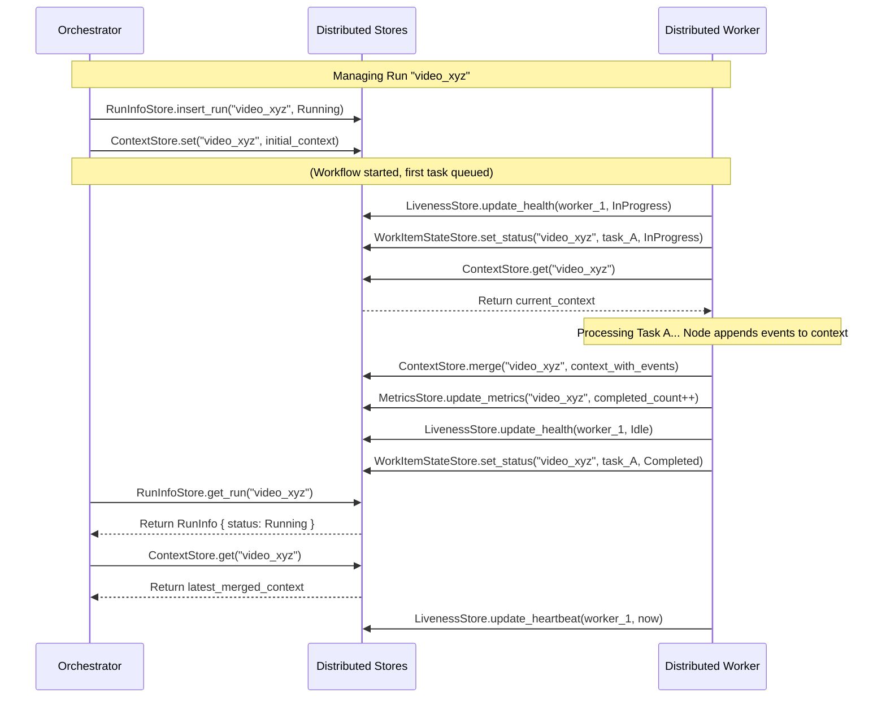

# Chapter 9: Distributed Stores (`RunInfoStore`, `MetricsStore`, `ErrorStore`, `LivenessStore`, `WorkItemStateStore`)

In the [previous chapter](08__distributedorchestrator__.md), we met the `DistributedOrchestrator`, the project manager for our distributed workflow factory. It starts new runs, checks their status, and manages them. We also have our [`DistributedWorker`](07__distributedworker__.md)s diligently processing tasks from the [`WorkQueue`](05__workqueue__trait_.md) and saving progress using the [`CheckpointStore`](06__checkpoint_____checkpointstore__trait_.md).

But how does the orchestrator *know* the status of a run? How does it track errors? How do workers report they are still alive? How do we count how many tasks succeeded or failed? Simply saving the workflow's core data (`Checkpoint`) isn't enough for monitoring and management.

## What's the Problem? Keeping Track of Everything

Imagine running that video processing factory. Besides the main blueprints ([`Workflow`](04__workflow__trait____workflow___macro_.md)) and the task list ([`WorkQueue`](05__workqueue__trait_.md)), the factory manager ([`DistributedOrchestrator`](08__distributedorchestrator__.md)) and the floor supervisors need several specialized logbooks or ledgers to keep things running smoothly:

*   **Shared Project Data:** Where is the latest version of the project's shared information (like configuration, progress counters, aggregated results) stored?
*   **Project Status Board:** Which videos are currently being processed? Which are finished? Which failed?
*   **Quality Control Log:** How many steps completed successfully? How many failed? How many needed retries?
*   **Incident Report Book:** What errors occurred, when, and during which step?
*   **Employee Attendance Sheet:** Which workers are currently active? When did they last check in?
*   **Detailed Task Checklist:** For each video, what's the exact status of *each specific step* (Download, Extract Audio, etc.) – is it waiting, running, done, or failed?

In a **distributed** system, these logbooks need to be accessible and updatable by everyone involved (the orchestrator and all workers), even if they are on different computers.

Floxide provides a set of specialized "Distributed Stores" to act as these shared, digital logbooks.

## What are Distributed Stores? Specialized Ledgers

In a distributed Floxide system, managing state involves several specialized storage traits. Unlike the [`CheckpointStore`](06__checkpoint_____checkpointstore__trait_.md) (used primarily for local persistence), these stores separate concerns for better scalability and observability in a multi-worker environment:

*   **`ContextStore`**: Manages the shared workflow [`Context`](03__workflowctx_____context__trait_.md) data.
*   `RunInfoStore`: Tracks overall run status.
*   `MetricsStore`: Counts completed/failed items.
*   `ErrorStore`: Logs errors encountered.
*   `LivenessStore`: Tracks worker heartbeats and health.
*   `WorkItemStateStore`: Tracks the status of individual tasks within a run.

These stores work together with the [`WorkQueue`](05__workqueue__trait_.md) to provide a complete picture and enable coordination between the orchestrator and workers.

## The Different Stores Explained

Let's look at what each store is responsible for:

### 1. `ContextStore`: The Shared Project Data Store

*   **Purpose:** To reliably save, load, and *merge* the shared [`Context`](03__workflowctx_____context__trait_.md) data associated with each workflow run.
*   **Analogy:** A central, version-controlled document repository where each project's shared notes and configuration are stored. When multiple people edit concurrently, the system knows how to merge their changes.
*   **Key Info Stored:** The complete `Context` object for each `run_id`.
*   **Key Operations:**
    *   `set(run_id, context)`: Saves the initial or overwrites the context.
    *   `get(run_id)`: Retrieves the latest saved context.
    *   `merge(run_id, context_fragment)`: **Crucially**, merges a partial update (e.g., new events appended by a worker) into the existing stored context using the `Merge` trait defined on the context type (see [Chapter 3](03__workflowctx_____context__trait_.md)).
*   **Used By:**
    *   Orchestrator: To `set` the initial context when starting a run, and potentially `get` the final context.
    *   Worker: To `get` the context before processing a step, and to `merge` the updated context (with appended events) after successfully completing a step.

### 2. `RunInfoStore`: The Project Status Board

*   **Purpose:** Keeps track of the high-level status of each workflow run.
*   **Analogy:** A whiteboard listing all ongoing projects (video runs) and their current status (Running, Completed, Failed, Paused, Cancelled).
*   **Key Info Stored:** For each `run_id`: status, start time, end time.
*   **Used By:**
    *   Orchestrator: To `start_run` (sets status to Running), `status()`, `list_runs()`, `cancel()`, `pause()`, `resume()`.
    *   Worker: Potentially updates status to Completed or Failed upon run completion (often via callbacks).

### 3. `MetricsStore`: The Quality Control Log

*   **Purpose:** Collects numerical metrics about each workflow run's execution.
*   **Analogy:** A tally sheet tracking how many items passed quality control, how many failed, and how many needed rework (retries).
*   **Key Info Stored:** For each `run_id`: count of completed items, failed items, retried items.
*   **Used By:**
    *   Worker: Updates counts after processing each step (e.g., increment completed or failed count).
    *   Orchestrator: To query `metrics()` for a run.

### 4. `ErrorStore`: The Incident Report Book

*   **Purpose:** Records detailed information about errors that occur during workflow execution.
*   **Analogy:** A logbook where workers report any machine malfunctions or defects found, noting the time, machine, and details.
*   **Key Info Stored:** For each `run_id`: a list of errors, including the step (`WorkItem`), the error details, the attempt number, and the timestamp.
*   **Used By:**
    *   Worker: Records an error when a [`Node`](02__node__trait____node___macro_.md)'s `process` method returns an `Err` or [`Transition::Abort`](01__transition__enum_.md).
    *   Orchestrator: To query `errors()` for a run to diagnose problems.

### 5. `LivenessStore`: The Employee Attendance & Health Monitor

*   **Purpose:** Tracks whether workers are active and responsive.
*   **Analogy:** An automated system where employees clock in/out and report their status (Idle, Working, On Break). The manager can see who is currently active.
*   **Key Info Stored:** For each `worker_id`: the timestamp of the last heartbeat, current status (Idle, InProgress, Retrying), current task being worked on, error count.
*   **Used By:**
    *   Worker: Periodically sends `heartbeat()` updates and updates its status (`update_health()`) when starting/finishing/retrying tasks.
    *   Orchestrator: To check `liveness()` or `list_worker_health()` to monitor the workforce.

### 6. `WorkItemStateStore`: The Detailed Task Checklist

*   **Purpose:** Tracks the specific status of *each individual* `WorkItem` (task) within a workflow run. This is more granular than `RunInfoStore`.
*   **Analogy:** A detailed checklist attached to each product on the assembly line, where each station worker marks their specific task as Pending, InProgress, Completed, or Failed.
*   **Key Info Stored:** For each `run_id` and each unique `WorkItem` instance within that run: status (Pending, InProgress, Failed, WaitingRetry, PermanentlyFailed, Completed), number of attempts.
*   **Used By:**
    *   Worker: Updates the status before starting a task (Pending -> InProgress), after success (-> Completed), or after failure (-> Failed/WaitingRetry/PermanentlyFailed). Increments attempt count.
    *   Orchestrator: Can query `list_work_items()` to see the detailed state of all steps in a run. Useful for debugging or resuming complex workflows.

## How They Enable Distribution

These stores are defined as traits (interfaces). The key idea is that for a real distributed system, you provide implementations of these traits that use a shared, persistent backend accessible by all orchestrators and workers. Common backends include:

*   **Redis:** A fast in-memory data store, suitable for all stores. The `floxide-redis` crate provides implementations like `RedisContextStore`, `RedisRunInfoStore`, etc.
*   **Databases (SQL/NoSQL):** Can be used, especially for stores requiring more structured data like `RunInfoStore` or `ErrorStore`.
*   **Cloud Services:** Specific services like AWS DynamoDB, Google Cloud Datastore, or Azure Cosmos DB can back these stores.

When Worker 1 on Machine A successfully processes a step and calls `context_store.merge(...)` and `metrics_store.update_metrics(...)`, the underlying Redis or database implementation updates the shared state. Subsequently, the Orchestrator or another worker querying `context_store.get(...)` or `metrics_store.get_metrics(...)` will see the results of Worker 1's actions.

## Using the Stores (Conceptual)

You generally don't interact with these stores directly in your [`Node`](02__node__trait____node___macro_.md) logic. The [`DistributedWorker`](07__distributedworker__.md) and [`DistributedOrchestrator`](08__distributedorchestrator__.md) use them internally as part of their operations.

*   When the orchestrator calls `start_run`, it uses `RunInfoStore.insert_run(...)`.
*   When the orchestrator calls `status()`, it uses `RunInfoStore.get_run(...)`.
*   When a worker starts a task, it calls `context_store.get(...)`, `LivenessStore.update_health(...)` and `WorkItemStateStore.set_status(..., InProgress)`.
*   When a worker finishes a task successfully, it calls `context_store.merge(...)`, `MetricsStore.update_metrics(...)` and `WorkItemStateStore.set_status(..., Completed)`.
*   When a worker encounters an error, it calls `ErrorStore.record_error(...)`, `MetricsStore.update_metrics(...)`, `LivenessStore.update_health(...)` and `WorkItemStateStore.set_status(..., Failed/...)`. Note: It typically *does not* merge context changes on error.
*   Periodically, the worker calls `LivenessStore.update_heartbeat(...)`.

## The Store Traits

Each store has a corresponding trait defining its methods. We saw `RunInfoStore` earlier. Here's a conceptual look at `ContextStore`:

```rust
// Simplified concept from floxide-core/src/distributed/context_store.rs
use async_trait::async_trait;
use crate::context::Context;
use crate::distributed::ContextStoreError;

/// Store for workflow run context data.
#[async_trait]
pub trait ContextStore<C: Context>: Clone + Send + Sync + 'static {
    /// Set (or overwrite) the entire context for a run.
    async fn set(&self, run_id: &str, context: C) -> Result<(), ContextStoreError>;

    /// Get the current context for a run.
    async fn get(&self, run_id: &str) -> Result<Option<C>, ContextStoreError>;

    /// Merge a context fragment into the existing context for a run.
    /// This relies on the `Merge` trait implemented by type `C`.
    async fn merge(&self, run_id: &str, context_fragment: C) -> Result<(), ContextStoreError>;

    // Potentially other methods like `delete`
}
```

This defines the standard operations. The key method here is `merge`, which enables concurrent updates using the event sourcing pattern described in [Chapter 3](03__workflowctx_____context__trait_.md).

## Implementations: In-Memory vs. Distributed

Floxide provides default `InMemory...Store` implementations for all these traits (e.g., `InMemoryContextStore`, `InMemoryRunInfoStore`). These are useful for testing and single-process use.

The `floxide-redis` crate provides `Redis...Store` implementations (e.g., `RedisContextStore`) for use with a Redis backend in truly distributed scenarios.

Here's a conceptual look at `InMemoryContextStore`:

```rust
// Simplified concept
use std::collections::HashMap;
use std::sync::Arc;
use tokio::sync::Mutex;
use crate::merge::Merge; // <-- Requires Context to implement Merge

/// In-memory context store.
#[derive(Clone, Default)]
pub struct InMemoryContextStore<C: Context> {
    inner: Arc<Mutex<HashMap<String, C>>>,
}

#[async_trait]
impl<C: Context> ContextStore<C> for InMemoryContextStore<C> {
    async fn set(&self, run_id: &str, context: C) -> Result<(), ContextStoreError> {
        let mut map = self.inner.lock().await;
        map.insert(run_id.to_string(), context);
        Ok(())
    }

    async fn get(&self, run_id: &str) -> Result<Option<C>, ContextStoreError> {
        let map = self.inner.lock().await;
        Ok(map.get(run_id).cloned())
    }

    async fn merge(&self, run_id: &str, context_fragment: C) -> Result<(), ContextStoreError> {
        let mut map = self.inner.lock().await;
        match map.entry(run_id.to_string()) {
            std::collections::hash_map::Entry::Occupied(mut entry) => {
                // Use the Merge trait to combine the fragment
                entry.get_mut().merge(context_fragment);
            }
            std::collections::hash_map::Entry::Vacant(entry) => {
                // If no existing context, just insert the fragment
                entry.insert(context_fragment);
            }
        }
        Ok(())
    }
}
```

**Important:** For *true* distribution across multiple machines, you **must** use implementations backed by external, shared services. The `floxide-redis` crate provides these for Redis.

## Under the Hood: Orchestrator and Worker Interaction

The orchestrator and workers rely heavily on these stores to coordinate.



This diagram shows how different actions trigger updates or queries to the various specialized stores, using `ContextStore` specifically for the shared workflow data.

## Conclusion

The distributed stores (`ContextStore`, `RunInfoStore`, `MetricsStore`, `ErrorStore`, `LivenessStore`, `WorkItemStateStore`) are essential components for managing and monitoring Floxide workflows in a distributed environment. They act as specialized, shared ledgers, providing:

*   **State Management (`ContextStore`):** Reliably persists and merges shared workflow data using the `Merge` trait.
*   **Visibility:** Allows the orchestrator and users to see the status of runs, worker health, errors, and performance metrics.
*   **Coordination:** Enables workers and the orchestrator to access consistent state information, even when running on different machines.
*   **Control:** Provides the foundation for actions like cancelling runs or checking worker liveness.

While in-memory versions are provided, real distributed applications require implementations backed by shared, persistent storage. The `floxide-redis` crate provides implementations for Redis.

These stores work together with the [`WorkQueue`](05__workqueue__trait_.md) to make distributed workflow execution manageable and robust.

Now that we understand how errors are tracked (`ErrorStore`) and how individual task states are managed (`WorkItemStateStore`), how can we build workflows that automatically handle transient failures? Let's look at how Floxide supports retries.

**Next:** [Chapter 10: `RetryPolicy` & `RetryNode`](10__retrypolicy_____retrynode__.md)