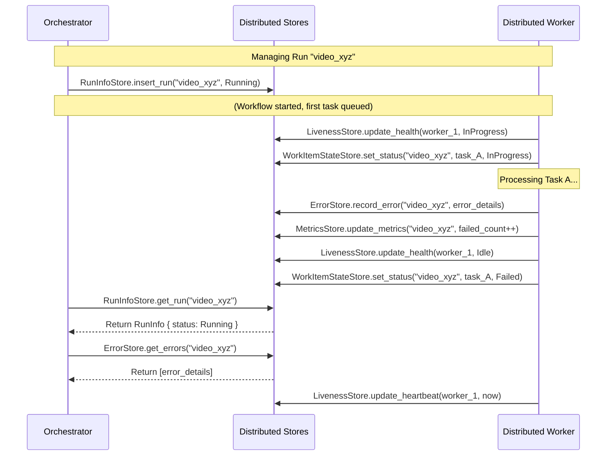

# Chapter 9: Distributed Stores (`RunInfoStore`, `MetricsStore`, `ErrorStore`, `LivenessStore`, `WorkItemStateStore`)

In the [previous chapter](08__distributedorchestrator__.md), we met the `DistributedOrchestrator`, the project manager for our distributed workflow factory. It starts new runs, checks their status, and manages them. We also have our [`DistributedWorker`](07__distributedworker__.md)s diligently processing tasks from the [`WorkQueue`](05__workqueue__trait_.md) and saving progress using the [`CheckpointStore`](06__checkpoint_____checkpointstore__trait_.md).

But how does the orchestrator *know* the status of a run? How does it track errors? How do workers report they are still alive? How do we count how many tasks succeeded or failed? Simply saving the workflow's core data (`Checkpoint`) isn't enough for monitoring and management.

## What's the Problem? Keeping Track of Everything

Imagine running that video processing factory. Besides the main blueprints ([`Workflow`](04__workflow__trait____workflow___macro_.md)) and the task list ([`WorkQueue`](05__workqueue__trait_.md)), the factory manager ([`DistributedOrchestrator`](08__distributedorchestrator__.md)) and the floor supervisors need several specialized logbooks or ledgers to keep things running smoothly:

*   **Project Status Board:** Which videos are currently being processed? Which are finished? Which failed?
*   **Quality Control Log:** How many steps completed successfully? How many failed? How many needed retries?
*   **Incident Report Book:** What errors occurred, when, and during which step?
*   **Employee Attendance Sheet:** Which workers are currently active? When did they last check in?
*   **Detailed Task Checklist:** For each video, what's the exact status of *each specific step* (Download, Extract Audio, etc.) – is it waiting, running, done, or failed?

In a **distributed** system, these logbooks need to be accessible and updatable by everyone involved (the orchestrator and all workers), even if they are on different computers.

Floxide provides a set of specialized "Distributed Stores" to act as these shared, digital logbooks.

## What are Distributed Stores? Specialized Ledgers

Beyond the core [`CheckpointStore`](06__checkpoint_____checkpointstore__trait_.md) (which saves the workflow's internal state and pending tasks), Floxide defines several other storage traits for specific kinds of metadata needed for monitoring and managing distributed workflows. These are:

*   `RunInfoStore`: Tracks overall run status.
*   `MetricsStore`: Counts completed/failed items.
*   `ErrorStore`: Logs errors encountered.
*   `LivenessStore`: Tracks worker heartbeats and health.
*   `WorkItemStateStore`: Tracks the status of individual tasks within a run.

Think of them as separate database tables or dedicated sections in a shared document, each designed for a specific purpose. They provide visibility and enable coordination between the orchestrator and workers.

## The Different Stores Explained

Let's look at what each store is responsible for:

### 1. `RunInfoStore`: The Project Status Board

*   **Purpose:** Keeps track of the high-level status of each workflow run.
*   **Analogy:** A whiteboard listing all ongoing projects (video runs) and their current status (Running, Completed, Failed, Paused, Cancelled).
*   **Key Info Stored:** For each `run_id`: status, start time, end time.
*   **Used By:**
    *   Orchestrator: To `start_run` (sets status to Running), `status()`, `list_runs()`, `cancel()`, `pause()`, `resume()`.
    *   Worker: Potentially updates status to Completed or Failed upon run completion (often via callbacks).

### 2. `MetricsStore`: The Quality Control Log

*   **Purpose:** Collects numerical metrics about each workflow run's execution.
*   **Analogy:** A tally sheet tracking how many items passed quality control, how many failed, and how many needed rework (retries).
*   **Key Info Stored:** For each `run_id`: count of completed items, failed items, retried items.
*   **Used By:**
    *   Worker: Updates counts after processing each step (e.g., increment completed or failed count).
    *   Orchestrator: To query `metrics()` for a run.

### 3. `ErrorStore`: The Incident Report Book

*   **Purpose:** Records detailed information about errors that occur during workflow execution.
*   **Analogy:** A logbook where workers report any machine malfunctions or defects found, noting the time, machine, and details.
*   **Key Info Stored:** For each `run_id`: a list of errors, including the step (`WorkItem`), the error details, the attempt number, and the timestamp.
*   **Used By:**
    *   Worker: Records an error when a [`Node`](02__node__trait____node___macro_.md)'s `process` method returns an `Err` or [`Transition::Abort`](01__transition__enum_.md).
    *   Orchestrator: To query `errors()` for a run to diagnose problems.

### 4. `LivenessStore`: The Employee Attendance & Health Monitor

*   **Purpose:** Tracks whether workers are active and responsive.
*   **Analogy:** An automated system where employees clock in/out and report their status (Idle, Working, On Break). The manager can see who is currently active.
*   **Key Info Stored:** For each `worker_id`: the timestamp of the last heartbeat, current status (Idle, InProgress, Retrying), current task being worked on, error count.
*   **Used By:**
    *   Worker: Periodically sends `heartbeat()` updates and updates its status (`update_health()`) when starting/finishing/retrying tasks.
    *   Orchestrator: To check `liveness()` or `list_worker_health()` to monitor the workforce.

### 5. `WorkItemStateStore`: The Detailed Task Checklist

*   **Purpose:** Tracks the specific status of *each individual* `WorkItem` (task) within a workflow run. This is more granular than `RunInfoStore`.
*   **Analogy:** A detailed checklist attached to each product on the assembly line, where each station worker marks their specific task as Pending, InProgress, Completed, or Failed.
*   **Key Info Stored:** For each `run_id` and each unique `WorkItem` instance within that run: status (Pending, InProgress, Failed, WaitingRetry, PermanentlyFailed, Completed), number of attempts.
*   **Used By:**
    *   Worker: Updates the status before starting a task (Pending -> InProgress), after success (-> Completed), or after failure (-> Failed/WaitingRetry/PermanentlyFailed). Increments attempt count.
    *   Orchestrator: Can query `list_work_items()` to see the detailed state of all steps in a run. Useful for debugging or resuming complex workflows.

## How They Enable Distribution

These stores are designed as traits (interfaces). The key idea is that for a real distributed system, you provide implementations of these traits that use a shared, persistent backend accessible by all orchestrators and workers. Common backends include:

*   **Redis:** A fast in-memory data store, often used for queues, caching, and storing simple state like heartbeats or statuses.
*   **Databases (SQL/NoSQL):** More robust storage for run info, errors, and detailed work item states.
*   **Cloud Services:** Specific services like AWS DynamoDB, Google Cloud Datastore, or Azure Cosmos DB.

When Worker 1 on Machine A updates the `RunInfoStore` (e.g., sets status to Completed), Worker 2 on Machine B or the Orchestrator on Machine C can immediately query that same store and see the updated status. This shared information layer is what allows the distributed components to coordinate.

## Using the Stores (Conceptual)

You generally don't interact with these stores directly in your [`Node`](02__node__trait____node___macro_.md) logic. The [`DistributedWorker`](07__distributedworker__.md) and [`DistributedOrchestrator`](08__distributedorchestrator__.md) use them internally as part of their operations.

*   When the orchestrator calls `start_run`, it uses `RunInfoStore.insert_run(...)`.
*   When the orchestrator calls `status()`, it uses `RunInfoStore.get_run(...)`.
*   When a worker starts a task, it might call `LivenessStore.update_health(...)` and `WorkItemStateStore.set_status(..., InProgress)`.
*   When a worker finishes a task successfully, it might call `MetricsStore.update_metrics(...)` and `WorkItemStateStore.set_status(..., Completed)`.
*   When a worker encounters an error, it calls `ErrorStore.record_error(...)`, `MetricsStore.update_metrics(...)`, `LivenessStore.update_health(...)` and `WorkItemStateStore.set_status(..., Failed/...)`.
*   Periodically, the worker calls `LivenessStore.update_heartbeat(...)`.

## The Store Traits

Each store has a corresponding trait defining its methods. For example, the `RunInfoStore`:

```rust
// Simplified from crates/floxide-core/src/distributed/run_info_store.rs
use async_trait::async_trait;
use crate::distributed::{RunInfo, RunStatus, RunInfoError};

/// Trait for a distributed workflow run info store.
#[async_trait]
pub trait RunInfoStore {
    /// Insert a new workflow run record.
    async fn insert_run(&self, info: RunInfo) -> Result<(), RunInfoError>;
    /// Update the status for a workflow run.
    async fn update_status(&self, run_id: &str, status: RunStatus) -> Result<(), RunInfoError>;
    // ... other methods like update_finished_at, get_run, list_runs ...
}
```

This defines the standard operations any `RunInfoStore` implementation must provide. The other store traits (`MetricsStore`, `ErrorStore`, etc.) follow a similar pattern, defining methods specific to their purpose.

## Implementations: In-Memory vs. Distributed

Floxide provides default `InMemory...Store` implementations for all these traits (e.g., `InMemoryRunInfoStore`, `InMemoryLivenessStore`). These are useful for getting started quickly, testing, and running workflows within a single process.

Here's a look at the `InMemoryRunInfoStore`:

```rust
// Simplified from crates/floxide-core/src/distributed/run_info_store.rs
use std::collections::HashMap;
use std::sync::Arc;
use tokio::sync::Mutex; // For thread-safe access

/// In-memory implementation of RunInfoStore for testing.
#[derive(Clone, Default)]
pub struct InMemoryRunInfoStore {
    // Stores run info in a HashMap protected by a Mutex
    inner: Arc<Mutex<HashMap<String, RunInfo>>>,
}

#[async_trait]
impl RunInfoStore for InMemoryRunInfoStore {
    async fn insert_run(&self, info: RunInfo) -> Result<(), RunInfoError> {
        let mut map = self.inner.lock().await; // Lock the map for writing
        map.insert(info.run_id.clone(), info); // Insert the data
        Ok(())
    } // Lock released automatically

    async fn update_status(&self, run_id: &str, status: RunStatus) -> Result<(), RunInfoError> {
        let mut map = self.inner.lock().await;
        if let Some(info) = map.get_mut(run_id) { // Find the run by ID
            info.status = status; // Update its status
            Ok(())
        } else {
            Err(RunInfoError::NotFound) // Return error if run ID doesn't exist
        }
    }
    // ... implementations for other methods ...
}
```

This uses a standard Rust `HashMap` wrapped in an `Arc<Mutex>` to allow safe sharing across different async tasks within the *same process*.

**Important:** For *true* distribution across multiple machines, you **must** use implementations backed by external, shared services (like Redis, PostgreSQL, Kafka, etc.). These implementations would replace the `HashMap` with client calls to the external service.

## Under the Hood: Orchestrator and Worker Interaction

The orchestrator and workers rely heavily on these stores to coordinate.



This diagram shows how different actions (worker processing a task, worker failing, orchestrator checking status) trigger updates or queries to the various specialized stores, keeping the overall state consistent and observable across the distributed system.

## Conclusion

The distributed stores (`RunInfoStore`, `MetricsStore`, `ErrorStore`, `LivenessStore`, `WorkItemStateStore`) are essential components for managing and monitoring Floxide workflows in a distributed environment. They act as specialized, shared ledgers, providing:

*   **Visibility:** Allows the orchestrator and users to see the status of runs, worker health, errors, and performance metrics.
*   **Coordination:** Enables workers and the orchestrator to access consistent state information, even when running on different machines.
*   **Control:** Provides the foundation for actions like cancelling runs or checking worker liveness.

While in-memory versions are provided, real distributed applications require implementations backed by shared, persistent storage like Redis or databases. These stores work alongside the [`WorkQueue`](05__workqueue__trait_.md) and [`CheckpointStore`](06__checkpoint_____checkpointstore__trait_.md) to make distributed workflow execution manageable and robust.

Now that we understand how errors are tracked (`ErrorStore`) and how individual task states are managed (`WorkItemStateStore`), how can we build workflows that automatically handle transient failures? Let's look at how Floxide supports retries.

**Next:** [Chapter 10: `RetryPolicy` & `RetryNode`](10__retrypolicy_____retrynode__.md)