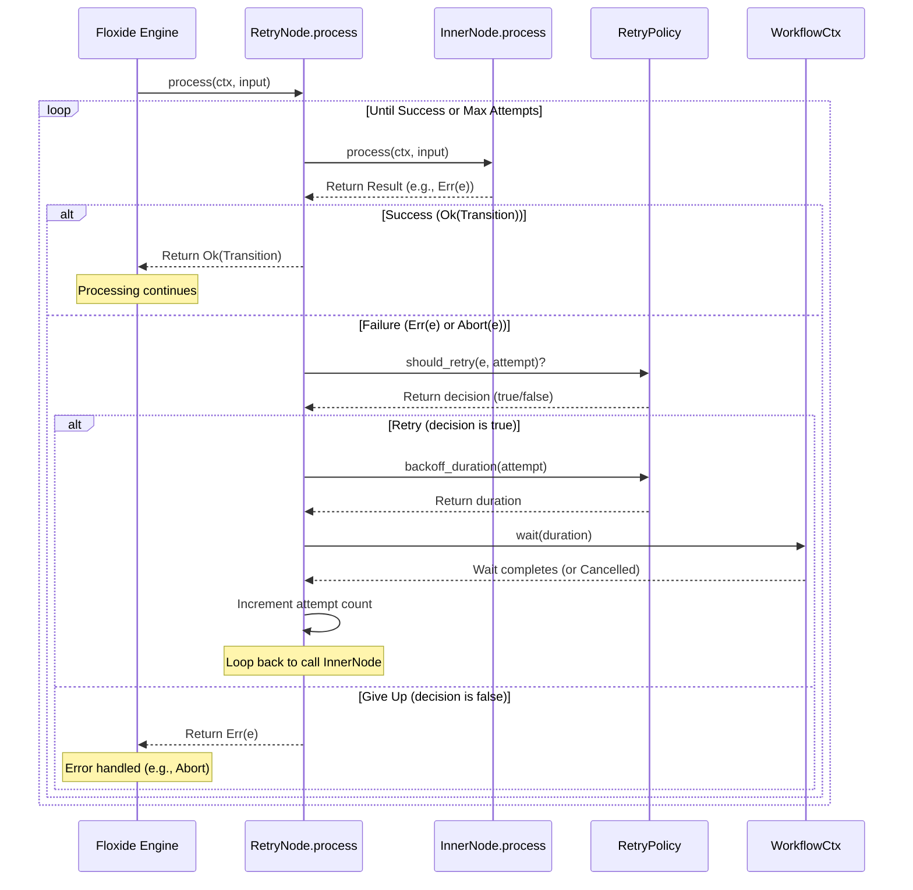

# Chapter 10: `RetryPolicy` & `RetryNode`

Welcome to the final chapter in our introductory tour of Floxide! In the [previous chapter](09_distributed_stores___runinfostore____metricsstore____errorstore____livenessstore____workitemstatestore___.md), we explored the various distributed stores that Floxide uses to keep track of run status, errors, metrics, and worker health, enabling monitoring and management across our distributed system. We saw how errors are recorded in the `ErrorStore`. But what if an error is just temporary?

## What's the Problem? Dealing with Temporary Glitches

Imagine one step in your workflow involves calling an external web service (an API) to get some data. What happens if the network connection briefly drops just as your [`Node`](02__node__trait____node___macro_.md) makes the call? Or what if the external service is momentarily overloaded and returns a temporary error?

If the Node simply fails and returns [`Transition::Abort`](01__transition__enum_.md), the whole workflow run might stop unnecessarily. The problem might fix itself if we just waited a moment and tried again!

This is especially common in **distributed** systems. Tasks running on different machines communicate over networks, which aren't always perfectly reliable. Services might become temporarily unavailable. We need a way to automatically handle these transient failures without stopping the entire workflow.

Floxide provides built-in support for automatic retries using the `RetryPolicy` and `RetryNode` concepts.

## The Concepts: Rules and the Enforcer

Floxide splits the retry logic into two parts:

1.  **`RetryPolicy`**: This defines the *rules* for how retries should happen. Think of it as the instruction manual for retrying a failed task:
    *   **How many times should we retry?** (Maximum attempts)
    *   **How long should we wait between tries?** (Initial backoff duration)
    *   **Should the wait time increase after each failure?** (Backoff strategy: Linear or Exponential)
    *   **What's the longest we should ever wait?** (Maximum backoff duration)
    *   **Which kinds of errors should we even bother retrying?** (Maybe only retry network errors, not configuration errors).

2.  **`RetryNode`**: This is the *enforcer* that applies the rules. It's a special kind of Node that wraps your *original* Node.
    *   You give it your potentially fallible Node (like the one calling the API) and a `RetryPolicy`.
    *   When the `RetryNode` is executed, it tries running the inner Node.
    *   If the inner Node succeeds, the `RetryNode` passes the result along.
    *   If the inner Node fails with an error that the `RetryPolicy` says is retryable:
        *   The `RetryNode` catches the error.
        *   It waits for the duration specified by the policy's backoff strategy.
        *   It tries running the inner Node *again*.
        *   It repeats this process until the inner Node succeeds, or the maximum number of attempts is reached, or a non-retryable error occurs.

This wrapper approach makes it easy to add resilience to existing Nodes without modifying their core logic.

## How to Use Retries

Let's add retries to a hypothetical `CallApiNode`.

### 1. Define a `RetryPolicy`

First, you create an instance of `RetryPolicy` specifying your desired rules.

```rust
use floxide_core::retry::{RetryPolicy, BackoffStrategy, RetryError};
use std::time::Duration;

// Example policy:
// - Try up to 5 times in total (1 initial + 4 retries).
// - Start with a 100ms wait.
// - Double the wait time after each failure (exponential backoff).
// - Don't wait longer than 1 second between tries.
// - Retry only on "Generic" errors (often used for I/O or temporary issues).
let my_retry_policy = RetryPolicy::new(
    5,                         // max_attempts
    Duration::from_millis(100), // initial_backoff
    Duration::from_secs(1),    // max_backoff
    BackoffStrategy::Exponential, // strategy
    RetryError::Generic,       // which errors to retry
);

// You can also add jitter (random variation) to backoff times
// let my_retry_policy = my_retry_policy.with_jitter(Duration::from_millis(50));

println!("Created retry policy: {:?}", my_retry_policy);
```

**Explanation:**
*   We use `RetryPolicy::new(...)` to create the policy object.
*   `max_attempts`: The total number of tries.
*   `initial_backoff`: The wait time before the *first* retry (after the initial failure).
*   `max_backoff`: The ceiling for the wait time, even if the strategy calculates a longer duration.
*   `BackoffStrategy::Exponential`: Means the wait time roughly doubles each time (100ms, 200ms, 400ms, 800ms, then capped at 1000ms). `Linear` would add the initial amount each time (100ms, 200ms, 300ms...).
*   `RetryError::Generic`: Specifies that we should *only* retry if the inner Node fails with `FloxideError::Generic`. Other errors like `FloxideError::Cancelled` or `FloxideError::Timeout` would not be retried with this setting. `RetryError::All` would retry any error.

### 2. Wrap Your Node with `RetryNode`

Now, take your original Node instance and wrap it using the `floxide_core::retry::with_retry` helper function (or directly creating `RetryNode`).

```rust
use floxide_core::retry::with_retry;
// Assume CallApiNode is a Node struct we defined elsewhere using `node!`
// use crate::nodes::CallApiNode;

// Create an instance of the potentially fallible node
let original_api_node = CallApiNode { /* ... configuration ... */ };

// Wrap it with our retry policy
let resilient_api_node = with_retry(original_api_node, my_retry_policy.clone());

println!("Created a RetryNode wrapping CallApiNode.");
```

**Explanation:**
*   `with_retry` takes the original `Node` instance (`original_api_node`) and the `RetryPolicy` (`my_retry_policy`).
*   It returns a new `RetryNode` instance (`resilient_api_node`). This `RetryNode` now contains both the original node and the policy.
*   Crucially, `RetryNode` itself *also implements the [`Node` trait](02__node__trait____node___macro_.md)*! This means you can use `resilient_api_node` anywhere you would use a regular Node.

### 3. Use the `RetryNode` in Your Workflow

You can now use the wrapped node (`resilient_api_node`) in your [`workflow!` macro](04__workflow__trait____workflow___macro_.md) definition just like any other node.

```rust
use floxide::{workflow, node, Workflow, Node, Context, Transition, FloxideError};
use serde::{Serialize, Deserialize};
use std::sync::Arc;
// --- Assume definitions for SimpleContext, StartNode, EndNode, CallApiNode ---
// --- Assume `my_retry_policy` is defined as above ---

// --- Workflow Definition ---
workflow! {
  #[derive(Clone, Debug)]
  pub struct MyApiWorkflow {
    // Node instances for the workflow
    step1_start: StartNode,
    // *** Use the wrapped RetryNode here! ***
    step2_call_api: floxide_core::retry::RetryNode<CallApiNode>,
    step3_end: EndNode,
  }
  context = SimpleContext;
  start = step1_start;
  edges {
    step1_start => [step2_call_api];
    step2_call_api => [step3_end];
    step3_end => [];
  };
}

// --- How you might create the workflow instance ---
// let start_node = StartNode {};
// let original_api_node = CallApiNode { /* ... */ };
// let resilient_api_node = with_retry(original_api_node, my_retry_policy); // Wrap it!
// let end_node = EndNode {};
//
// let my_workflow = MyApiWorkflow {
//   step1_start: start_node,
//   step2_call_api: resilient_api_node, // Assign the wrapped node
//   step3_end: end_node,
// };
```

**Explanation:**
*   In the `MyApiWorkflow` struct definition inside `workflow!`, the type for `step2_call_api` is `floxide_core::retry::RetryNode<CallApiNode>`.
*   When you create an instance of `MyApiWorkflow`, you provide the `resilient_api_node` (the wrapped one) for the `step2_call_api` field.
*   When the Floxide engine runs this workflow and reaches `step2_call_api`, it will execute the `RetryNode`'s logic, which internally handles the retries for the `CallApiNode` according to `my_retry_policy`.

**(Alternative) Using `#[retry]` Attribute:**
The [`workflow!` macro](04__workflow__trait____workflow___macro_.md) also provides a convenient `#[retry = ...]` attribute as a shortcut. You can define a `RetryPolicy` as a field in your workflow struct and apply it directly to a node field:

```rust
use floxide_core::retry::RetryPolicy;
// ... other imports ...

workflow! {
  #[derive(Clone, Debug)]
  pub struct MyApiWorkflowWithAttr {
    // Define the policy as a field
    api_retry_policy: RetryPolicy,

    // Node instances
    step1_start: StartNode,
    // Apply the policy directly using the attribute
    #[retry = api_retry_policy]
    step2_call_api: CallApiNode, // Note: type is the original Node here!
    step3_end: EndNode,
  }
  context = SimpleContext;
  start = step1_start;
  edges { /* ... same edges ... */ };
}

// --- How you might create this workflow instance ---
// let my_policy = RetryPolicy::new(/* ... */);
// let start_node = StartNode {};
// let original_api_node = CallApiNode { /* ... */ };
// let end_node = EndNode {};
//
// let my_workflow_attr = MyApiWorkflowWithAttr {
//   api_retry_policy: my_policy,
//   step1_start: start_node,
//   step2_call_api: original_api_node, // Provide the original node
//   step3_end: end_node,
// };
// The macro automatically wraps step2_call_api with the policy at compile time.
```
This attribute simplifies the workflow definition when using retries.

## How it Works Under the Hood

What happens when the engine calls `process` on a `RetryNode`?

1.  **Call Inner:** The `RetryNode` calls the `process` method of the `inner` Node it contains, passing along the context and input.
2.  **Check Result:** It examines the `Result<Transition, FloxideError>` returned by the inner Node.
3.  **Success?** If the result is `Ok(Transition::Next(..))`, `Ok(Transition::NextAll(..))`, or `Ok(Transition::Hold)`, the `RetryNode` simply returns that result immediately. The job is done.
4.  **Failure?** If the result is `Ok(Transition::Abort(e))` or `Err(e)`, the `RetryNode` catches the error `e`.
5.  **Check Policy:** It calls `self.policy.should_retry(&e, current_attempt)`. This checks two things:
    *   Have we exceeded `max_attempts`?
    *   Is this `e` the kind of error the policy wants to retry (based on `RetryError` setting)?
6.  **Retry?** If `should_retry` returns `true`:
    *   Calculate wait time: `let backoff = self.policy.backoff_duration(current_attempt);`
    *   Wait: It calls `ctx.wait(backoff).await`. Using the [`WorkflowCtx`](03__workflowctx_____context__trait_.md) for waiting is important because it respects overall workflow cancellation or timeouts.
    *   Increment `current_attempt`.
    *   Loop back to step 1 (Call Inner again).
7.  **Give Up?** If `should_retry` returns `false`:
    *   The `RetryNode` stops trying.
    *   It returns the original error `e` (as `Err(e)`). The workflow will then likely handle this as a permanent failure (perhaps using fallback edges defined in `workflow!`, or ultimately failing the run).

Here's a simplified sequence diagram:



## Deeper Dive into Code

The core logic resides in `floxide-core/src/retry.rs`.

**`RetryPolicy` Struct:**

```rust
// Simplified from crates/floxide-core/src/retry.rs

#[derive(Clone, Debug)]
pub struct RetryPolicy {
    pub max_attempts: usize,
    pub initial_backoff: Duration,
    pub max_backoff: Duration,
    pub strategy: BackoffStrategy, // Enum: Linear, Exponential
    pub jitter: Option<Duration>,
    pub retry_error: RetryError, // Enum: All, Cancelled, Timeout, Generic
}

impl RetryPolicy {
    // Determines if an error should be retried based on policy rules and attempt count.
    pub fn should_retry(&self, error: &FloxideError, attempt: usize) -> bool {
        // Check max_attempts and error type based on retry_error setting
        // ... logic ...
    }

    // Calculates the duration to wait before the next attempt.
    pub fn backoff_duration(&self, attempt: usize) -> Duration {
        // Calculate base duration based on strategy (Linear/Exponential)
        // Cap at max_backoff
        // Add jitter if configured
        // ... logic ...
    }
}
```
This struct holds the configuration, and the methods implement the rules for deciding whether to retry and how long to wait.

**`RetryNode` Struct:**

```rust
// Simplified from crates/floxide-core/src/retry.rs

#[derive(Clone, Debug)]
pub struct RetryNode<N> { // Generic over the inner Node type N
    /// Inner node to invoke.
    pub inner: N,
    /// Policy controlling retry attempts and backoff.
    pub policy: RetryPolicy,
}
```
This simple struct just holds the inner node and the policy to apply to it.

**`RetryNode::process` Implementation:**

```rust
// Simplified from crates/floxide-core/src/retry.rs
use crate::node::Node;
use crate::context::{Context, WorkflowCtx}; // Context needed for wait
use crate::retry::RetryDelay; // Trait providing ctx.wait()

#[async_trait::async_trait]
impl<C, N> Node<C> for RetryNode<N>
where
    C: Context + RetryDelay, // Context must support waiting
    N: Node<C> + Clone + Send + Sync + 'static, // Inner node requirements
    N::Input: Clone + Send + 'static,
    // ... other bounds ...
{
    type Input = N::Input;
    type Output = N::Output;

    async fn process(
        &self,
        ctx: &C, // The workflow context
        input: Self::Input,
    ) -> Result<Transition<Self::Output>, FloxideError> {
        let mut attempt = 1; // Start with attempt 1

        loop { // Keep trying until success or give up
            // Call the inner node's process method
            let result = self.inner.process(ctx, input.clone()).await;

            match result {
                // Pass through successful transitions immediately
                Ok(Transition::Next(out)) => return Ok(Transition::Next(out)),
                Ok(Transition::NextAll(vs)) => return Ok(Transition::NextAll(vs)),
                Ok(Transition::Hold) => return Ok(Transition::Hold),

                // Handle failures (Abort or Err)
                Ok(Transition::Abort(e)) | Err(e) => {
                    tracing::debug!(attempt, error=%e, "RetryNode: caught error");

                    // Check if policy allows retrying this error at this attempt count
                    if self.policy.should_retry(&e, attempt) {
                        let backoff = self.policy.backoff_duration(attempt);
                        tracing::info!(attempt, backoff=?backoff, "RetryNode: retrying");

                        // Wait for the backoff period, respecting context cancellation
                        ctx.wait(backoff).await?; // Returns Err if cancelled/timeout

                        attempt += 1; // Increment attempt count
                        continue; // Go to the next iteration of the loop
                    } else {
                        // Max attempts reached or non-retryable error
                        tracing::warn!(attempt, error=%e, "RetryNode: giving up");
                        return Err(e); // Return the final error
                    }
                }
            }
        } // End of loop
    }
}
```
This implementation clearly shows the loop structure, the call to the inner node, the error handling, the policy checks (`should_retry`, `backoff_duration`), the crucial `ctx.wait(backoff).await` call, and the final return of either success or the persistent error.

## Conclusion

`RetryPolicy` and `RetryNode` provide a powerful and flexible mechanism for adding automatic retries to individual steps in your Floxide workflows.

*   **`RetryPolicy`** defines *how* to retry (attempts, backoff, error types).
*   **`RetryNode`** acts as a wrapper that *applies* the policy to an existing Node.
*   They work seamlessly with the rest of Floxide, including context-aware waiting (`ctx.wait`) that respects cancellation and timeouts.
*   This significantly improves the **fault tolerance** of your workflows, especially in distributed environments where transient errors are common.

By making individual steps more resilient, you make the entire distributed workflow more robust and reliable. This concludes our introduction to the core concepts of Floxide! You've learned about transitions, nodes, context, workflows, queues, checkpoints, workers, orchestrators, stores, and retries – everything you need to start building your own easy, distributed workflows.
