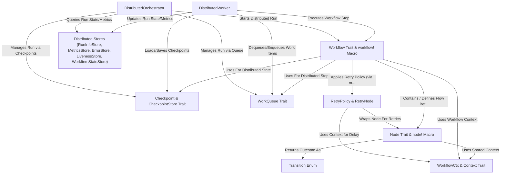

# Tutorial: Floxide, an easy distributed workflow engine

Floxide is a workflow engine for Rust designed to make building and running **distributed** task sequences easy.
Think of it like a *digital assembly line* where different steps (**Nodes**) can run on different computers.
It uses a central **WorkQueue** to assign tasks to **Workers** and **Checkpointing** to recover from failures, making your workflows *scalable* and *fault-tolerant*.
An **Orchestrator** manages starting, stopping, and monitoring these distributed runs.

**Source Repository:** [None](None)

## Chapters

1. [`Transition` Enum
](01__transition__enum_.md)
2. [`Node` Trait & `node!` Macro
](02__node__trait____node___macro_.md)
3. [`WorkflowCtx` & `Context` Trait
](03__workflowctx_____context__trait_.md)
4. [`Workflow` Trait & `workflow!` Macro
](04__workflow__trait____workflow___macro_.md)
5. [`WorkQueue` Trait
](05__workqueue__trait_.md)
6. [`Checkpoint` & `CheckpointStore` Trait
](06__checkpoint_____checkpointstore__trait_.md)
7. [`DistributedWorker`
](07__distributedworker__.md)
8. [`DistributedOrchestrator`
](08__distributedorchestrator__.md)
9. [Distributed Stores (`RunInfoStore`, `MetricsStore`, `ErrorStore`, `LivenessStore`, `WorkItemStateStore`)
](09_distributed_stores___runinfostore____metricsstore____errorstore____livenessstore____workitemstatestore___.md)
10. [`RetryPolicy` & `RetryNode`
](10__retrypolicy_____retrynode__.md)

