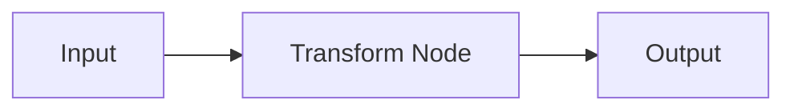
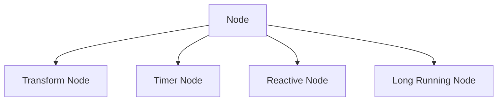
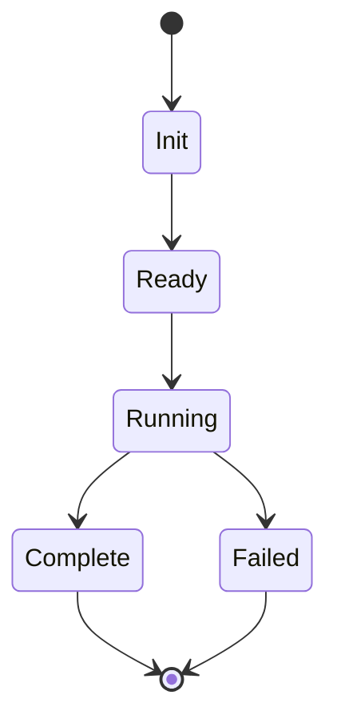

# Using Mermaid Diagrams

This guide explains how to use Mermaid diagrams in the Floxide documentation.

## Overview

[Mermaid](https://mermaid.js.org/) is a JavaScript-based diagramming tool that lets you create diagrams using text and code. It's particularly useful for visualizing:

- Flow charts
- Sequence diagrams
- Class diagrams
- State diagrams

## Example Node Implementation

Here's an example of a transform node implementation in Rust:

```rust
use async_trait::async_trait;
use floxide_core::error::FloxideError;

#[derive(Debug)]
pub struct TransformNode<T> {
    id: String,
    transform_fn: Box<dyn Fn(T) -> T + Send + Sync>,
}

#[async_trait]
impl<T: Send + Sync + 'static> Node<T, T> for TransformNode<T> {
    async fn execute(&self, input: T) -> Result<T, FloxideError> {
        // Apply the transformation function
        let output = (self.transform_fn)(input);
        Ok(output)
    }

    fn id(&self) -> String {
        self.id.clone()
    }
}
```

## Basic Mermaid Usage

Here's a simple flow diagram showing the transform node's execution:



## Node Types

Here's a diagram showing different node types in Floxide:



## Node Lifecycle

A state diagram showing node lifecycle:



## Best Practices

1. **Keep Diagrams Simple**
   - Focus on one concept per diagram
   - Use clear labels
   - Maintain consistent styling

2. **Common Issues**
   - Ensure proper indentation
   - Use correct arrow types (-->, -->, etc.)
   - Test diagrams in the live editor

## Resources

- [Mermaid Live Editor](https://mermaid.live/)
- [Mermaid Documentation](https://mermaid.js.org/)
