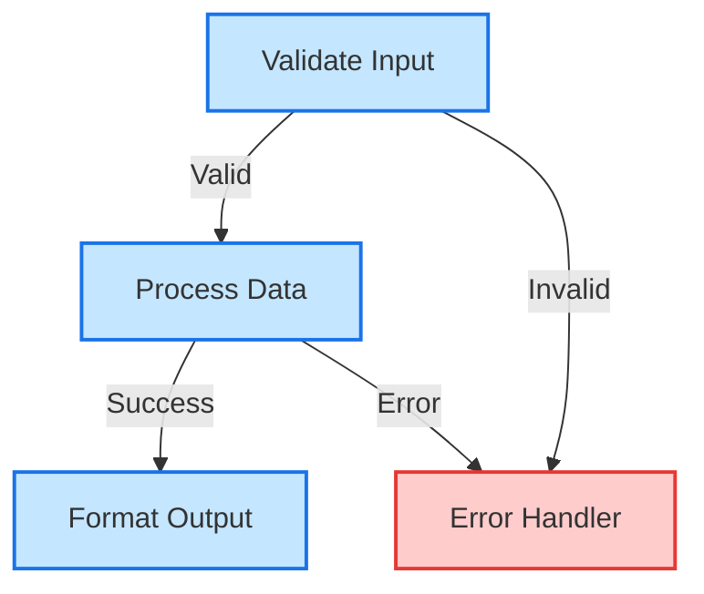
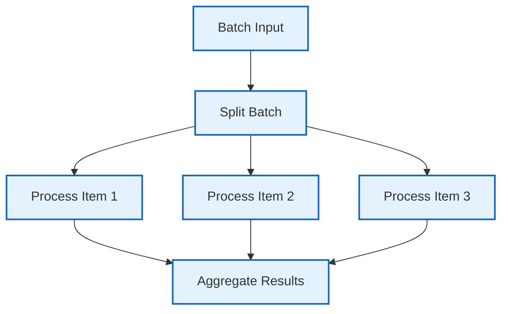

# 🚀 Floxide: The Power of Workflows in Rust

> A type-safe, composable directed graph workflow system written in Rust.

## 💫 Overview

Floxide transforms complex workflow orchestration into a delightful experience. Built with Rust's powerful type system at its core, Floxide provides a flexible, performant, and type-safe way to create sophisticated workflow graphs with crystal-clear transitions between steps.

## ✨ Key Features

- **🔒 Type-Safe By Design**: Leverage Rust's type system for compile-time workflow correctness
- **🧩 Composable Architecture**: Build complex workflows from simple, reusable components
- **⚡ Async First**: Native support for asynchronous execution with Tokio
- **🔄 Advanced Patterns**: Support for batch processing, event-driven workflows, and more
- **💾 State Management**: Built-in serialization for workflow persistence
- **🔍 Observability**: Comprehensive tracing and monitoring capabilities
- **🧪 Testable**: Design your workflows for easy testing and verification

## 📐 Architectural Decisions

This project follows documented architectural decisions recorded in ADRs (Architectural Decision Records). Each ADR captures the context, decision, and consequences of significant architectural choices.

Key architectural decisions include:

- **Core Framework Abstractions** - Defining the fundamental abstractions like Node, Action, and Workflow with a trait-based approach for type safety and flexibility.
- **Project Structure and Crate Organization** - Organizing the framework as a Cargo workspace with multiple specialized crates for modularity and separation of concerns.
- **Async Runtime Selection** - Choosing Tokio as the primary async runtime for its comprehensive feature set and wide adoption.
- **Node Lifecycle Methods** - Implementing a three-phase lifecycle (prep/exec/post) for workflow nodes to provide clear separation of concerns.
- **Batch Processing Implementation** - Designing a batch processing system that efficiently handles parallel execution with configurable concurrency limits.

## 🚀 Quick Start

Add Floxide to your project:

```toml
[dependencies]
floxide-core = "0.1.0"
```

Create your first workflow:

```rust
use floxide_core::{lifecycle_node, LifecycleNode, Workflow, DefaultAction, FloxideError};
use async_trait::async_trait;
use std::sync::Arc;

// Define your context type
#[derive(Debug, Clone)]
struct MessageContext {
    input: String,
    result: Option<String>,
}

// Create a node using the convenience function
fn create_processor_node() -> impl LifecycleNode<MessageContext, DefaultAction> {
    lifecycle_node(
        Some("processor"), // Node ID
        |ctx: &mut MessageContext| async move {
            // Preparation phase
            println!("Preparing to process: {}", ctx.input);
            Ok(ctx.input.clone())
        },
        |input: String| async move {
            // Execution phase
            println!("Processing message...");
            Ok(format!("✅ Processed: {}", input))
        },
        |_prep, exec_result, ctx: &mut MessageContext| async move {
            // Post-processing phase
            ctx.result = Some(exec_result);
            Ok(DefaultAction::Next)
        },
    )
}

#[tokio::main]
async fn main() -> Result<(), Box<dyn std::error::Error>> {
    // Create a context
    let mut context = MessageContext {
        input: "Hello, Floxide!".to_string(),
        result: None,
    };

    // Create a node and workflow
    let node = Arc::new(create_processor_node());
    let mut workflow = Workflow::new(node);

    // Execute the workflow
    workflow.execute(&mut context).await?;

    // Print the result
    println!("Result: {:?}", context.result);

    Ok(())
}
```

## 🧩 Workflow Pattern Examples

Floxide supports a wide variety of workflow patterns through its modular crate system. Each pattern is designed to solve specific workflow challenges:

### 🔄 Simple Chain (Linear Workflow)

A basic sequence of nodes executed one after another. This is the foundation of all workflows.


### 🌲 Conditional Branching

Workflows that make decisions based on context data or node results, directing flow through different paths.



### 🔀 Parallel Batch Processing

Process multiple items concurrently with controlled parallelism, ideal for high-throughput data processing.



## 📚 Documentation

Explore our extensive documentation:

- [Getting Started](getting-started/installation.md) - Installation and quick start guides
- [Core Concepts](core-concepts/overview.md) - Learn about the fundamental concepts of Floxide
- [Guides](guides/event_driven_architecture.md) - In-depth guides for specific use cases
- [Examples](examples/basic-workflow.md) - Example workflows to help you get started
- [Architecture](architecture/adr-process.md) - Architectural Decision Records (ADRs)
- [API Reference](api/floxide-core.md) - Detailed API documentation
