# Flowrs Framework

A directed graph workflow system written in Rust.

## Overview

Flowrs is a robust framework for building and executing workflow graphs. It provides a flexible and type-safe way to create complex workflows with clearly defined transitions between steps.

## Features

- Type-safe workflow definitions
- Composition-based node system
- Async execution of workflow steps
- Built-in retry mechanisms
- Batch processing and parallel execution
- Workflow state serialization
- Comprehensive observability through OpenTelemetry

## Workflow Patterns

Flowrs supports a variety of workflow patterns to handle different processing needs:

### Node

A single step operation that processes input and produces output. In this example, a node that summarizes an email as a standalone operation.

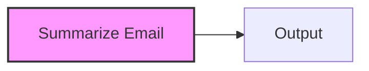

### Chain

A sequence of connected nodes where the output of one node becomes the input to the next. Here, we first summarize an email and then draft a reply based on that summary.

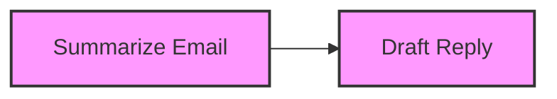

### Batch

Repeats the same processing step across multiple inputs in parallel. This pattern allows us to summarize multiple emails simultaneously, improving throughput for repetitive tasks.

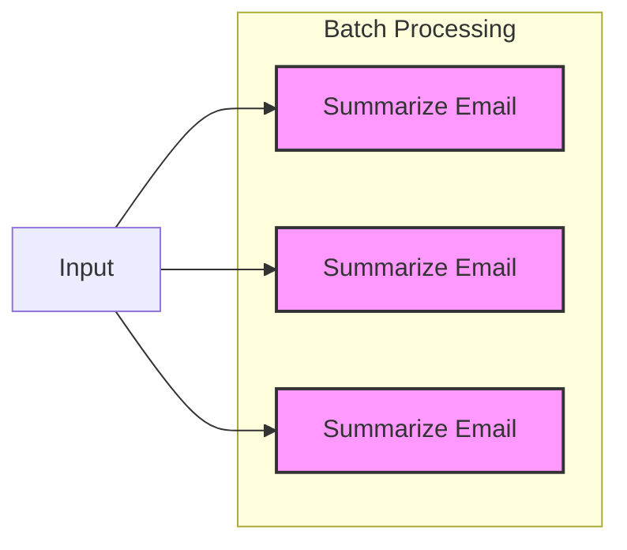

### Async

Handles operations that involve waiting for I/O or external events. In this example, we check an inbox (which involves I/O wait) and then process new emails when they arrive.

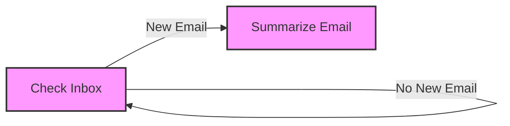

### Shared

Enables communication between nodes through shared state. Here, the "Summarize Email" node writes an email summary to a shared state, and the "Draft Reply" node reads from that shared state rather than receiving direct input from the previous node.

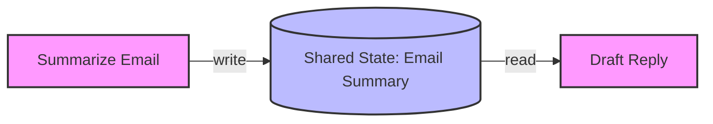

### Branch

Implements conditional logic to determine the next step based on certain criteria. In this workflow, after summarizing an email, we determine if it needs review. If it does, it goes to the "Review" node and then to "Draft Reply" after approval. If review is not needed, it goes directly to "Draft Reply".

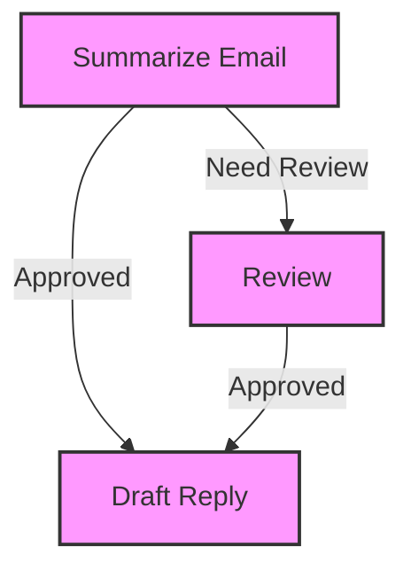

### Nesting

Allows workflows to be composed of other workflows, creating reusable components. In this example, we have a "Coding Task" node that triggers a nested workflow for software development. This nested workflow includes writing tests, writing code, verifying the code, and analyzing its complexity.

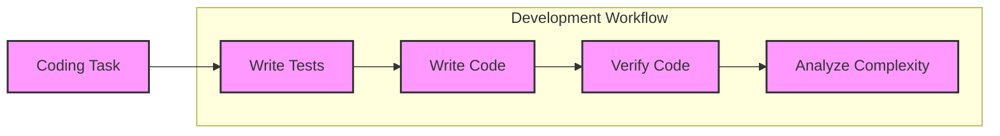

### Looping

Implements repetitive processes that continue until a condition is met. This long-running workflow starts with "Get Question", proceeds to "Answer Question", and then loops back to "Get Question" to continue the cycle indefinitely.

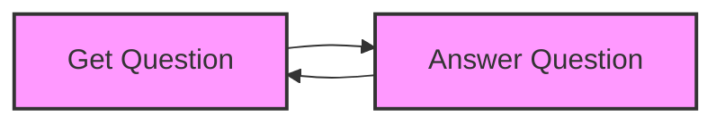

## Workflow Composition

The true power of Flowrs comes from combining these patterns to create complex, real-world workflows. Each pattern addresses a specific workflow need, and they can be composed to solve sophisticated business problems:

### Pattern Combinations

- **Chain + Branch**: Create sequential workflows with decision points
- **Batch + Async**: Process multiple items in parallel while handling I/O operations
- **Nesting + Shared**: Build reusable workflow components that communicate through shared state
- **Looping + Branch**: Implement iterative processes with exit conditions

### Composition Benefits

1. **Modularity**: Break complex workflows into manageable, reusable components
2. **Flexibility**: Adapt workflows to changing requirements by recombining patterns
3. **Maintainability**: Update specific parts of a workflow without affecting the whole
4. **Scalability**: Handle increasing workloads by applying batch processing to appropriate steps

### Visual Workflow Design

When designing workflows with Flowrs, consider visualizing them first using the patterns shown above. This helps identify:

- Which steps can be processed in parallel (Batch)
- Where conditional logic is needed (Branch)
- Which components can be reused (Nesting)
- Where shared state is required (Shared)
- Which operations need to wait for external events (Async)

### Example: Email Processing Workflow

Here's an example of a complex email processing workflow that combines multiple patterns:

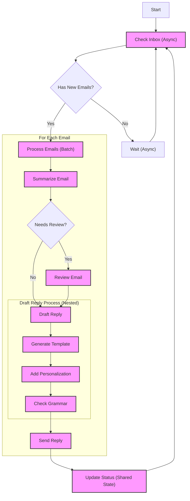

This workflow combines:

- **Async**: For checking the inbox and waiting
- **Batch**: For processing multiple emails in parallel
- **Branch**: For deciding whether emails need review
- **Chain**: For sequential processing steps
- **Nesting**: For the draft reply process
- **Shared**: For updating status across the workflow
- **Looping**: For continuously checking the inbox

## Paradigm Patterns

In addition to the core workflow patterns, Flowrs can be used to implement specialized workflow types for AI and automation applications:

### Workflow (Directed Path)

Simple directed path workflow with sequential processing.


### Chat (Loop + Chat History Store)

Looping conversation flow with state management for chat history.

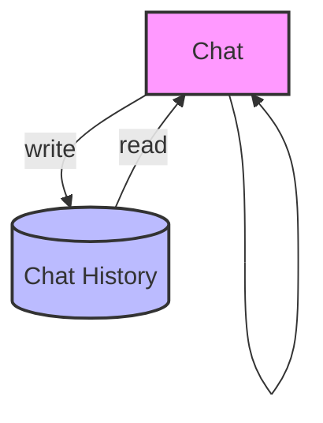

### RAG (Vector DB Store)

Workflows that integrate document storage and retrieval for question answering.

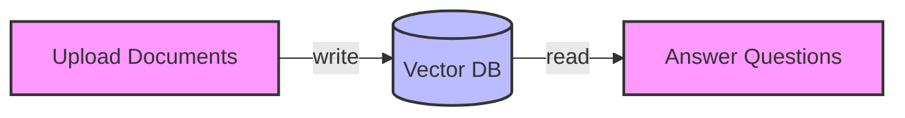

### Chain of Thought (Loop + Think History Store)

Single "thinking" step that loops and maintains reasoning history.

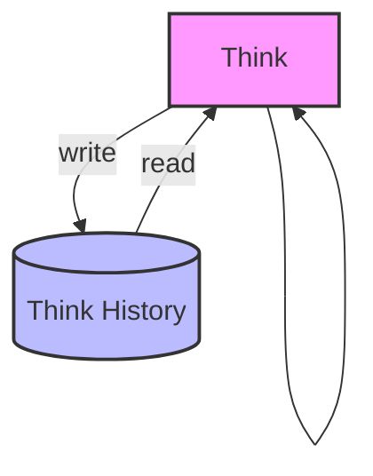

### Map-Reduce (Batch + Merge)

Batch processing of data chunks followed by aggregation of results.

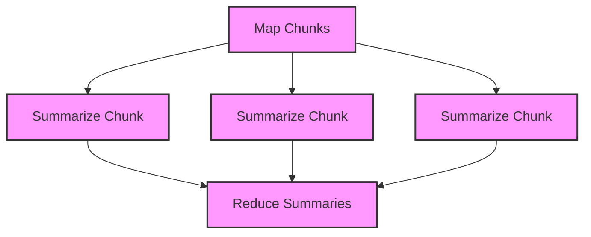

### Agent (Loop + Branching)

Autonomous workflows with branching decision logic and feedback loops.

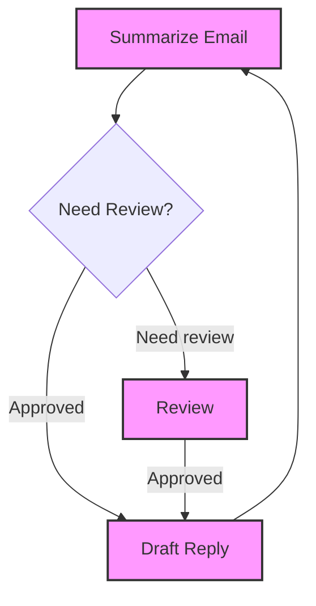

### Multi-Agent (Loop + Branching + Pub/Sub)

Complex interconnected workflows with multiple processing nodes and publish/subscribe communication.

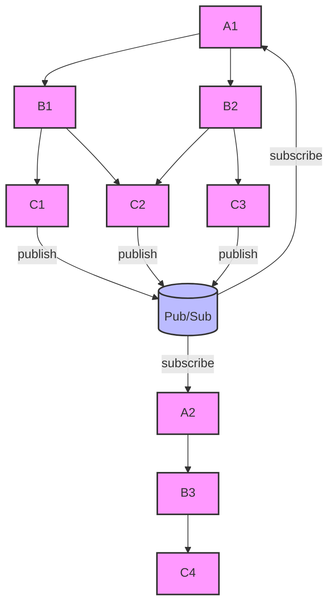

### Supervisor (Nesting)

Nested workflows with oversight that can approve or reject work.

```mermaid
graph TD
    subgraph "Nested Workflow"
    A --> B --> C
    end
    Nested Workflow --> D["Supervise"]
    D -->|reject| Nested Workflow
    D -->|approve| E
    style A fill:#f9f,stroke:#333,stroke-width:2px
    style B fill:#f9f,stroke:#333,stroke-width:2px
    style C fill:#f9f,stroke:#333,stroke-width:2px
    style D fill:#f9f,stroke:#333,stroke-width:2px
    style E fill:#f9f,stroke:#333,stroke-width:2px
```

## Getting Started

Add flowrs to your Cargo.toml:

```toml
[dependencies]
flowrs-core = "0.1.0"
flowrs-async = "0.1.0"
```

### Example Usage

```rust
use flowrs_core::{Node, NodeOutcome, Workflow, ActionType, DefaultAction};

// Define a simple workflow node
struct GreetingNode;

impl Node<String, DefaultAction> for GreetingNode {
    type Output = String;

    async fn process(&self, name: &mut String) -> Result<NodeOutcome<Self::Output, DefaultAction>, FlowrsError> {
        let greeting = format!("Hello, {}!", name);
        Ok(NodeOutcome::Complete(greeting))
    }
}

// Build and run a workflow
async fn run_workflow() {
    let mut workflow = Workflow::new(GreetingNode);
    let mut name = String::from("World");

    let result = workflow.execute(&mut name).await;
    assert_eq!(result.unwrap(), "Hello, World!");
}
```

## Project Structure

The framework is organized as a Cargo workspace with multiple crates:

- `flowrs-core`: Core traits and structures for the framework
- `flowrs-async`: Async runtime integration
- `examples`: Example workflow implementations
- `benches`: Performance benchmarks

## Documentation

For detailed documentation, see:

- [API Documentation](https://docs.rs/flowrs-core) (coming soon)
- [User Guide](docs/guide/README.md) (coming soon)
- [Architectural Decision Records](docs/adrs/README.md)

## License

This project is licensed under the MIT License - see the LICENSE file for details.
